<div style="text-align: center;">
  
</div>

<h4 class="cover-label" style="text-align: center;"> Universidad Peruana de Ciencias Aplicadas </h4>

<h4 class="cover-label" style="text-align: center"> Carrera de Ingeniería de Software </h4>

<h4 style="text-align: center; margin-top: 18px;"> 1ASI0593 </h4>

<h4 style="text-align: center"> Team Software Process </h4>

<h4 class="cover-label" style="text-align: center"> NRC </h4>

<h4 style="text-align: center"> 17432 </h4>

<h3 style="text-align: center;"> "Informe del Trabajo Final" </h3>

<h4 class="cover-label" style="text-align: center"> Docente </h4>

<h4 style="text-align: center"> Escobar Aguirre, Jaime Luis </h4>

<h4 class="cover-label" style="text-align: center; margin-top: 18px;"> Startup </h4>

<h4 style="text-align: center"> LiquiLabs </h4>

<h4 class="cover-label" style="text-align: center; margin-top: 18px;"> Producto </h4>

<h4 style="text-align: center"> Vankoo </h4>

<h4 style="text-align: center; margin-top: 18px;">Integrantes:</h4>

<div style="text-align:center; margin-top: 10px; font-size: 90%; line-height: 1.6;">
   <table class="cover-table" style="margin-left: auto; margin-right: auto;">
      <tr>
         <th>Código</th>
         <th>Apellidos y Nombres</th>
      </tr>
      <tr>
         <td>U20221G044</td>
         <td>Amaro Villar, Anjali</td>
      </tr>
      <tr>
         <td>U20221G120</td>
         <td>Crispin Ramos, Daniel Franco</td>
      </tr>
      <tr>
         <td>U20201E843</td>
         <td>Ramirez Mestanza, Salim Ignacio</td>
      </tr>
      <tr>
         <td>U20221C486</td>
         <td>Sulca Gonzales, Paúl Fernando</td>
      </tr>
      <tr>
         <td>U20231A778</td>
         <td>Vilca Saboya, Diego Alejandro</td>
      </tr>
   </table>
</div>

<br>

<h5 style="text-align: center;"> Período 202620 </h5>

<hr class="page-break">

# Registro de Versiones del Informe

<!-- Resumir las modificaciones relevantes al informe durante el ciclo de vida del proyecto: adición o eliminación de secciones, correcciones o mejoras producto de la retroalimentación del docente o de la autocrítica del equipo. -->

| Versión | Fecha      | Autor                           | Descripción de modificación                                              |
|---------|------------|---------------------------------|--------------------------------------------------------------------------|
| 1.0.0   | 2026-09-06 | Ramirez Mestanza, Salim Ignacio | Creación de la estructura base del informe, carátula y registro de versiones. |
|         |            |                                 |                                                                          |

<hr class="page-break">

# Contenido

- [Registro de Versiones del Informe](#registro-de-versiones-del-informe)
- [Contenido](#contenido)
- [Student Outcome](#student-outcome)
- [Capítulo I: Introducción](#capítulo-i-introducción)
  - [1.1. Startup Profile](#11-startup-profile)
    - [1.1.1. Descripción de la Startup](#111-descripción-de-la-startup)
    - [1.1.2. Perfiles de integrantes del equipo](#112-perfiles-de-integrantes-del-equipo)
  - [1.2. Solution Profile](#12-solution-profile)
    - [1.2.1. Antecedentes y problemática](#121-antecedentes-y-problemática)
    - [1.2.2. Lean UX Process](#122-lean-ux-process)
      - [1.2.2.1. Lean UX Problem Statements](#1221-lean-ux-problem-statements)
      - [1.2.2.2. Lean UX Assumptions](#1222-lean-ux-assumptions)
      - [1.2.2.3. Lean UX Hypothesis Statements](#1223-lean-ux-hypothesis-statements)
      - [1.2.2.4. Lean UX Canvas](#1224-lean-ux-canvas)
  - [1.3. Segmentos objetivo](#13-segmentos-objetivo)
- [Capítulo II: Requirements Elicitation \& Analysis](#capítulo-ii-requirements-elicitation--analysis)
  - [2.1. Competidores](#21-competidores)
    - [2.1.1. Análisis competitivo](#211-análisis-competitivo)
    - [2.1.2. Estrategias y tácticas frente a competidores](#212-estrategias-y-tácticas-frente-a-competidores)
  - [2.2. Entrevistas](#22-entrevistas)
    - [2.2.1. Diseño de entrevistas](#221-diseño-de-entrevistas)
    - [2.2.2. Registro de entrevistas](#222-registro-de-entrevistas)
    - [2.2.3. Análisis de entrevistas](#223-análisis-de-entrevistas)
  - [2.3. Needfinding](#23-needfinding)
    - [2.3.1. User Personas](#231-user-personas)
    - [2.3.2. User Task Matrix](#232-user-task-matrix)
    - [2.3.3. User Journey Mapping](#233-user-journey-mapping)
    - [2.3.4. Empathy Mapping](#234-empathy-mapping)
    - [2.3.5. As-is Scenario Mapping](#235-as-is-scenario-mapping)
- [Capítulo III: Requirements Specification](#capítulo-iii-requirements-specification)
  - [3.1. To-Be Scenario Mapping](#31-to-be-scenario-mapping)
  - [3.2. User Stories](#32-user-stories)
  - [3.3. Impact Mapping](#33-impact-mapping)
  - [3.4. Product Backlog](#34-product-backlog)
- [Capítulo IV: Product Design](#capítulo-iv-product-design)
  - [4.1. Style Guidelines](#41-style-guidelines)
    - [4.1.1. General Style Guidelines](#411-general-style-guidelines)
    - [4.1.2. Web Style Guidelines](#412-web-style-guidelines)
  - [4.2. Information Architecture](#42-information-architecture)
    - [4.2.1. Organization Systems](#421-organization-systems)
    - [4.2.2. Labeling Systems](#422-labeling-systems)
    - [4.2.3. SEO Tags and Meta Tags](#423-seo-tags-and-meta-tags)
    - [4.2.4. Searching Systems](#424-searching-systems)
    - [4.2.5. Navigation Systems](#425-navigation-systems)
  - [4.3. Landing Page UI Design](#43-landing-page-ui-design)
    - [4.3.1. Landing Page Wireframe](#431-landing-page-wireframe)
    - [4.3.2. Landing Page Mock-up](#432-landing-page-mock-up)
  - [4.4. Web Applications UX/UI Design](#44-web-applications-uxui-design)
    - [4.4.1. Web Applications Wireframes](#441-web-applications-wireframes)
    - [4.4.2. Web Applications Wireflow Diagrams](#442-web-applications-wireflow-diagrams)
    - [4.4.3. Web Applications Mock-ups](#443-web-applications-mock-ups)
    - [4.4.4. Web Applications User Flow Diagrams](#444-web-applications-user-flow-diagrams)
  - [4.5. Web Applications Prototyping](#45-web-applications-prototyping)
  - [4.6. Domain-Driven Software Architecture](#46-domain-driven-software-architecture)
    - [4.6.1. Software Architecture Context Diagram](#461-software-architecture-context-diagram)
    - [4.6.2. Software Architecture Container Diagrams](#462-software-architecture-container-diagrams)
    - [4.6.3. Software Architecture Components Diagrams](#463-software-architecture-components-diagrams)
  - [4.7. Software Object-Oriented Design](#47-software-object-oriented-design)
    - [4.7.1. Class Diagrams](#471-class-diagrams)
    - [4.7.2. Class Dictionary](#472-class-dictionary)
  - [4.8. Database Design](#48-database-design)
    - [4.8.1. Database Diagram](#481-database-diagram)
- [Capítulo V: Product Implementation, Validation \& Deployment](#capítulo-v-product-implementation-validation--deployment)
  - [5.1. Software Configuration Management](#51-software-configuration-management)
    - [5.1.1. Software Development Environment Configuration](#511-software-development-environment-configuration)
    - [5.1.2. Source Code Management](#512-source-code-management)
    - [5.1.3. Source Code Style Guide \& Conventions](#513-source-code-style-guide--conventions)
    - [5.1.4. Software Deployment Configuration](#514-software-deployment-configuration)
  - [5.2. Landing Page, Services \& Applications Implementation](#52-landing-page-services--applications-implementation)
    - [5.2.1. Sprint 1](#521-sprint-1)
      - [5.2.1.1. Sprint Planning 1](#5211-sprint-planning-1)
      - [5.2.1.2. Sprint Backlog 1](#5212-sprint-backlog-1)
      - [5.2.1.3. Development Evidence for Sprint Review](#5213-development-evidence-for-sprint-review)
      - [5.2.1.4. Testing Suite Evidence for Sprint Review](#5214-testing-suite-evidence-for-sprint-review)
      - [5.2.1.5. Execution Evidence for Sprint Review](#5215-execution-evidence-for-sprint-review)
      - [5.2.1.6. Services Documentation Evidence for Sprint Review](#5216-services-documentation-evidence-for-sprint-review)
      - [5.2.1.7. Software Deployment Evidence for Sprint Review](#5217-software-deployment-evidence-for-sprint-review)
      - [5.2.1.8. Team Collaboration Insights during Sprint](#5218-team-collaboration-insights-during-sprint)
      - [5.2.1.9. Actas de reunión](#5219-actas-de-reunión)
- [Avance de Conclusiones](#avance-de-conclusiones)
- [Bibliografía](#bibliografía)
- [Anexos](#anexos)

<hr class="page-break">

# Student Outcome

<!-- Cada participante debe colaborar para redactar como grupo los sustentos y evidencias de cómo las actividades del trabajo final han ayudado a desarrollar las dimensiones del student outcome. En "Acciones realizadas" se especifica cada participante (Apellidos, Nombres) y, a continuación, cada entrega (TB1, TB2, etc.) con las acciones específicas realizadas. Las celdas "Conclusiones" se llenan de forma grupal y son acumulables. Ver Anexo A del enunciado. -->

El curso contribuye al cumplimiento del Student Outcome ABET:

**ABET – EAC - Student Outcome 3**

**Criterio:** Capacidad de comunicarse efectivamente con un rango de audiencias.

En el siguiente cuadro se describe las acciones realizadas y enunciados de conclusiones por parte del grupo, que permiten sustentar el haber alcanzado el logro del ABET – EAC - Student Outcome 3.

| Criterio específico | Acciones realizadas | Conclusiones |
|:--------------------|:--------------------|:-------------|
| Comunica oralmente sus ideas y/o resultados con objetividad a público de diferentes especialidades y niveles jerárquicos, en el marco del desarrollo de un proyecto en ingeniería. | **Amaro Villar, Anjali**<br>**TB1**<br>_Pendiente de elaboración._<br><br>**Crispin Ramos, Daniel Franco**<br>**TB1**<br>_Pendiente de elaboración._<br><br>**Ramirez Mestanza, Salim Ignacio**<br>**TB1**<br>_Pendiente de elaboración._<br><br>**Sulca Gonzales, Paúl Fernando**<br>**TB1**<br>_Pendiente de elaboración._<br><br>**Vilca Saboya, Diego Alejandro**<br>**TB1**<br>_Pendiente de elaboración._ | **TB1**<br>_Pendiente de elaboración._ |
| Comunica en forma escrita ideas y/o resultados con objetividad a público de diferentes especialidades y niveles jerárquicos, en el marco del desarrollo de un proyecto en ingeniería. | **Amaro Villar, Anjali**<br>**TB1**<br>_Pendiente de elaboración._<br><br>**Crispin Ramos, Daniel Franco**<br>**TB1**<br>_Pendiente de elaboración._<br><br>**Ramirez Mestanza, Salim Ignacio**<br>**TB1**<br>_Pendiente de elaboración._<br><br>**Sulca Gonzales, Paúl Fernando**<br>**TB1**<br>_Pendiente de elaboración._<br><br>**Vilca Saboya, Diego Alejandro**<br>**TB1**<br>_Pendiente de elaboración._ | **TB1**<br>_Pendiente de elaboración._ |

<hr class="page-break">

# Capítulo I: Introducción

## 1.1. Startup Profile

### 1.1.1. Descripción de la Startup

<!-- Nombre y origen del nombre de LiquiLabs, misión, visión y propuesta de valor. -->
<!-- Assets: ./assets/logos/ -->

LiquiLabs es una startup Fintech de base tecnológica creada por estudiantes de la carrera de Ingeniería de Software de la UPC. Nuestro objetivo es democratizar el acceso a la liquidez inmediata para las PYMES peruanas a través de una plataforma de crowdfactoring inteligente. Mediante el uso de tecnologías emergentes como Arquitecturas Orientadas a Eventos (EDA) y Tokenización de activos, conectamos a empresas que necesitan capital de trabajo con inversionistas individuales, eliminando barreras tradicionales, reduciendo el riesgo mediante Inteligencia Artificial y promoviendo prácticas empresariales sostenibles a través de nuestro modelo de "Factoring Verde".

**Misión**: Facilitar el crecimiento de las pequeñas y medianas empresas en el Perú proporcionando una plataforma financiera tecnológica, transparente y eficiente que transforme sus cuentas por cobrar en liquidez inmediata, impulsada por el análisis de datos y la colaboración ciudadana.

**Visión**: Ser la plataforma de financiamiento participativo líder en la región, reconocida por revolucionar la arquitectura de servicios financieros mediante el uso ético de la IA y la descentralización de inversiones, construyendo un ecosistema donde el capital fluya de manera justa hacia negocios con impacto positivo.

### 1.1.2. Perfiles de integrantes del equipo

|  | **Amaro Villar, Anjali**<br>Código: U20221G044<br>Carrera: Ingeniería de Software<br><br>_Conocimiento en bases de datos y aseguramiento de calidad de software. Experiencia en diseño de pruebas, validación funcional y gestión de incidencias._ |
|-------------------------------------------------------------------|----------------------------------------------------------------------------------------------------------------------------------------------------------------------------------------------------------------------------------------------------|

|  | **Crispin Ramos, Daniel Franco**<br>Código: U20221G120<br>Carrera: Ingeniería de Software<br><br>_Tengo conocimientos en desarrollo web frontend y backend, programación orientada a objetos y uso de Git. Soy una persona responsable, comprometida y con facilidad para trabajar en equipo._ |
|---------------------------------------------------------------------|------------------------------------------------------------------------------------------------------------------------------------------------------------------------------------------------------------------------------------------------------------------------------------------------|

|  | **Ramirez Mestanza, Salim Ignacio**<br>Código: U20201E843<br>Carrera: Ingeniería de Software<br><br>_Conocimiento en arquitectura de software y control de versiones con Git. Experiencia en documentación técnica y colaboración en equipos ágiles._ |
|--------------------------------------------------------------------|-------------------------------------------------------------------------------------------------------------------------------------------------------------------------------------------------------------------------------------------------------|

|  | **Sulca Gonzales, Paúl Fernando**<br>Código: U20221C486<br>Carrera: Ingeniería de Software<br><br>_Conocimiento en diseño de software orientado a objetos y modelado UML. Experiencia en implementación de interfaces web adaptativas._ |
|-----------------------------------------------------------------|-----------------------------------------------------------------------------------------------------------------------------------------------------------------------------------------------------------------------------------------|

|  | **Vilca Saboya, Diego Alejandro**<br>Código: U20231A778<br>Carrera: Ingeniería de Software<br><br>_Conocimiento en desarrollo web utilizando las últimas tecnologías en tendencia. Experiencia en elaboración de diagramas de arquitectura y prototipado UX/UI._ |
|------------------------------------------------------------------|------------------------------------------------------------------------------------------------------------------------------------------------------------------------------------------------------------------------------------------------------------------|

<hr class="page-break">

## 1.2. Solution Profile

### 1.2.1. Antecedentes y problemática

| Pregunta                 | Respuesta                                                                                                                                                                                                                                                                                                                                                                                                                             |
|--------------------------|---------------------------------------------------------------------------------------------------------------------------------------------------------------------------------------------------------------------------------------------------------------------------------------------------------------------------------------------------------------------------------------------------------------------------------------|
| **What?** (¿Qué?)        | Se presenta una severa restricción de liquidez en las MYPES peruanas. Al cierre de 2024, el ratio de inclusión financiera (acceso al crédito formal) para este segmento fue de apenas 27.8%, frente al 66.1% de la gran empresa (PRODUCE, 2025). Esto genera una brecha de capital de trabajo que el sistema bancario tradicional no logra cubrir debido a requisitos de garantía rígidos.                                            |
| **When?** (¿Cuándo?)     | El problema ocurre en la brecha temporal entre la entrega del bien o servicio y el cobro efectivo. Aunque la Ley N° 31362 establece un plazo de pago de 30 días, la norma permite "pactos en contrario", lo que en la práctica extiende los ciclos de efectivo a 60, 90 o 120 días (LP, 2021). Durante este tiempo, la empresa debe autofinanciar sus operaciones.                                                                    |
| **Where?** (¿Dónde?)     | Se identifica principalmente en las MYPES de los sectores Comercio y Servicios, que representan más del 85% de este tejido empresarial (PRODUCE, 2025). El cuello de botella se encuentra en el proceso de "conformidad" y registro de la factura negociable ante CAVALI, donde las facturas de tickets bajos (menores a S/ 10,000) representan el 67% del volumen pero enfrentan mayores dificultades de negociación (CAVALI, 2024). |
| **Who?** (¿Quién?)       | Afecta a los 2.3 millones de MYPES formales en el Perú (ComexPerú, 2025). La problemática no es de gestión interna, sino de asimetría de poder: el 99.7% de las empresas en Perú son MYPES, pero estas tienen una bajísima capacidad de negociación frente a grandes adquirentes corporativos que imponen los plazos de pago para optimizar su propio flujo de caja.                                                                  |
| **Why?** (¿Por qué?)     | Se debe a la alta percepción de riesgo y los costos operativos de la banca tradicional. El 95% de los deudores MYPE son personas naturales con negocio, lo que dificulta su evaluación bajo modelos de scoring tradicionales (ComexPerú, 2025). Además, existe una ausencia de plataformas descentralizadas (Crowdfactoring) que automaticen la evaluación de riesgo mediante IA y reduzcan costos de intermediación.                 |
| **How?** (¿Cómo?)        | El estado óptimo es un ciclo de caja donde el pago se reciba en máximo 30 días según ley. Sin embargo, la realidad muestra un patrón sistémico de postergación: las ventas de las MYPES continúan perdiendo participación en el PBI total debido a que no pueden reinvertir su capital rápidamente al tenerlo "atrapado" en facturas por cobrar (Innova Funding, 2022).                                                               |
| **How much?** (¿Cuánto?) | El saldo de crédito otorgado a empresas en Perú es de aprox. S/ 213,121 millones (2024), pero la mayoría se concentra en grandes empresas. Se estima que el mercado de factoring aún tiene un potencial de crecimiento de hasta S/ 120,000 millones hacia el 2028 (Contadores y Empresas, 2025).                                                                                                                                      |

### 1.2.2. Lean UX Process

#### 1.2.2.1. Lean UX Problem Statements

La solución que ofrecemos tiene como objetivo proporcionar a las micro y pequeñas empresas (MYPES) del Perú una plataforma de crowdfactoring inteligente que permita convertir sus facturas por cobrar en liquidez inmediata, mediante un mercado descentralizado donde inversionistas individuales financian estas operaciones de manera ágil y segura.

Nos hemos percatado de la severa restricción de caja que enfrentan las MYPES debido a plazos de cobranza que se extienden entre 60 y 120 días, sumado a un acceso limitado al crédito formal donde solo el 27.8% de estas empresas logra obtener financiamiento bancario. Esta deficiencia financiera no se debe a una mala gestión del negocio, sino a la asimetría de poder frente a los grandes adquirentes y a la falta de herramientas tecnológicas que evalúen el riesgo de manera justa. Como consecuencia, muchas empresas se ven obligadas a detener sus operaciones, incumplir pagos a proveedores o incluso cerrar por falta de flujo de caja, perdiendo competitividad en el mercado nacional.

Hemos identificado que la dependencia de procesos manuales y modelos de riesgo tradicionales excluye a miles de facturas de bajo monto del sistema financiero. La ausencia de un sistema transparente y automatizado que utilice Inteligencia Artificial para el scoring de riesgo y arquitecturas distribuidas para garantizar la seguridad de la inversión, impide que el capital fluya de manera eficiente hacia los emprendedores que más lo necesitan, afectando la sostenibilidad y el crecimiento del tejido empresarial peruano.

¿Cómo podríamos democratizar el acceso a la liquidez inmediata para las MYPES de forma transparente y automatizada, permitiendo a los empresarios obtener efectivo sin deuda y a los inversionistas participar en un mercado de bajo riesgo, reduciendo los tiempos de espera y eliminando las barreras de entrada del sistema financiero tradicional?

#### 1.2.2.2. Lean UX Assumptions

**Business Assumptions**

1. **Creemos que nuestros clientes necesitan** una plataforma digital centralizada que les permita obtener liquidez inmediata sin generar deuda bancaria tradicional.
2. **Estas necesidades se pueden resolver con** un marketplace de crowdfactoring que facilite el descuento de facturas negociables, conectando directamente a empresas con inversionistas.
3. **Nuestros clientes iniciales serán** propietarios de pequeñas y medianas empresas de los sectores comercio y servicios que actualmente enfrentan plazos de pago de 60 a 120 días.
4. **El valor más importante que el cliente quiere de nuestro servicio es** la rapidez en el desembolso (menos de 48 horas) y una evaluación de riesgo justa basada en el pagador.
5. **El cliente también puede obtener beneficios adicionales como** un dashboard de salud financiera, reducción de comisiones por prácticas sostenibles (Factoring Verde) y gestión automatizada de sus facturas ante CAVALI.
6. **Vamos a adquirir la mayoría de nuestros clientes mediante** marketing digital dirigido (LinkedIn y Google Ads), alianzas con gremios empresariales y cámaras de comercio locales.
7. **Generaremos dinero a través de** una comisión por operación (ej. 1% del monto de la factura) y un margen sobre el diferencial de la tasa de descuento ofrecida a los inversionistas.
8. **Nuestra competencia principal en el mercado son** las empresas de factoring tradicionales, bancos locales y otras Fintech de financiamiento participativo ya establecidas.
9. **Lo venceremos debido a** nuestra arquitectura basada en IA para un scoring de riesgo más preciso, la capacidad de tokenizar facturas para permitir inversiones de bajo monto y un enfoque en sostenibilidad.
10. **El mayor riesgo del servicio es que** los inversionistas perciban un alto riesgo de impago por parte de los adquirentes o que las MYPES desconfíen de las plataformas no bancarias.
11. **Resolveremos esto a través de un sistema de** transparencia total basado en eventos inmutables (Event Sourcing), validación biométrica para firmas digitales y un motor de IA que filtre facturas de alta probabilidad de cobro.

**User Assumptions**

1. **¿Quién es el usuario?** Principalmente dos perfiles: el empresario MYPE que busca liquidez urgente y el inversionista particular que busca rentabilizar su capital apoyando el crecimiento de negocios locales.
2. **¿Qué problema tiene nuestro producto que debe resolver?** Debe resolver la falta de efectivo para cubrir gastos operativos inmediatos (planillas, impuestos) y la dificultad de encontrar opciones de inversión accesibles y seguras con retornos atractivos.
3. **¿Qué características son importantes?** Destacan el motor de carga y lectura automática de facturas (IA/OCR), el marketplace con niveles de riesgo claros, la firma digital con biometría y el seguimiento en tiempo real del estado de cobranza.
4. **¿Dónde encaja nuestro producto en su trabajo o vida**? En la gestión financiera diaria del empresario para mantener operativo su negocio, y en la estrategia de ahorro e inversión del usuario particular para generar ingresos pasivos.
5. **¿Cuándo y cómo es nuestro producto usado?** Será usado semanalmente para subir nuevas facturas tras una venta, o diariamente por inversionistas para revisar nuevas oportunidades en el marketplace. Se accederá vía web para gestión administrativa y vía móvil para inversiones rápidas.
6. **¿Cómo debe verse nuestro producto y cómo debe comportarse?** Debe proyectar seguridad, transparencia y profesionalismo. La interfaz debe ser limpia, con gráficos claros de rentabilidad y flujos de caja, con una navegación intuitiva que no requiera conocimientos financieros avanzados.

#### 1.2.2.3. Lean UX Hypothesis Statements

**Hypothesis 01:** Creemos que implementar un motor de lectura automática de facturas mediante IA (OCR + NLP) reducirá el tiempo de registro y errores manuales para los empresarios MYPE. Sabremos que hemos tenido éxito cuando el tiempo promedio de carga y validación de una factura disminuya de 15 minutos (proceso manual típico) a menos de 2 minutos, y al menos el 85% de los datos extraídos no requieran corrección manual por parte del usuario.

**Hypothesis 02:** Creemos que el uso de un Score de Riesgo basado en IA, que evalúe la solvencia del adquirente (pagador) y no solo del emisor, aumentará la tasa de aprobación de facturas de pequeñas empresas. Sabremos que hemos tenido éxito cuando el volumen de facturas de MYPES nuevas (con menos de 1 año de creación) aprobadas para subasta crezca en un 50% en comparación con los criterios de evaluación de la banca tradicional durante el primer semestre.

**Hypothesis 03:** Creemos que la tokenización de facturas (fraccionamiento de deuda) permitirá que inversionistas minoristas financien operaciones con montos de entrada bajos, aumentando la velocidad de fondeo. Sabremos que hemos tenido éxito cuando el 90% de las facturas publicadas en el marketplace logren ser financiadas al 100% en un tiempo menor a 24 horas gracias a la participación de múltiples micro-inversionistas.

**Hypothesis 04:** Creemos que la transparencia brindada por una arquitectura de Event Sourcing (Ledger inmutable), que permite rastrear cada evento de la factura, aumentará la confianza de los inversionistas. Sabremos que hemos tenido éxito, cuando el 70% de los inversionistas activos califiquen la "seguridad y trazabilidad" de la plataforma como el factor principal de su permanencia en la encuesta de satisfacción trimestral.

**Hypothesis 05:** Creemos que ofrecer beneficios e incentivos (comisiones reducidas) a través del modelo de Factoring Verde para empresas con impacto positivo atraerá a un segmento de inversionistas éticos. Sabremos que hemos tenido éxito, cuando las facturas etiquetadas como "Verdes" reciban ofertas de financiamiento un 20% más rápido que las facturas convencionales y representen al menos el 15% del volumen total transaccionado en el primer año.

#### 1.2.2.4. Lean UX Canvas

El Lean UX Canvas nos permite organizar de forma clara y colaborativa los elementos clave del diseño: problema, usuarios, suposiciones, hipótesis y métricas. En este proyecto, nos ayuda a enfocar el desarrollo en generar valor real para las PYMES peruanas que requieren liquidez inmediata y los inversionistas que buscan rentabilidad con seguridad tecnológica.

A continuación, se presenta el Lean UX Canvas elaborado en la herramienta Miro:

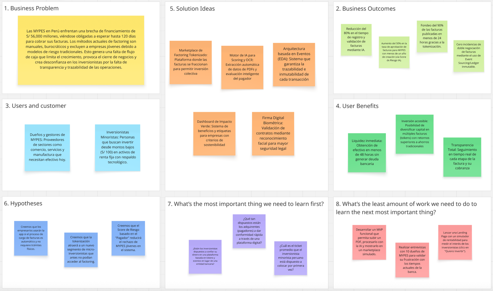

**Enlace al Lean UX Canvas:** [https://goo.su/XhiN](https://miro.com/app/board/uXjVGGrzXsM=/?share_link_id=452277568220)

<hr class="page-break">

## 1.3. Segmentos objetivo

En el análisis del segmento objetivo para LiquiLabs, hemos identificado que los usuarios principales se dividen en dos perfiles críticos que dinamizan el ecosistema de crowdfactoring: los empresarios MYPE que buscan liquidez y los inversionistas individuales que buscan rentabilizar sus ahorros

**Empresarios de Micro y Pequeñas Empresas (MYPES)**  
Este segmento representa el núcleo de la demanda de liquidez en el Perú. Según el informe de ComexPerú (2025), las MYPES formales generan el 99% del empleo empresarial en el país, pero enfrentan una brecha de crédito de aproximadamente S/ 56,000 millones. Estas empresas han sido rechazadas por la banca tradicional debido a modelos de riesgo que no consideran la solvencia del cliente final (el pagador de la factura), lo que las obliga a paralizar operaciones o recurrir a prestamistas informales con tasas usureras
- **Edad**: Emprendedores y dueños de negocio entre los 25 y 55 años.
- **Necesidad clave**: Obtener capital de trabajo de forma inmediata (en menos de 48 horas) sin aumentar su nivel de deuda bancaria y con tasas competitivas basadas en la calidad de sus facturas.
- **Nivel educativo**: Formación técnica o universitaria, con experiencia en gestión comercial pero con limitado conocimiento en ingeniería financiera avanzada.
- **Uso de tecnología**: Utilizan facturación electrónica de SUNAT y aplicaciones bancarias básicas, pero requieren una plataforma intuitiva que automatice la gestión de sus cuentas por cobrar.


**Inversionistas Minoristas (Personas Naturales)**  
Este segmento representa la oferta de capital. El mercado de factoring en Perú alcanzó un monto negociado de S/ 43,000 millones en 2024, lo que representa un crecimiento del 14% respecto al año anterior (Contadores y Empresas, 2025). Esta expansión del mercado permite que personas naturales participen financiando facturas. Según CAVALI (2024), el ticket promedio de las facturas negociadas es de aproximadamente S/ 24,405, un monto que, mediante un modelo de crowdfactoring, puede ser fraccionado para que inversionistas con menor capital participen en la compra de deuda con retornos atractivos.
- **Edad**: Profesionales de entre 22 y 45 años.
- **Necesidad clave**: Acceder a opciones de inversión con tasas de rendimiento competitivas frente a la banca tradicional y con periodos de retorno de capital a corto plazo (entre 30 y 90 días).
- **Nivel educativo**: Educación superior completa, con interés en optimizar la gestión de sus ahorros personales a través de medios digitales.
- **Uso de tecnología**: Usuarios habituales de servicios financieros digitales y aplicaciones móviles; valoran la trazabilidad de su dinero y la facilidad de monitoreo de sus ganancias en tiempo real.


<hr class="page-break">

# Capítulo II: Requirements Elicitation & Analysis

Este capítulo documenta el proceso de *Requirements Elicitation & Analysis* llevado a cabo por el equipo de LiquiLabs para fundamentar el diseño de Vankoo. En primer lugar, se desarrolla un análisis competitivo que compara la propuesta de valor de Vankoo frente a los actores ya establecidos en el mercado peruano de factoring y crowdfactoring, con el fin de identificar ventajas diferenciales y definir estrategias frente a sus fortalezas y debilidades. En segundo lugar, se ejecuta un proceso de *needfinding* compuesto por entrevistas semiestructuradas a los dos segmentos objetivo —empresarios MYPE e inversionistas minoristas—, cuyos hallazgos alimentan las herramientas de user personas, user task matrix, user journey mapping, empathy mapping y as-is scenario mapping. Los resultados obtenidos en este capítulo constituyen la base empírica sobre la cual se sustenta la especificación de requisitos desarrollada en el Capítulo III.

## 2.1. Competidores


Para el análisis de la competencia se identificaron tres competidores directos que operan bajo modelos de negocio de factoring y/o crowdfactoring en el mercado peruano: Prestamype, Finsmart e Innova Funding. A continuación se describe brevemente el perfil de cada uno.

**Prestamype**  
Es la Fintech líder en préstamos y factoring en el Perú, reconocida por una marca sólida y un ecosistema amplio de productos financieros (factoring, préstamos con garantía hipotecaria, cambio de divisas y préstamos para capital de trabajo). Actúa como una suerte de "banco" dentro del ecosistema Fintech local, apalancándose en su gran liquidez, su reputación consolidada y una base de clientes inmensa para financiar operaciones incluso cuando no hay suficientes inversionistas retail. Su mercado objetivo se concentra en PYMES más consolidadas que buscan tickets altos, así como en inversionistas conservadores e institucionales, a quienes llega mediante publicidad masiva (TV, radio, paneles), Google Ads agresivo e influencers de alto perfil.

**Finsmart**  
Es el competidor directo más cercano al modelo de crowdfactoring de Vankoo. Se distingue por una plataforma muy digital y ágil, con un fuerte enfoque en la experiencia de usuario (UX) tanto para el inversionista como para la empresa que solicita el adelanto de sus facturas, permitiendo conectar facturas muy rápido. Su mercado objetivo son las MYPES digitales y los profesionales independientes, así como inversionistas jóvenes (millennials y generación Z), a quienes atrae mediante fuerte presencia en redes sociales (LinkedIn, Instagram), un programa de referidos y email marketing automatizado.

**Innova Funding**  
Es uno de los pioneros del sector de factoring participativo en el Perú, con un perfil más institucional orientado al segmento B2B. Se enfoca fuertemente en la educación financiera y su ventaja competitiva radica en el profundo conocimiento de la normativa de facturas negociables y en alianzas estratégicas para la integración de la facturación electrónica con CAVALI, posicionándose como "la bolsa de facturas". Su mercado objetivo son proveedores de grandes corporaciones y entidades del Estado, a quienes llega mediante alianzas con cámaras de comercio, eventos corporativos y relaciones públicas en medios de negocios.

### 2.1.1. Análisis competitivo

<table style="width:100%; table-layout:fixed; font-size:8pt; line-height:1.3; border-collapse:collapse;">
<colgroup>
<col style="width:8%">
<col style="width:15%">
<col style="width:19.25%">
<col style="width:19.25%">
<col style="width:19.25%">
<col style="width:19.25%">
</colgroup>
<thead>
<tr>
<th colspan="6" style="text-align:left; background:#f2f2f2; border:1px solid #999; padding:4pt;">Competitive Analysis Landscape</th>
</tr>
<tr>
<th colspan="6" style="text-align:left; border:1px solid #999; padding:4pt;">¿Por qué llevar a cabo este análisis?</th>
</tr>
<tr>
<td colspan="6" style="border:1px solid #999; padding:4pt; text-align:left;">Este análisis permite comprender el posicionamiento de Vankoo frente a los actores relevantes del mercado peruano de factoring y crowdfactoring, identificando las ventajas competitivas y los vacíos de valor que la propuesta puede capitalizar, así como las fortalezas de la competencia que representan una amenaza directa para su adopción. Sus resultados retroalimentan las estrategias de diferenciación y las decisiones de producto y marketing que se abordan en la sección 2.1.2.</td>
</tr>
<tr>
<th style="border:1px solid #999; padding:4pt;"></th>
<th style="border:1px solid #999; padding:4pt;"></th>
<th style="border:1px solid #999; padding:4pt; text-align:left; vertical-align:bottom;">
  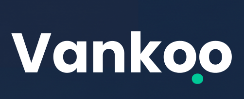<br>
  LiquiLabs (Vankoo)
</th>
<th style="border:1px solid #999; padding:4pt; text-align:left; vertical-align:bottom;">
  <br>
  Prestamype
</th>
<th style="border:1px solid #999; padding:4pt; text-align:left; vertical-align:bottom;">
  <br>
  Finsmart
</th>
<th style="border:1px solid #999; padding:4pt; text-align:left; vertical-align:bottom;">
  <br>
  Innova Funding
</th>
</tr>
</thead>
<tbody>
<tr>
<th rowspan="2" style="border:1px solid #999; padding:4pt; text-align:left; vertical-align:top;">Perfil</th>
<td style="border:1px solid #999; padding:4pt; vertical-align:top;">Overview</td>
<td style="border:1px solid #999; padding:4pt; vertical-align:top;">La nueva propuesta disruptiva que busca democratizar la liquidez mediante tecnología avanzada (Event-Driven Architecture), reducción de riesgo con IA y un enfoque único de sostenibilidad (Factoring Verde).</td>
<td style="border:1px solid #999; padding:4pt; vertical-align:top;">Es la Fintech líder en préstamos y factoring en Perú. Tienen una marca muy fuerte y ofrecen un ecosistema de productos (préstamos con garantía hipotecaria, cambio de divisas, factoring). Son el "banco" de las Fintech.</td>
<td style="border:1px solid #999; padding:4pt; vertical-align:top;">Competidor directo en el modelo de crowdfactoring. Se destacan por una plataforma muy digital, ágil y enfocada en la experiencia de usuario (UX) tanto para el inversionista como para la empresa.</td>
<td style="border:1px solid #999; padding:4pt; vertical-align:top;">Pioneros en el sector. Se enfocan mucho en la educación financiera y tienen alianzas fuertes para la integración de facturas electrónicas. Su perfil es más institucional/B2B.</td>
</tr>
<tr>
<td style="border:1px solid #999; padding:4pt; vertical-align:top;">Ventaja competitiva<br>¿Qué valor ofrece a los clientes?</td>
<td style="border:1px solid #999; padding:4pt; vertical-align:top;">Uso de IA real para scoring predictivo del pagador (no solo historial crediticio), arquitectura de eventos (trazabilidad total) y el distintivo de Factoring Verde (menores tasas por sostenibilidad).</td>
<td style="border:1px solid #999; padding:4pt; vertical-align:top;">Reputación y solidez. Al ser los líderes, generan confianza inmediata. Tienen un fondo grande para financiar operaciones si no hay inversionistas retail.</td>
<td style="border:1px solid #999; padding:4pt; vertical-align:top;">User Experience (UX). Su plataforma es extremadamente sencilla de usar. Conectan facturas muy rápido.</td>
<td style="border:1px solid #999; padding:4pt; vertical-align:top;">Integración B2B. Tienen una conexión muy fuerte con el ecosistema de facturación electrónica y CAVALI. Se posicionan como "La bolsa de facturas".</td>
</tr>
<tr>
<th rowspan="2" style="border:1px solid #999; padding:4pt; text-align:left; vertical-align:top;">Perfil de Marketing</th>
<td style="border:1px solid #999; padding:4pt; vertical-align:top;">Mercado objetivo</td>
<td style="border:1px solid #999; padding:4pt; vertical-align:top;">MYPES del sector servicios/comercio excluidas por la banca tradicional y el inversionista "consciente" (retail y ESG).</td>
<td style="border:1px solid #999; padding:4pt; vertical-align:top;">PYMES más consolidadas (que buscan tickets altos) e inversionistas conservadores/institucionales.</td>
<td style="border:1px solid #999; padding:4pt; vertical-align:top;">MYPES digitales y profesionales independientes. Inversionistas jóvenes (millennials/Gen Z).</td>
<td style="border:1px solid #999; padding:4pt; vertical-align:top;">Proveedores de grandes corporaciones y entidades del Estado.</td>
</tr>
<tr>
<td style="border:1px solid #999; padding:4pt; vertical-align:top;">Estrategias de marketing</td>
<td style="border:1px solid #999; padding:4pt; vertical-align:top;">Marketing de contenidos (Inbound) sobre educación financiera, SEO técnico y alianzas con certificadoras verdes.</td>
<td style="border:1px solid #999; padding:4pt; vertical-align:top;">Publicidad masiva (TV, radio, paneles), Google Ads agresivo, influencers de alto perfil.</td>
<td style="border:1px solid #999; padding:4pt; vertical-align:top;">Fuerte presencia en redes sociales (LinkedIn, Instagram), programa de referidos, email marketing automatizado.</td>
<td style="border:1px solid #999; padding:4pt; vertical-align:top;">Alianzas estratégicas con cámaras de comercio, eventos corporativos, PR en medios de negocios.</td>
</tr>
<tr>
<th rowspan="3" style="border:1px solid #999; padding:4pt; text-align:left; vertical-align:top;">Perfil de Producto</th>
<td style="border:1px solid #999; padding:4pt; vertical-align:top;">Productos &amp; Servicios</td>
<td style="border:1px solid #999; padding:4pt; vertical-align:top;">Crowdfactoring inteligente, dashboard de salud financiera, tokenización de facturas (fraccionamiento).</td>
<td style="border:1px solid #999; padding:4pt; vertical-align:top;">Factoring, préstamos con garantía hipotecaria, gestor de divisas, préstamos para capital de trabajo.</td>
<td style="border:1px solid #999; padding:4pt; vertical-align:top;">Crowdfactoring puro, adelanto de facturas.</td>
<td style="border:1px solid #999; padding:4pt; vertical-align:top;">Subasta de facturas, factoring electrónico.</td>
</tr>
<tr>
<td style="border:1px solid #999; padding:4pt; vertical-align:top;">Precios &amp; Costos</td>
<td style="border:1px solid #999; padding:4pt; vertical-align:top;">Modelo de comisión por éxito (aprox. 1% - 1.5% al empresario) + spread de rendimiento al inversionista. Costos operativos bajos por automatización (IA).</td>
<td style="border:1px solid #999; padding:4pt; vertical-align:top;">Tasas competitivas pero con costos de estructuración a veces elevados para la MYPE.</td>
<td style="border:1px solid #999; padding:4pt; vertical-align:top;">Comisiones transparentes, ticket de entrada bajo para inversionistas.</td>
<td style="border:1px solid #999; padding:4pt; vertical-align:top;">Modelo de subasta (la tasa la define el mercado/inversionista), lo que puede ser muy barato o muy caro según la demanda.</td>
</tr>
<tr>
<td style="border:1px solid #999; padding:4pt; vertical-align:top;">Canales de distribución (Web y/o Móvil)</td>
<td style="border:1px solid #999; padding:4pt; vertical-align:top;">Web App (PWA) responsiva.</td>
<td style="border:1px solid #999; padding:4pt; vertical-align:top;">Plataforma Web robusta y fuerza de ventas telefónica.</td>
<td style="border:1px solid #999; padding:4pt; vertical-align:top;">Plataforma Web y App Móvil.</td>
<td style="border:1px solid #999; padding:4pt; vertical-align:top;">Plataforma Web.</td>
</tr>
<tr>
<th rowspan="4" style="border:1px solid #999; padding:4pt; text-align:left; vertical-align:top;">Análisis SWOT</th>
<td style="border:1px solid #999; padding:4pt; vertical-align:top;">Fortalezas</td>
<td style="border:1px solid #999; padding:4pt; vertical-align:top;">Stack tecnológico moderno (escalable), propuesta de valor ética (Green), automatización de procesos.</td>
<td style="border:1px solid #999; padding:4pt; vertical-align:top;">Gran liquidez, marca reconocida, base de datos de clientes inmensa.</td>
<td style="border:1px solid #999; padding:4pt; vertical-align:top;">Agilidad tecnológica, comunidad de inversionistas muy activa, marca "cool" y cercana.</td>
<td style="border:1px solid #999; padding:4pt; vertical-align:top;">Conocimiento profundo de la normativa de facturas negociables, red de partners.</td>
</tr>
<tr>
<td style="border:1px solid #999; padding:4pt; vertical-align:top;">Debilidades</td>
<td style="border:1px solid #999; padding:4pt; vertical-align:top;">Marca nueva sin reputación (trust issue), base de inversionistas inicial nula (problema del huevo y la gallina).</td>
<td style="border:1px solid #999; padding:4pt; vertical-align:top;">Procesos pueden volverse lentos por el volumen; menos enfoque en micro-inversionistas (tickets de entrada más altos).</td>
<td style="border:1px solid #999; padding:4pt; vertical-align:top;">Dependencia alta del crowdfactoring (si los inversionistas se asustan, se seca la liquidez), riesgo de impago en facturas de menor calidad.</td>
<td style="border:1px solid #999; padding:4pt; vertical-align:top;">Interfaz de usuario (UI) menos moderna que Finsmart/LiquiLabs, curva de aprendizaje para el usuario nuevo.</td>
</tr>
<tr>
<td style="border:1px solid #999; padding:4pt; vertical-align:top;">Oportunidades</td>
<td style="border:1px solid #999; padding:4pt; vertical-align:top;">Creciente interés en inversiones de impacto (ESG), saturación de la banca tradicional.</td>
<td style="border:1px solid #999; padding:4pt; vertical-align:top;">Expansión internacional, compra de competidores pequeños.</td>
<td style="border:1px solid #999; padding:4pt; vertical-align:top;">Alianzas con software de contabilidad o facturación electrónica.</td>
<td style="border:1px solid #999; padding:4pt; vertical-align:top;">Convertirse en el motor de factoring de otros bancos (SaaS).</td>
</tr>
<tr>
<td style="border:1px solid #999; padding:4pt; vertical-align:top;">Amenazas</td>
<td style="border:1px solid #999; padding:4pt; vertical-align:top;">Regulaciones estrictas de la SBS/SMV sobre "tokenización", reacción agresiva de bancos bajando tasas.</td>
<td style="border:1px solid #999; padding:4pt; vertical-align:top;">Fintechs de nicho que ofrezcan mejor UX o procesos más rápidos (como LiquiLabs).</td>
<td style="border:1px solid #999; padding:4pt; vertical-align:top;">Entrada de bancos digitales al sector de factoring con tasas subsidiadas.</td>
<td style="border:1px solid #999; padding:4pt; vertical-align:top;">Que la competencia simplifique tanto el proceso que su modelo de "subasta" parezca complejo.</td>
</tr>
</tbody>
</table>

### 2.1.2. Estrategias y tácticas frente a competidores

**Diferenciación por Scoring Predictivo e IA**

* **Estrategia:** Posicionar a LiquiLabs no solo como un intermediario de dinero, sino como una plataforma de tecnología de riesgo superior que ofrece mayor seguridad que el crowdfactoring tradicional.
* **Tácticas:**
  * Publicar un "Reporte de Salud del Pagador" generado por IA para cada factura, dándole al inversionista una métrica de riesgo que los competidores no ofrecen.
  * Implementar un sistema de notificaciones que avise a los inversionistas sobre oportunidades de financiamiento en milisegundos.

**Nicho de Impacto: El "Factoring Verde**

* **Estrategia:** Dominar el segmento de Inversión Responsable (ESG), capturando al inversionista consciente y a las MYPES con buenas prácticas, donde los competidores no tienen un enfoque claro.
* **Tácticas:**
  * **Certificación digital:** Otorgar un sello de "Empresa de Impacto" a las MYPES que financien facturas de sectores sostenibles.
  * **Tasa Preferencial Verde:** Reducir la comisión de éxito en un 0.25% para proyectos que cumplan criterios ambientales, compensándolo con una mayor rapidez de fondeo por parte de inversionistas interesados en ESG.


**Democratización mediante la Tokenización (Fraccionamiento)**

* **Estrategia:** Resolver el "problema del huevo y la gallina" bajando la barrera de entrada para inversionistas retail a niveles que Prestamype o Innova Funding no atienden por sus costos operativos.
* **Tácticas:**
  * Permitir inversiones desde montos mínimos (ej. S/ 50 o S/ 100) gracias al fraccionamiento de facturas.
  * Crear una "Billetera de Reinversión Automática" que use la IA para diversificar el capital del inversionista en múltiples micro-fracciones de facturas automáticamente.


**Transparencia y Trazabilidad Total**

* **Estrategia:** Mitigar la debilidad de ser una "marca nueva sin reputación" mediante una transparencia técnica radical que los competidores antiguos (con sistemas legados) no pueden replicar.
* **Tácticas:**
  * **Dashboard de Trazabilidad:** Permitir que el empresario y el inversionista vean en qué etapa exacta está la factura (validación SUNAT, confirmación CAVALI, fondeo, pago) en tiempo real.
  * **Auditoría de Algoritmos:** Publicar resúmenes ejecutivos sobre cómo funciona la IA de scoring para generar confianza técnica frente a la opacidad de los modelos bancarios tradicionales.


**Crecimiento por Alianzas de Ecosistema (Inbound Tech)**

* **Estrategia:** En lugar de competir en gasto publicitario masivo con Prestamype, integrarse directamente donde la factura nace.
* **Tácticas:**
  * **API para ERPs:** Ofrecer integración gratuita a softwares de contabilidad para que las MYPES puedan descontar facturas con un solo clic desde su propio sistema.
  * **Webinars de "Finanzas Sostenibles para MYPES":** Atraer tráfico mediante educación sobre cómo la sostenibilidad puede reducir sus costos de financiamiento.
<hr class="page-break">

## 2.2. Entrevistas

Para validar las suposiciones e hipótesis planteadas en el Lean UX Process, el equipo llevó a cabo entrevistas semiestructuradas con representantes de los dos segmentos objetivo de Vankoo: los empresarios de micro y pequeñas empresas que requieren liquidez y los inversionistas minoristas que aportan el capital. Se realizaron 3 entrevistas por segmento, todas registradas en video previo consentimiento del participante.

### 2.2.1. Diseño de entrevistas

A continuación se presenta el guión de preguntas elaborado para cada segmento objetivo. Cada uno consta de 12 preguntas principales, organizadas en cuatro bloques: contexto y perfil, problemática, perfil digital y objetivos, y validación de solución. Las preguntas complementarias que acompañan a cada una se utilizan como repregunta según lo amerite la respuesta del entrevistado.

**Segmento 1: Empresarios de Micro y Pequeñas Empresas (MYPES)**

**Preguntas de contexto y perfil (1-3)**

1. ¿Cuál es su nombre, edad y en qué distrito vive actualmente?
   - ¿Con quién vive? ¿Tiene pareja o hijos que dependan del negocio?
   - ¿Cuál es su formación académica y cuántos años lleva al frente de su empresa?

2. ¿A qué se dedica su empresa y cómo está organizada? ¿Cuántos trabajadores tiene, hace cuánto opera formalmente y cuál es su facturación mensual aproximada?
   - ¿Quiénes son sus principales clientes: empresas grandes, entidades del Estado, consumidor final?
   - ¿Qué porcentaje de sus ventas cobra al contado y qué porcentaje al crédito?

3. ¿Cómo lleva hoy el control de sus cuentas por cobrar y de su facturación electrónica?
   - ¿Usa algún sistema, un Excel, o lo maneja un contador externo?
   - ¿Quién decide en su empresa cuándo y cómo conseguir dinero: usted solo, un socio, su contador?

**Preguntas sobre la problemática (4-8)**

4. Cuénteme la última vez que se quedó sin efectivo para cubrir un pago importante —planilla, proveedores, SUNAT—. ¿Qué ocurrió exactamente y cómo lo resolvió?
   - ¿Cuánto tiempo le tomó conseguir ese dinero?
   - ¿Qué dejó de hacer en el negocio mientras tanto?

5. ¿Cuál es el plazo de pago real que le imponen sus principales clientes y qué tan seguido se atrasan respecto a lo pactado?
   - ¿Ha podido negociar ese plazo alguna vez? ¿Qué pasó cuando lo intentó?
   - ¿Qué hace cuando un cliente importante se atrasa: le insiste, lo deja pasar, deja de venderle?

6. ¿Ha intentado obtener financiamiento formal en los últimos dos años? ¿Con quién, qué le pidieron, cuánto demoró y cómo terminó?
   - Si se lo negaron, ¿le explicaron por qué?
   - ¿Ha recurrido a préstamos de familiares, tarjetas de crédito o prestamistas informales? ¿En qué circunstancias?

7. ¿Ha usado alguna vez factoring o descuento de facturas?
   - Si lo usó: ¿qué parte del proceso le resultó más engorrosa —la conformidad del cliente, el registro en CAVALI, la firma de documentos, la espera del desembolso—?
   - Si nunca lo usó: ¿qué lo ha detenido? ¿Le preocupa que su cliente se entere de que cedió la factura?

8. La última vez que consiguió dinero rápido, ¿cuánto le costó en total —tasa, comisiones, tiempo invertido— y cómo se enteró de esas condiciones?
   - ¿Sintió que entendía completamente lo que iba a pagar antes de firmar?
   - ¿Con qué comparó ese costo para decidir si le convenía?

**Preguntas de perfil digital y objetivos (9-10)**

9. ¿Qué dispositivos usa para gestionar su negocio y por qué canal prefiere que le respondan un tema financiero: WhatsApp, llamada, correo, una aplicación?
   - ¿Qué aplicaciones bancarias o de gestión usa a diario y cuál le parece la mejor hecha?
   - Cuando evalúa un servicio financiero nuevo, ¿en quién confía para que se lo recomiende: su contador, su gremio o cámara de comercio, otros empresarios, redes sociales?

10. ¿Cuáles son sus objetivos para la empresa en los próximos 12 meses y qué es lo que más lo frustra hoy de manejar el dinero del negocio?
    - ¿Qué oportunidad concreta ha tenido que rechazar por falta de capital de trabajo?

**Preguntas de validación de solución (11-12)**

11. Si pudiera convertir una factura ya emitida en efectivo en menos de 48 horas, sin tomar deuda y siendo evaluado por la solvencia de su cliente en lugar de la suya, ¿en qué situación concreta de los últimos meses la habría usado?
    - ¿Qué porcentaje del monto de la factura consideraría razonable ceder por ese servicio y a partir de qué porcentaje ya no le convendría?
    - ¿Preferiría registrar la factura usted mismo o que el sistema la lea automáticamente del PDF de SUNAT? ¿Cuánto tiempo le dedica hoy a ese tipo de trámite?

12. ¿Qué le generaría desconfianza al operar con una plataforma nueva que no es un banco y qué necesitaría ver antes de hacer su primera operación?
    - ¿Le serviría poder ver en pantalla en qué etapa exacta está su factura —validación, conformidad, fondeo, pago— o le basta con que le avisen al final?
    - Si le ofrecieran una comisión menor por acreditar prácticas sostenibles en su empresa, ¿lo consideraría un beneficio real o un requisito adicional? ¿Qué tendría que hacer para que le valga la pena?

**Segmento 2: Inversionistas Minoristas (Personas Naturales)**

**Preguntas de contexto y perfil (1-3)**

1. ¿Cuál es su nombre, edad y en qué distrito vive actualmente?
   - ¿Con quién vive? ¿Tiene pareja o hijos?
   - ¿Cuál es su formación académica y a qué se dedica actualmente?

2. ¿Cómo distribuye hoy sus ahorros? ¿Qué instrumentos usa —cuenta de ahorros, depósito a plazo, fondos mutuos, bolsa, criptomonedas, préstamos a conocidos, negocio propio—?
   - ¿Desde hace cuánto invierte y qué monto suele destinar a una sola operación?
   - ¿Qué porcentaje de sus ingresos logra ahorrar al mes?

3. Cuénteme cómo tomó su última decisión de inversión: ¿qué revisó, cuánto tiempo le dedicó y a quién consultó antes de decidir?
   - ¿Qué información terminó siendo determinante?
   - ¿Sigue a alguna marca, creador de contenido o comunidad de finanzas personales? ¿Cuál y por qué le da credibilidad?

**Preguntas sobre la problemática (4-8)**

4. ¿Qué es lo que más le molesta de las opciones de inversión que usa hoy?
   - ¿Le incomoda más el rendimiento bajo, el monto mínimo de entrada, el plazo en que su dinero queda inmovilizado o no entender en qué está invertido?
   - ¿Qué rendimiento anual considera que "vale la pena" para mover su dinero de donde está hoy?

5. Cuénteme una vez en que una inversión no salió como esperaba o perdió dinero. ¿Cómo se enteró, qué le explicaron y qué hizo después?
   - ¿Qué habría necesitado saber antes para evitarlo?

6. ¿Ha invertido alguna vez en factoring, crowdfunding o alguna plataforma fintech?
   - Si sí: ¿en cuál, cuánto puso la primera vez y qué lo hizo confiar lo suficiente para poner ese primer monto?
   - Si no: ¿qué lo ha detenido? ¿Conoce a alguien que lo haya hecho?

7. Antes de poner su dinero en algo, ¿cómo evalúa el riesgo? ¿Qué datos concretos busca y cuáles nunca logra encontrar?
   - Si una plataforma le mostrara una calificación de riesgo, ¿le creería? ¿Qué necesitaría que le explicaran sobre cómo se calcula?

8. ¿Con qué frecuencia revisa el estado de sus inversiones y qué es lo primero que mira?
   - ¿Qué haría si pasaran dos semanas sin poder ver en qué estado está su dinero?
   - ¿Cómo esperaría que le comuniquen una mala noticia, por ejemplo un retraso en un pago?

**Preguntas de perfil digital y objetivos (9-10)**

9. ¿Desde qué dispositivo maneja su dinero y qué aplicaciones financieras usa con más frecuencia?
   - ¿Prefiere gestionar una inversión desde el celular o desde una computadora? ¿Por qué?
   - ¿En qué canales se informa sobre finanzas: YouTube, LinkedIn, TikTok, podcasts, grupos de WhatsApp, su banco?

10. ¿Cuál es su objetivo financiero para los próximos uno a tres años y cuánto dinero estaría dispuesto a mantener inmovilizado para lograrlo?
    - ¿Por cuánto tiempo como máximo aceptaría no disponer de ese dinero?
    - ¿Qué lo haría sentir que está invirtiendo bien y no solamente "guardando" su dinero?

**Preguntas de validación de solución (11-12)**

11. Si pudiera invertir desde S/ 100 comprando fracciones de facturas de distintas empresas, con retorno del capital entre 30 y 90 días, ¿cuánto destinaría en su primera operación y qué tendría que pasar para que repita?
    - ¿Preferiría elegir usted mismo cada factura o que el sistema distribuya automáticamente su dinero entre varias para diversificar el riesgo?
    - ¿Qué información necesitaría ver de cada factura antes de invertir: el nombre de la empresa que paga, su historial, el sector, el plazo, la calificación de riesgo?

12. ¿Qué esperaría que ocurra si la empresa que debe pagar la factura no paga a tiempo y qué tan claro debería estar eso antes de invertir?
    - ¿Le daría más confianza poder rastrear cada movimiento de su dinero paso a paso en la plataforma o le resulta indiferente mientras le paguen?
    - Si una factura correspondiera a una empresa con prácticas sostenibles certificadas, ¿aceptaría un rendimiento algo menor por financiarla o esperaría exactamente el mismo retorno?

### 2.2.2. Registro de entrevistas

<!-- 3 entrevistas por segmento. Por cada una: nombres, apellidos, edad, distrito, screenshot de un cuadro del video, URL del video en Microsoft Stream, timing donde inicia y duración, más un resumen descriptivo de las respuestas. -->
<!-- Assets: ./assets/cap2-requirements-elicitation/entrevistas/ -->

#### Segmento 1: Empresarios de Micro y Pequeñas Empresas (MYPES)

**Entrevista 1**

| Atributo | Detalle                                                                                  |
| :---: |:-----------------------------------------------------------------------------------------|
| Nombre | Irving Vergara                                                                           |
| Edad | 22                                                                                       |
| Distrito | San Juan de Lurigancho                                                                   |
| Ocupación | Dueño de Metalmecanica                                                                   |
| Fecha de entrevista | 08/09/2026                                                                               |
| Timing de inicio | 00:00 - 8:58                                                                             |
| Duración | 8:58 minutos                                                                             |
| Enlace a la grabación | [*Ver en Microsoft Stream*](https://upcedupe-my.sharepoint.com/:v:/g/personal/u20221g044_upc_edu_pe/IQBH1rA-DTogSZAoQrPM1UIOAWCjy1cb2NoZaTQaVktAxrk?e=WJmOfj&nav=eyJyZWZlcnJhbEluZm8iOnsicmVmZXJyYWxBcHAiOiJTdHJlYW1XZWJBcHAiLCJyZWZlcnJhbFZpZXciOiJTaGFyZURpYWxvZy1MaW5rIiwicmVmZXJyYWxBcHBQbGF0Zm9ybSI6IldlYiIsInJlZmVycmFsTW9kZSI6InZpZXcifSwicGxheWJhY2tPcHRpb25zIjp7InN0YXJ0VGltZUluU2Vjb25kcyI6MC42OX19)                                                            |
| Captura de pantalla de la grabación |  |
| Resumen |  Empresario del sector metalmecánico a cargo de la gestión comercial y operativa de su taller, donde equilibra proyectos al contado con contratos pagados a crédito. Identifica como principal limitación la brecha de liquidez que generan los plazos de cobranza de 30 a 60 días o más, impidiéndole comprar materia prima de forma inmediata para cerrar nuevos contratos y afectando el cumplimiento con trabajadores y proveedores. Valora de forma muy positiva un mecanismo ágil de anticipo de cobro con procesamiento automatizado de facturas electrónicas, condicionado a contar con claridad absoluta sobre el costo total de la operación, respaldo de seguridad institucional y trazabilidad transparente sobre el estado de aprobación y desembolso de los fondos.                                                                                        |

**Entrevista 2**

| Atributo | Detalle                                                                                  |
| :---: |:-----------------------------------------------------------------------------------------|
| Nombre | Diego Melendez                                                                           |
| Edad | 26                                                                                       |
| Distrito | San Miguel                                                                               |
| Ocupación | Dueño de TechnoRed                                                                       |
| Fecha de entrevista | 08/09/2026                                                                               |
| Timing de inicio | 8:58 - 17:30                                                                             |
| Duración | 8:32                                                                                     |
| Enlace a la grabación | [*Ver en Microsoft Stream*](https://upcedupe-my.sharepoint.com/:v:/g/personal/u20221g044_upc_edu_pe/IQBH1rA-DTogSZAoQrPM1UIOAWCjy1cb2NoZaTQaVktAxrk?e=Guig5U&nav=eyJyZWZlcnJhbEluZm8iOnsicmVmZXJyYWxBcHAiOiJTdHJlYW1XZWJBcHAiLCJyZWZlcnJhbFZpZXciOiJTaGFyZURpYWxvZy1MaW5rIiwicmVmZXJyYWxBcHBQbGF0Zm9ybSI6IldlYiIsInJlZmVycmFsTW9kZSI6InZpZXcifSwicGxheWJhY2tPcHRpb25zIjp7InN0YXJ0VGltZUluU2Vjb25kcyI6NTM5LjF9fQ%3D%3D)                                                            |
| Captura de pantalla de la grabación |  |
| Resumen | Empresario y técnico en redes con cuatro años administrando su propia empresa de servicios tecnológicos, cuyo volumen de ventas se divide entre pagos al contado y facturas a crédito. Su principal obstáculo radica en el desfase del flujo de caja originado por clientes que extienden sus pagos entre 45 y 60 días, lo que le impide asumir nuevos proyectos o cubrir planillas y proveedores a tiempo, forzándolo a recurrir a financiamientos inmediatos pero costosos como las tarjetas de crédito. Valora de forma muy positiva una alternativa de liquidez en menos de 48 horas basada en la lectura automática de facturas electrónicas, siempre que la plataforma ofrezca total transparencia en comisiones netas, tiempos de desembolso y un seguimiento visual en tiempo real de cada etapa del proceso.                                                                                         |

**Entrevista 3**

| Atributo | Detalle                                                                                  |
| :---: |:-----------------------------------------------------------------------------------------|
| Nombre | Thomas Bernardo                                                                          |
| Edad | 20                                                                                       |
| Distrito | Chorrillos                                                                               |
| Ocupación | Socio de empresa de servicio tecnico                                                     |
| Fecha de entrevista | 08/09/2026                                                                               |
| Timing de inicio | 17:30 - 27:30                                                                            |
| Duración | 9:58                                                                                     |
| Enlace a la grabación | [*Ver en Microsoft Stream*](https://upcedupe-my.sharepoint.com/:v:/g/personal/u20221g044_upc_edu_pe/IQBH1rA-DTogSZAoQrPM1UIOAWCjy1cb2NoZaTQaVktAxrk?e=RYPQOg&nav=eyJyZWZlcnJhbEluZm8iOnsicmVmZXJyYWxBcHAiOiJTdHJlYW1XZWJBcHAiLCJyZWZlcnJhbFZpZXciOiJTaGFyZURpYWxvZy1MaW5rIiwicmVmZXJyYWxBcHBQbGF0Zm9ybSI6IldlYiIsInJlZmVycmFsTW9kZSI6InZpZXcifSwicGxheWJhY2tPcHRpb25zIjp7InN0YXJ0VGltZUluU2Vjb25kcyI6MTA1MS40M319)                                                            |
| Captura de pantalla de la grabación |  |
| Resumen |  Socio y administrador de una microempresa de soporte técnico para laptops, computadoras y celulares, a cargo de dos colaboradores y con un margen de ingresos mensual modesto de entre 2,000 y 4,000 soles. Gestiona el registro contable y las cuentas pendientes mediante hojas de cálculo manuales en Excel, enfrentando como principal obstáculo los desfases de liquidez derivados de clientes que demoran entre 15 y 30 días en liquidar sus servicios. Esta falta de caja inmediata lo ha obligado a recurrir a soluciones de emergencia poco convenientes, como microcréditos digitales con intereses cercanos al 20%, un costo financiero desproporcionado que además descarta la opción de adquirir deudas bancarias tradicionales de mayor escala. Valora de forma muy positiva la posibilidad de incorporar el factoring para anticipar el cobro de sus facturas a cambio de una comisión transparente y acotada, señalando que adoptaría esta solución si la plataforma demuestra procesos nítidos, directos y sin costos ocultos frente a las alternativas de endeudamiento rápido.                                                                                        |

<hr class="page-break">

#### Segmento 2: Inversionistas Minoristas (Personas Naturales)

**Entrevista 4**

| Atributo | Detalle                                                                                  |
| :---: |:-----------------------------------------------------------------------------------------|
| Nombre | Alessandro Hesse                                                                         |
| Edad | 22                                                                                       |
| Distrito | Surquillo                                                                                |
| Ocupación | Estudiante                                                                               |
| Fecha de entrevista | 08/09/2026                                                                               |
| Timing de inicio | 27:30 - 40:15                                                                            |
| Duración | 12:45                                                                                    |
| Enlace a la grabación | [*Ver en Microsoft Stream*](https://upcedupe-my.sharepoint.com/:v:/g/personal/u20221g044_upc_edu_pe/IQBH1rA-DTogSZAoQrPM1UIOAWCjy1cb2NoZaTQaVktAxrk?e=0XdsHP&nav=eyJyZWZlcnJhbEluZm8iOnsicmVmZXJyYWxBcHAiOiJTdHJlYW1XZWJBcHAiLCJyZWZlcnJhbFZpZXciOiJTaGFyZURpYWxvZy1MaW5rIiwicmVmZXJyYWxBcHBQbGF0Zm9ybSI6IldlYiIsInJlZmVycmFsTW9kZSI6InZpZXcifSwicGxheWJhY2tPcHRpb25zIjp7InN0YXJ0VGltZUluU2Vjb25kcyI6MTY1MC40OX19)                                                            |
| Captura de pantalla de la grabación |  |
| Resumen | Estudiante universitario de Ciencias de la Computación y aficionado a los mercados financieros, habituado a colocar tickets de entre 1,000 y 1,500 soles en vehículos tradicionales como depósitos a plazo fijo. Identifica como principal limitación el bajo rendimiento de la banca convencional frente a la rigidez de mantener su dinero inmovilizado por largos periodos, sumado a la desconfianza generada por experiencias negativas previas en fondos mutuos debido a la volatilidad imprevista. Considera que un rendimiento en torno al 8% anual justificaría la búsqueda de nuevos instrumentos. Valora de forma muy positiva incursionar en el factoring mediante la compra fraccionada de facturas por cobrar, siempre y cuando la plataforma tecnológica ofrezca respaldo institucional verificable, reglas claras sobre la gestión del riesgo de cobro y una estricta transparencia operativa que garantice el retorno puntual de los rendimientos pactados.                                                                                         |

**Entrevista 5**

| Atributo | Detalle                                                                                  |
| :---: |:-----------------------------------------------------------------------------------------|
| Nombre | Leicy Cahuana                                                                            |
| Edad | 22                                                                                       |
| Distrito | San Juan de Lurigancho                                                                   |
| Ocupación | Estudiante                                                                               |
| Fecha de entrevista | 07/09/2026                                                                               |
| Timing de inicio | 40:15 - 55:19                                                                            |
| Duración | 15:04                                                                                    |
| Enlace a la grabación | [*Ver en Microsoft Stream*](https://upcedupe-my.sharepoint.com/:v:/g/personal/u20221g044_upc_edu_pe/IQBH1rA-DTogSZAoQrPM1UIOAWCjy1cb2NoZaTQaVktAxrk?e=FHk57K&nav=eyJyZWZlcnJhbEluZm8iOnsicmVmZXJyYWxBcHAiOiJTdHJlYW1XZWJBcHAiLCJyZWZlcnJhbFZpZXciOiJTaGFyZURpYWxvZy1MaW5rIiwicmVmZXJyYWxBcHBQbGF0Zm9ybSI6IldlYiIsInJlZmVycmFsTW9kZSI6InZpZXcifSwicGxheWJhY2tPcHRpb25zIjp7InN0YXJ0VGltZUluU2Vjb25kcyI6MjQxNS45OX19)                                                            |
| Captura de pantalla de la grabación |  |
| Resumen |  Estudiante y administradora de un negocio del rubro de snacks, con un perfil de inversión orientado a la colocación directa de préstamos personales de envergadura relevante (de 30,000 a 150,000 soles) entre su red de contactos. Descarta las alternativas bancarias tradicionales por considerarlas poco rentables y tras haber enfrentado la incomodidad de mantener su capital retenido en depósitos a plazo sin suficiente flexibilidad; no obstante, reconoce que prestar a conocidos demanda un proceso de evaluación manual, largo y desgastante para mitigar el riesgo de impago. Constantemente informada a través de medios digitales especializados como podcasts y YouTube, valora de forma muy positiva la transición hacia una plataforma de factoring que fundamente la seguridad crediticia con evidencia técnica, ofrezca asignación automatizada de fondos para diversificar el riesgo de su cartera y demuestre transparencia rigurosa ante retrasos en la cobranza, respaldada por protocolos de solución claros y estructurados.                                                                                        |

**Entrevista 6**

| Atributo | Detalle                                                                                  |
| :---: |:-----------------------------------------------------------------------------------------|
| Nombre | Kalet Esteban                                                                            |
| Edad | 20                                                                                       |
| Distrito | Ate                                                                                      |
| Ocupación | Estudiante                                                                               |
| Fecha de entrevista | 07/09/2026                                                                               |
| Timing de inicio | 55:19 - 1:06:47                                                                          |
| Duración | 11:28                                                                                    |
| Enlace a la grabación | [*Ver en Microsoft Stream*](https://upcedupe-my.sharepoint.com/:v:/g/personal/u20221g044_upc_edu_pe/IQBH1rA-DTogSZAoQrPM1UIOAWCjy1cb2NoZaTQaVktAxrk?e=i6G1cy&nav=eyJyZWZlcnJhbEluZm8iOnsicmVmZXJyYWxBcHAiOiJTdHJlYW1XZWJBcHAiLCJyZWZlcnJhbFZpZXciOiJTaGFyZURpYWxvZy1MaW5rIiwicmVmZXJyYWxBcHBQbGF0Zm9ybSI6IldlYiIsInJlZmVycmFsTW9kZSI6InZpZXcifSwicGxheWJhY2tPcHRpb25zIjp7InN0YXJ0VGltZUluU2Vjb25kcyI6MzMyMC43NX19)                                                            |
| Captura de pantalla de la grabación |  |
| Resumen |  Estudiante de Ingeniería de Software y practicante que se encuentra dando sus primeros pasos en el ámbito de las inversiones con montos de entrada pequeños mediante fondos mutuos de banca tradicional. Señala como principal barrera la complejidad del lenguaje financiero técnico y la falta de claridad respecto al destino exacto y nivel de riesgo de su capital, lo que le genera desconfianza ante plataformas o instrumentos no regulados como el factoring. Valora de forma muy positiva la posibilidad de invertir desde montos mínimos accesibles con diversificación asistida, exigiendo trazabilidad continua del estado de las facturas, protocolos nítidos ante retrasos o impagos y una rentabilidad superior a la de una cuenta de ahorros que justifique el riesgo asumido.                                                                                        |

### 2.2.3. Análisis de entrevistas

Las entrevistas en profundidad se llevaron a cabo entre el 7 y el 8 de septiembre de 2026 en Lima Metropolitana, contando con la participación de seis perfiles clave divididos equitativamente en dos grupos de interés: tres dueños/administradores de micro y pequeñas empresas (MYPES) y tres inversionistas minoristas (personas naturales). El propósito principal fue contrastar las dinámicas actuales de cobranza, liquidez e inversión, identificar las fricciones operativas más severas y validar la propuesta de valor de *Vankoo* como solución fintech orientada al adelanto y financiamiento participativo de facturas negociables.

---

**Segmento 1: Empresarios de Micro y Pequeñas Empresas (MYPES)**

**Características objetivas:**
* Emisión regular de facturación a crédito con plazos de cobro que oscilan entre 15 y 60 días: **3/3 (100%)**
* Empleo de herramientas manuales y desconectadas (hojas de cálculo en Excel y seguimiento por mensajería) para el control de cuentas por cobrar: **3/3 (100%)**
* Uso predominante del smartphone para la gestión comercial y coordinación del día a día: **3/3 (100%)**
* Recurrencia a mecanismos financieros costosos o de emergencia (tarjetas de crédito, préstamos personales o microcréditos digitales) ante la falta de caja: **3/3 (100%)**

**Características subjetivas:**
* Perciben el descalce de flujo de caja como una amenaza directa para asumir nuevos contratos y pagar nóminas/proveedores: **3/3 (100%)**
* Frustración ante la lentitud, requisitos excesivos o tasas abusivas de la banca tradicional y los créditos inmediatos: **3/3 (100%)**
* Alta disposición a adoptar el descuento de facturas si el desembolso es ágil (menor a 48 horas) y con comisiones claras: **3/3 (100%)**
* Exigen transparencia radical en el costo neto y seguimiento en tiempo real del ciclo de validación de cada comprobante: **3/3 (100%)**
* Desconocimiento previo sobre el funcionamiento técnico-legal del factoring, lo que genera cautela inicial frente a nuevos actores no bancarios: **2/3 (66.7%)**

---

**Segmento 2: Inversionistas Minoristas (Personas Naturales)**

**Características objetivas:**
* Uso habitual de canales y aplicaciones móviles (banca digital, billeteras electrónicas) para la administración de su dinero: **3/3 (100%)**
* Consumo recurrente de canales digitales (YouTube, redes sociales, podcasts) para informarse sobre finanzas y mercados: **3/3 (100%)**
* Experiencia previa con alternativas de inversión (depósitos a plazo, fondos mutuos o préstamos entre particulares): **3/3 (100%)**
* Respaldo por activos o empresas con historial crediticio formal como criterio clave de evaluación de riesgo: **3/3 (100%)**

**Características subjetivas:**
* Inconformidad con los bajos rendimientos de la banca tradicional frente a la falta de liquidez por inmovilización prolongada del capital: **3/3 (100%)**
* Reclaman claridad total sobre los escenarios de riesgo, solvencia del pagador y protocolos de cobranza ante demoras o impagos: **3/3 (100%)**
* Interés en participar del factoring mediante tickets accesibles o esquemas fraccionados con retorno a corto/mediano plazo (30 a 90 días): **3/3 (100%)**
* Inclinación por la diversificación automatizada de sus fondos para mitigar el riesgo sin complejizar la toma de decisiones: **3/3 (100%)**
* Escepticismo inicial hacia entidades no reguladas o plataformas fintech desconocidas, condicionando su ingreso a la fiabilidad de la plataforma: **3/3 (100%)**

---

A partir del cruce de hallazgos de ambos segmentos, se consolidan tres ejes estratégicos que fundamentan y orientan la construcción de *Vankoo*:

1. **La brecha de liquidez como freno sistémico:** Existe una clara complementariedad entre los dos frentes. Por un lado, las MYPES sufren asfixia financiera porque su capital queda atrapado en facturas por cobrar a 30, 45 o 60 días, perdiendo oportunidades de compra de insumos y crecimiento. Por el otro, los pequeños inversionistas cuentan con excedentes de liquidez pero se sienten estancados ante productos bancarios de escaso rendimiento y plazos rígidos. *Vankoo* actúa como puente directo entre ambas necesidades, inyectando liquidez ágil a la microempresa mediante el capital atomizado de la comunidad inversora.

2. **Validación de la propuesta de valor según segmento:**
    * **Para la MYPE:** *Vankoo* no representa un endeudamiento bancario asfixiante ni una tasa usurera de emergencia; es una herramienta ágil para convertir sus cuentas por cobrar en efectivo operativo en menos de 48 horas sin comprometer el balance del negocio.
    * **Para el Inversionista:** *Vankoo* no es un instrumento complejo de alto riesgo especulativo; es una alternativa tangible para rentabilizar ahorros a corto plazo, respaldada por comprobantes comerciales reales y con rendimientos superiores a los de las cuentas de ahorro tradicionales.

3. **Criterios técnicos y de diseño innegociables:**
    * **Cero fricción y automatización de datos:** La plataforma debe contar con lectura automática de facturas electrónicas (vía XML/SUNAT) para eliminar el tipeo manual en los empresarios y facilitar interfaces limpias y comprensibles para los inversionistas.
    * **Trazabilidad y estados en tiempo real:** Es imprescindible habilitar un panel visual donde la MYPE supervise cada hito del comprobante (validación, oferta, fondeo y desembolso) y el inversionista visualice el estado de su capital, rendimientos ganados y calendario estimado de retorno.
    * **Transparencia absoluta en costos y riesgos:** Desglose visible del costo total de la operación (comisiones netas y descuentos) sin letras pequeñas para el cedente, junto con métricas de riesgo explicadas en lenguaje sencillo y protocolos claros de cobranza para el inversionista.

**Conclusión:**
Los resultados validan sólidamente la viabilidad y necesidad de una plataforma como *Vankoo*. El núcleo del problema no reside en la falta de solvencia comercial ni en la ausencia de ahorristas dispuestos a invertir, sino en la **ineficiencia del sistema financiero tradicional para conectar ambas partes con agilidad, costos justos y tecnología accesible**. La solución debe priorizar la simplificación operativa, la transparencia informativa y una rigurosa gestión del riesgo crediticio para consolidar la confianza de ambos extremos del ecosistema.
<hr class="page-break">

## 2.3. Needfinding

El proceso de Needfinding se desarrolló a partir de la información recopilada en las entrevistas y del análisis de la competencia, con el objetivo de identificar los problemas, necesidades y oportunidades reales de los segmentos objetivo. A partir de estos hallazgos, se construyeron los siguientes artefactos que permiten comprender en profundidad a los usuarios de Vankoo, sus tareas, sus experiencias y sus emociones.

### 2.3.1. User Personas

A partir del análisis de entrevistas, del estudio de la competencia y de los segmentos objetivo identificados, se definieron dos User Personas que representan a los principales usuarios de Vankoo. Cada ficha sintetiza los objetivos, frustraciones y comportamientos más recurrentes de su segmento, y sirve de referencia para la priorización de funcionalidades y el diseño de las historias de usuario.

**User Persona MYPE**

User persona del segmento objetivo MYPES: representada por **Carlos, el empresario MYPE**, dueño de una micro o pequeña empresa que busca obtener liquidez inmediata de forma rápida y simple para la operatividad de su negocio, sin necesidad de conocimientos financieros avanzados.

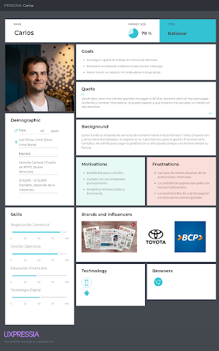

**User Persona Inversionista**

User persona del segmento de Inversionistas: representada por **Sofía, la inversionista**, profesional interesada en invertir su capital en MYPEs con la expectativa de obtener rentabilidad, y que valora la transparencia, la seguridad y la información confiable de cada oportunidad.


### 2.3.2. User Task Matrix

A continuación, se presenta el User task matrix donde se compara las tareas de cada segmento.

| Tareas | Empresario MYPE (Carlos) Frecuencia | Empresario MYPE (Carlos) Importancia | Inversionista (Sofía) Frecuencia | Inversionista (Sofía) Importancia |
|---|---|---|---|---|
| Monitorear el flujo de caja disponible | Alta | Alta | Media | Media |
| Gestionar la cobranza de facturas | Alta | Alta | Baja | Baja |
| Buscar fuentes de financiamiento | Media | Alta | Baja | Baja |
| Evaluar oportunidades de inversión | Baja | Baja | Alta | Alta |
| Analizar el riesgo de contraparte | Media | Alta | Alta | Alta |
| Ejecutar pagos o transferencias | Alta | Alta | Media | Alta |
| Gestionar documentos tributarios | Alta | Media | Baja | Baja |
| Monitorear el retorno de capital | Baja | Baja | Alta | Alta |
| Buscar educación financiera | Baja | Media | Media | Media |

A partir de la matriz presentada, se identifican los siguientes puntos claves que fundamentan el diseño de Vankoo:  
Mientras Carlos (MYPE) concentra sus tareas de mayor frecuencia e importancia en la gestión reactiva de cobranza y flujo de caja para garantizar la operatividad de su negocio, Sofía (Inversionista) realiza tareas proactivas de evaluación y monitoreo de rentabilidad. A pesar de estas diferencias en sus objetivos, ambos perfiles coinciden en asignar una importancia crítica al análisis de riesgo y la ejecución segura de transacciones, lo que confirma que la propuesta de valor de Vankoo reside en conectar eficazmente la necesidad urgente de liquidez del primero con la demanda de inversión de la segunda, utilizando la tecnología para garantizar la confianza que ambos requieren.

### 2.3.3. User Journey Mapping

En esta sección se presentan los User Journey Maps en su versión As-Is para los dos segmentos de usuario identificados: Carlos (Empresario MYPE) y Sofía (Inversionista Minorista). Estos diagramas ilustran el viaje de extremo a extremo (end-to-end journey) que experimentan actualmente en el ecosistema financiero peruano. Se detallan los puntos de contacto, los procesos manuales, las barreras de entrada y las frustraciones derivadas de la exclusión bancaria y la falta de alternativas digitales ágiles, evidenciando la oportunidad de diseño antes de la existencia de Vankoo.

**User Journey Map - Empresario MYPE (Carlos)**

El journey de Carlos inicia con el registro de una venta y la emisión de su factura, continúa con la espera del pago que se extiende más allá de los plazos legales y termina con su frustración al enfrentar la falta de liquidez para cubrir sus gastos operativos. Durante el recorrido se evidencian puntos de dolor como el acceso limitado al crédito bancario, los requisitos de garantía rígidos y la dependencia de procesos manuales para gestionar sus cuentas por cobrar.

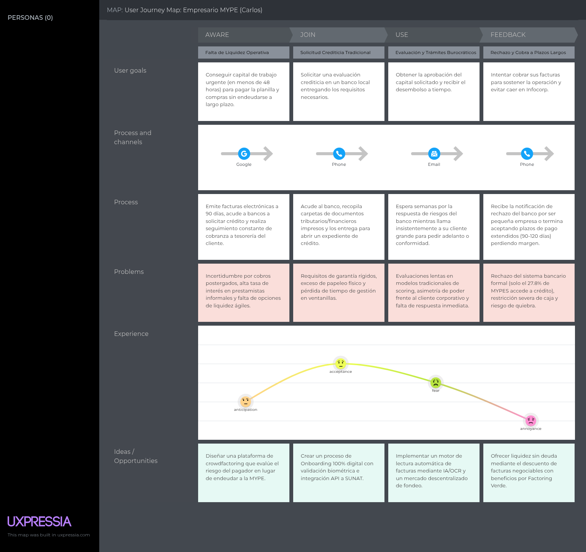

**User Journey Map - Inversionista (Sofía)**

El journey de Sofía inicia con la búsqueda de opciones de inversión rentables, pasa por la comparación de alternativas tradicionales y finaliza con la limitación de destinar su capital a productos con baja rentabilidad o altas barreras de entrada. Durante el recorrido se evidencian puntos de dolor como la poca transparencia de información, los montos mínimos elevados y la falta de herramientas digitales que le permitan monitorear sus inversiones en tiempo real.


### 2.3.4. Empathy Mapping

<!-- Un Empathy Map por cada User Persona, elaborado en UXPressia. Responder: ¿con quién empatizamos?, ¿qué necesita hacer?, ¿qué está diciendo, viendo, haciendo y escuchando?, ¿cómo se siente y qué piensa? Identificar Pains y Gains. -->
<!-- Assets: ./assets/cap2-requirements-elicitation/empathy-mapping/ -->

Para profundizar en las emociones, pensamientos y contexto de cada User Persona más allá de sus tareas, se elaboraron dos Empathy Maps en UXPressia. Cada mapa documenta qué piensa, siente, ve, oye, dice y hace el usuario, además de sus pains y gains, orientando el diseño de la solución.

**Empathy Map - Empresario MYPE (Carlos)**

El mapa evidencia a un empresario racional y pragmático, motivado por dar estabilidad a su familia y a su equipo, frustrado por la burocracia bancaria y la incertidumbre del cobro a sus clientes, y que valora la liquidez inmediata sin comprometerse con deuda a largo plazo.


**Empathy Map - Inversionista (Sofía)**

El mapa evidencia a una profesional analítica y ordenada, motivada por alcanzar la libertad financiera, frustrada por la pérdida de valor real de sus ahorros y la falta de transparencia de la banca tradicional, y que valora invertir de forma 100% digital y con impacto positivo.

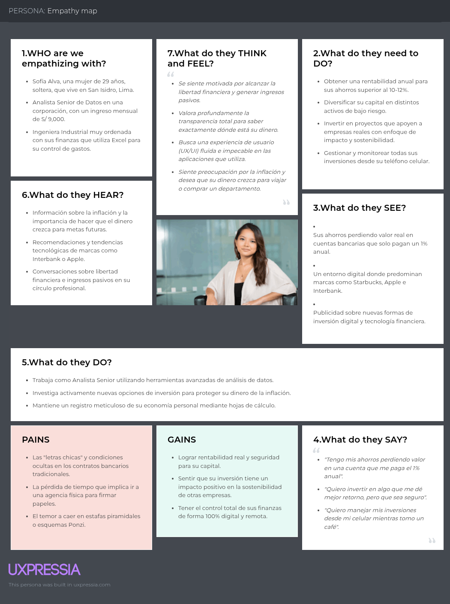

### 2.3.5. As-is Scenario Mapping

<!-- Un As-Is Scenario Map por cada User Persona, elaborado en LucidChart / Miro, con las filas Phases, Doing, Thinking y Feeling. Resumir el proceso: preparación, lluvia de ideas individual, revisión, identificación y nombrado de fases, etiquetado de áreas positivas, negativas y blank areas. -->
<!-- Assets: ./assets/cap2-requirements-elicitation/as-is-scenario-mapping/ -->

El As-Is Scenario Map, elaborado en Miro para cada User Persona, ordena su recorrido actual en fases con las filas Doing, Thinking y Feeling, etiquetando además áreas positivas, negativas y blank areas que orientan qué aspectos del proceso el equipo necesita seguir investigando.

**As-Is Scenario Map - Empresario MYPE (Carlos)**

El mapa evidencia un recorrido mayormente negativo: solo la emisión de la factura resulta neutral, mientras que la espera del pago, la búsqueda de liquidez de emergencia y su alto costo generan ansiedad, frustración e insatisfacción.

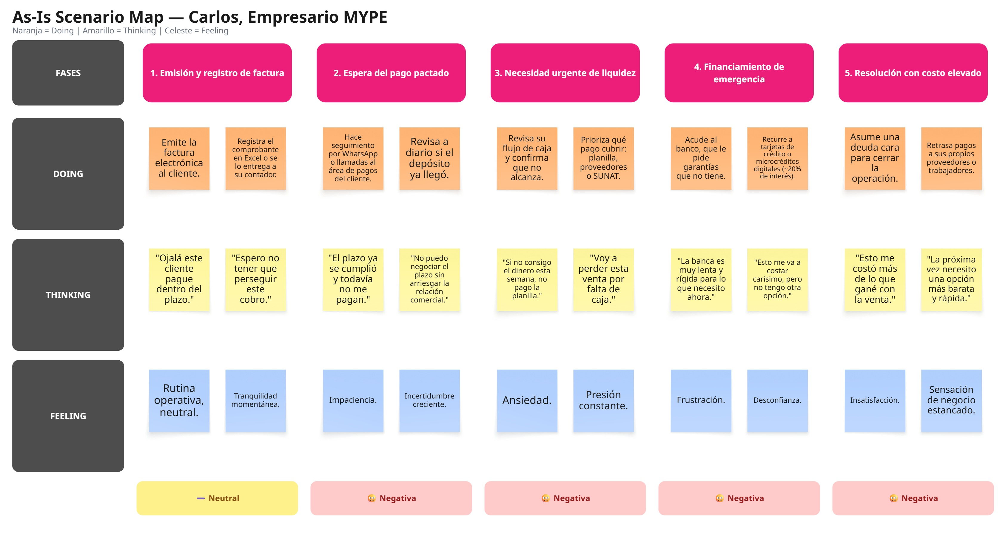

**As-Is Scenario Map - Inversionista (Sofía)**

El mapa evidencia un recorrido que inicia positivo por la motivación de hacer crecer sus ahorros, pero se vuelve negativo al comparar alternativas rígidas y opacas, y cierra en una inversión conservadora con seguimiento limitado.

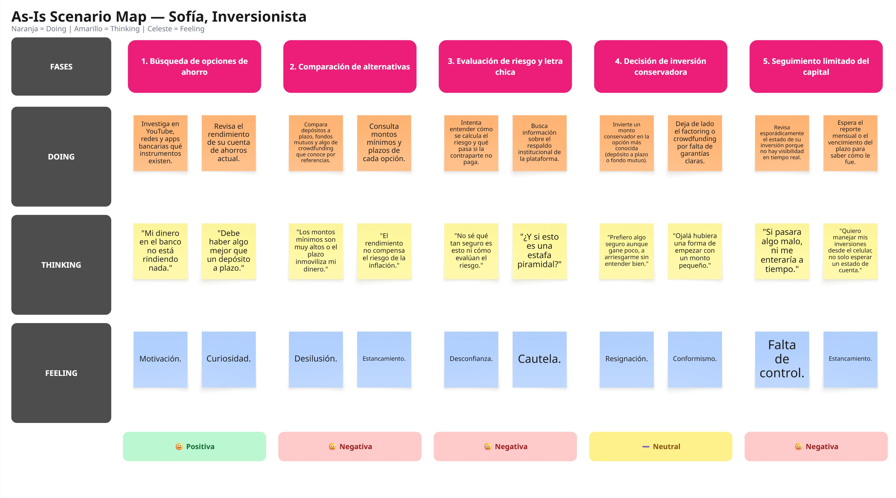

<hr class="page-break">

# Capítulo III: Requirements Specification

<!-- Especificación de los requisitos de los productos digitales, en base al análisis de la información obtenida en las investigaciones. -->

A partir del análisis de las entrevistas, el Needfinding y los User Personas desarrollados en el capítulo anterior, este capítulo traduce esos hallazgos en la especificación de los requisitos de los productos digitales de Vankoo. Se inicia proyectando el escenario futuro de cada usuario mediante el To-Be Scenario Mapping, que evidencia los cambios que la plataforma introduce frente al As-Is; a partir de ahí se detallan las User Stories que describen las funcionalidades del sistema, el Impact Mapping que conecta los objetivos de negocio con los impactos esperados en cada persona, y el Product Backlog que prioriza y organiza todo lo anterior de cara al desarrollo.

## 3.1. To-Be Scenario Mapping

<!-- Un To-Be Scenario Map por cada User Persona, elaborado en LucidChart / Miro, con las filas Phases, Doing, Thinking y Feeling. Comparar con el As-Is Scenario Mapping e identificar los cambios que ofrece el To-Be. -->
<!-- Assets: ./assets/cap3-requirements-specification/to-be-scenario-mapping/ -->

El To-Be Scenario Map, elaborado en Miro, reutiliza las mismas fases del As-Is para cada User Persona, mostrando cómo Vankoo transforma su Doing, Thinking y Feeling en cada una, y resume al costado los cambios concretos que la plataforma ofrece frente al escenario actual.

**To-Be Scenario Map - Empresario MYPE (Carlos)**

El mapa muestra un recorrido íntegramente positivo: con Vankoo, Carlos pasa de esperar pagos y endeudarse caro a recibir liquidez en menos de 48 horas con costos transparentes desde el inicio.


**To-Be Scenario Map - Inversionista (Sofía)**

El mapa muestra un recorrido íntegramente positivo: con Vankoo, Sofía pasa de invertir a ciegas en instrumentos rígidos a diversificar desde S/100 con riesgo explicado y seguimiento en tiempo real.

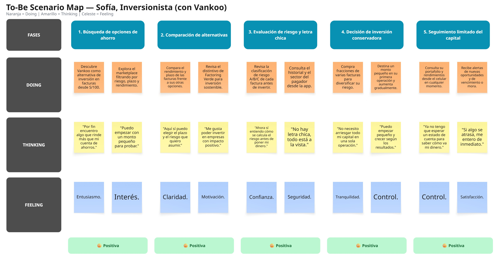

<hr class="page-break">

## 3.2. User Stories

En esta sección se presentan las historias de usuario que describen las funcionalidades y características que el sistema debe ofrecer para satisfacer las necesidades de los usuarios y cumplir con los objetivos del negocio. Cada historia de usuario sigue el formato estándar "Como [tipo de usuario], quiero [acción] para [beneficio/valor]", lo que facilita la comprensión de los requisitos desde la perspectiva del usuario final.

Se incluyen diferentes tipos de historias, tales como:
- **Epics:** grandes funcionalidades que pueden descomponerse en varias historias más pequeñas.
- **User Stories:** funcionalidades específicas que aportan valor directo al usuario.
- **Landing Page Stories:** historias relacionadas con la presentación y navegación en la interfaz web para los diferentes segmentos identificados.
- **Technical Stories:** historias que abordan aspectos técnicos necesarios para el correcto funcionamiento del sistema, como la integración con servicios externos, seguridad, rendimiento, entre otros.

| Epic / Story ID | Título                                            | Descripción                                                                                                                                                             | Criterios de Aceptación                                                                                                                                                                                                                                                                                                                                                                                                                                                                                                                                                                                                                              | Relacionado con (Epic ID) |
|-----------------|---------------------------------------------------|-------------------------------------------------------------------------------------------------------------------------------------------------------------------------|------------------------------------------------------------------------------------------------------------------------------------------------------------------------------------------------------------------------------------------------------------------------------------------------------------------------------------------------------------------------------------------------------------------------------------------------------------------------------------------------------------------------------------------------------------------------------------------------------------------------------------------------------|---------------------------|
| EP01            | Originación, validación y adelanto de facturas    | Gestionar el ciclo de una factura MYPE desde su registro hasta su publicación y adelanto de liquidez.                                                                   |                                                                                                                                                                                                                                                                                                                                                                                                                                                                                                                                                                                                                                                      |                           |
| US01            | Carga inteligente de facturas                     | Como empresario MYPE, quiero registrar mi factura en PDF o XML en la MYPE Web, para que el sistema extraiga sus datos y prepare la operación de liquidez.               | **Escenario 1:**<br>**Given:** El sistema recibe un PDF o XML legible con los datos obligatorios.<br>**When:** Finaliza la extracción y validación inicial.<br>**Then:** Registra un borrador con emisor, pagador, monto, moneda y fecha de vencimiento.<br><br>**Escenario 2:**<br>**Given:** El archivo está dañado, no es compatible o contiene datos inconsistentes.<br>**When:** El sistema intenta procesarlo.<br>**Then:** Marca la factura como `Requiere revisión` y evita que sea enviada a subasta.                                                                                                                                       | EP01                      |
| US02            | Clasificación de riesgo de la operación           | Como empresario MYPE, quiero conocer la clasificación de riesgo de mi factura, para saber si puede publicarse y comunicar sus condiciones a los inversionistas.         | **Escenario 1:**<br>**Given:** La factura está validada y existe información suficiente del pagador.<br>**When:** El motor de riesgo evalúa la operación.<br>**Then:** Asigna una clasificación A, B o C y registra la evaluación asociada a la factura.<br><br>**Escenario 2:**<br>**Given:** La información histórica del pagador es insuficiente.<br>**When:** El motor no alcanza el nivel necesario de confianza.<br>**Then:** Devuelve el estado `En evaluación` y crea una solicitud de revisión manual.                                                                                                                                      | EP01                      |
| US03            | Simulación de costos y adelanto                   | Como empresario MYPE, quiero simular el costo del adelanto, para decidir cuánto recibiré antes de aceptar la operación.                                                 | **Escenario 1:**<br>**Given:** La factura tiene monto, moneda, plazo y clasificación de riesgo válidos.<br>**When:** El sistema calcula la operación.<br>**Then:** Devuelve el monto bruto, descuento, comisión, monto neto e importe estimado para el inversionista.<br><br>**Escenario 2:**<br>**Given:** Falta la clasificación o el monto y plazo están fuera de los rangos permitidos.<br>**When:** Se solicita la simulación.<br>**Then:** Rechaza la solicitud e impide crear una subasta con datos incompletos.                                                                                                                              | EP01                      |
| US04            | Firma digital de cesión                           | Como empresario MYPE, quiero firmar digitalmente el contrato de cesión, para formalizar el adelanto de mi factura sin trámites físicos.                                 | **Escenario 1:**<br>**Given:** La cotización fue aceptada y la identidad del empresario está verificada.<br>**When:** El empresario completa la firma digital.<br>**Then:** El sistema almacena el contrato firmado y cambia la operación a `Formalizada`.<br><br>**Escenario 2:**<br>**Given:** El token de firma expiró o la firma no coincide con la identidad verificada.<br>**When:** Se intenta completar la firma.<br>**Then:** Mantiene la operación en `Pendiente de firma` y bloquea su desembolso.                                                                                                                                        | EP01                      |
| US05            | Corrección manual de datos extraídos              | Como empresario MYPE, quiero corregir los datos extraídos de mi factura, para asegurar que la información legal y financiera sea exacta antes de continuar.             | **Escenario 1:**<br>**Given:** La extracción automática terminó y el nuevo valor cumple formato y coherencia.<br>**When:** El empresario guarda la corrección.<br>**Then:** Actualiza la factura y recalcula los importes dependientes.<br><br>**Escenario 2:**<br>**Given:** El monto corregido difiere significativamente del valor detectado.<br>**When:** Se intenta guardar la modificación.<br>**Then:** Marca la factura para revisión humana y evita su aprobación automática.                                                                                                                                                               | EP01                      |
| US06            | Solicitud de subasta                              | Como empresario MYPE, quiero enviar una factura elegible a subasta, para que los inversionistas puedan financiarla.                                                     | **Escenario 1:**<br>**Given:** La factura está validada, la identidad está aprobada, existe una cuenta CCI y el contrato está formalizado.<br>**When:** El empresario solicita la publicación.<br>**Then:** Cambia la operación al estado `En subasta` y la incorpora al marketplace.<br><br>**Escenario 2:**<br>**Given:** Falta la validación de identidad, la cuenta CCI o algún dato obligatorio.<br>**When:** El empresario solicita la publicación.<br>**Then:** Rechaza la solicitud e informa los requisitos pendientes sin crear una subasta.                                                                                               | EP01                      |
| US07            | Seguimiento del fondeo                            | Como empresario MYPE, quiero seguir el avance del fondeo, para conocer cuándo se completa y cuándo recibiré el adelanto.                                                | **Escenario 1:**<br>**Given:** La operación está publicada en subasta.<br>**When:** Se registran nuevas participaciones de inversionistas.<br>**Then:** Actualiza el monto financiado, el porcentaje de avance y el saldo pendiente.<br><br>**Escenario 2:**<br>**Given:** El monto financiado alcanza el 100%.<br>**When:** El sistema confirma que la operación está completa.<br>**Then:** Cambia el estado a `Fondeada` y registra la fecha estimada de transferencia.                                                                                                                                                                           | EP01                      |
| EP02            | Marketplace e inversión                           | Permitir que el inversionista encuentre operaciones, compare riesgo y plazo, y participe en facturas elegibles.                                                         |                                                                                                                                                                                                                                                                                                                                                                                                                                                                                                                                                                                                                                                      |                           |
| US08            | Exploración del marketplace                       | Como inversionista, quiero consultar y filtrar las facturas disponibles, para elegir oportunidades según riesgo, plazo, moneda y rendimiento.                           | **Escenario 1:**<br>**Given:** Existen operaciones publicadas con diferentes clasificaciones y plazos.<br>**When:** El inversionista aplica filtros válidos.<br>**Then:** Devuelve únicamente las operaciones que cumplen los criterios seleccionados.<br><br>**Escenario 2:**<br>**Given:** Ninguna operación cumple los filtros seleccionados.<br>**When:** El inversionista consulta el marketplace.<br>**Then:** Devuelve una colección vacía e informa que no existen oportunidades coincidentes.                                                                                                                                               | EP02                      |
| US09            | Compra de fracciones                              | Como inversionista, quiero comprar una fracción de una factura, para diversificar mi riesgo con montos bajos.                                                           | **Escenario 1:**<br>**Given:** La operación está publicada, tiene capacidad disponible y el inversionista tiene saldo suficiente.<br>**When:** Confirma un monto válido de participación.<br>**Then:** Registra la participación, descuenta el saldo disponible y actualiza el avance de fondeo.<br><br>**Escenario 2:**<br>**Given:** El saldo es insuficiente o el monto supera la capacidad pendiente.<br>**When:** Intenta confirmar la participación.<br>**Then:** Rechaza la transacción y conserva sin cambios el saldo y el fondeo de la operación.                                                                                          | EP02                      |
| US10            | Identificación de inversión verde                 | Como inversionista, quiero identificar las empresas con certificación ambiental, para realizar inversiones responsables.                                                | **Escenario 1:**<br>**Given:** La empresa tiene una certificación sostenible vigente y validada.<br>**When:** Su operación se publica en el marketplace.<br>**Then:** Asocia el distintivo `Factoring Verde` y registra los criterios que lo sustentan.<br><br>**Escenario 2:**<br>**Given:** La certificación está vencida, incompleta o no validada.<br>**When:** La operación se prepara para publicación.<br>**Then:** No asigna el distintivo verde y conserva el motivo de la decisión.                                                                                                                                                        | EP02                      |
| US11            | Filtro de impacto positivo                        | Como inversionista, quiero filtrar las facturas de impacto positivo, para concentrar mis inversiones en empresas sostenibles.                                           | **Escenario 1:**<br>**Given:** El marketplace contiene operaciones con y sin distintivo sostenible.<br>**When:** El inversionista activa el filtro de impacto positivo.<br>**Then:** Devuelve únicamente operaciones con certificación verde vigente.<br><br>**Escenario 2:**<br>**Given:** No existen operaciones verdes activas.<br>**When:** El inversionista aplica el filtro.<br>**Then:** Devuelve una colección vacía e informa que no hay oportunidades sostenibles disponibles.                                                                                                                                                             | EP02                      |
| EP03            | Portafolio, billetera y seguimiento               | Administrar los fondos, inversiones, rendimientos, movimientos y eventos que permiten dar seguimiento a la operación financiera.                                        |                                                                                                                                                                                                                                                                                                                                                                                                                                                                                                                                                                                                                                                      |                           |
| US12            | Gestión gráfica del portafolio                    | Como inversionista, quiero consultar el resumen de mis inversiones y ganancias, para monitorear mi rentabilidad.                                                        | **Escenario 1:**<br>**Given:** El inversionista tiene participaciones activas o cerradas.<br>**When:** Consulta su portafolio.<br>**Then:** Calcula y devuelve capital invertido, rendimiento esperado, rendimiento obtenido y distribución por operación o sector.<br><br>**Escenario 2:**<br>**Given:** El inversionista todavía no tiene participaciones.<br>**When:** Consulta su portafolio.<br>**Then:** Devuelve un portafolio vacío o con valores cero sin presentar ganancias inexistentes.                                                                                                                                                 | EP03                      |
| US13            | Historial inmutable de transacciones              | Como empresario MYPE o inversionista, quiero consultar una línea de tiempo de mis transacciones, para tener trazabilidad sobre el dinero y las operaciones.             | **Escenario 1:**<br>**Given:** El usuario tiene eventos registrados en una o más operaciones.<br>**When:** Solicita su historial.<br>**Then:** Devuelve los eventos en orden cronológico descendente con tipo, fecha, monto y estado.<br><br>**Escenario 2:**<br>**Given:** El usuario solicita el detalle de un evento existente.<br>**When:** El sistema procesa la consulta.<br>**Then:** Devuelve el identificador único, origen y datos de auditoría sin permitir alterar el evento histórico.                                                                                                                                                  | EP03                      |
| US14            | Carga de fondos a la billetera                    | Como inversionista, quiero abonar fondos a mi billetera, para tener capital disponible para invertir.                                                                   | **Escenario 1:**<br>**Given:** La transferencia y su referencia cumplen las reglas de validación.<br>**When:** El inversionista registra el depósito.<br>**Then:** Crea una recarga en estado `Pendiente` y actualiza el saldo cuando el proveedor confirma el pago.<br><br>**Escenario 2:**<br>**Given:** La referencia de operación ya fue registrada.<br>**When:** El inversionista intenta registrar el mismo depósito.<br>**Then:** Rechaza la solicitud por duplicidad y no genera una segunda recarga.                                                                                                                                        | EP03                      |
| US15            | Retiro a cuenta bancaria                          | Como empresario MYPE o inversionista, quiero retirar fondos hacia una cuenta CCI verificada, para disponer de mi dinero.                                                | **Escenario 1:**<br>**Given:** El usuario tiene saldo suficiente y una cuenta CCI verificada.<br>**When:** Solicita un retiro válido.<br>**Then:** Debita el monto disponible y registra la transferencia en estado `En proceso`.<br><br>**Escenario 2:**<br>**Given:** El monto supera el saldo o la cuenta CCI no está verificada.<br>**When:** El usuario solicita el retiro.<br>**Then:** Rechaza la operación y conserva el saldo disponible sin cambios.                                                                                                                                                                                       | EP03                      |
| US16            | Notificaciones de nuevas oportunidades            | Como inversionista, quiero recibir alertas de nuevas operaciones que coincidan con mis preferencias, para evaluar oportunidades antes de que se complete el fondeo.     | **Escenario 1:**<br>**Given:** El inversionista tiene habilitadas las alertas para una clasificación determinada.<br>**When:** Se publica una operación que coincide con sus preferencias.<br>**Then:** Registra y envía una notificación con el identificador, riesgo, plazo y monto disponible.<br><br>**Escenario 2:**<br>**Given:** La operación no coincide con las preferencias o el usuario desactivó la alerta.<br>**When:** Se publica la operación.<br>**Then:** No envía la notificación y conserva las preferencias del usuario.                                                                                                         | EP03                      |
| US17            | Alertas de vencimiento y mora                     | Como inversionista, quiero recibir alertas sobre el pago o retraso de las facturas en las que participé, para conocer el estado de mi inversión.                        | **Escenario 1:**<br>**Given:** La fecha de vencimiento de una operación llega sin confirmación de pago.<br>**When:** El sistema detecta el incumplimiento.<br>**Then:** Registra el evento de mora y envía una alerta al inversionista participante.<br><br>**Escenario 2:**<br>**Given:** Una operación permanece vencida por más de cinco días.<br>**When:** El proceso de seguimiento actualiza su estado.<br>**Then:** Cambia la operación a `En gestión de cobranza` y registra la transición para auditoría.                                                                                                                                   | EP03                      |
| EP04            | Onboarding, perfiles y confianza                  | Verificar la identidad de los participantes, completar sus perfiles y habilitar operaciones financieras seguras.                                                        |                                                                                                                                                                                                                                                                                                                                                                                                                                                                                                                                                                                                                                                      |                           |
| US18            | Registro MYPE con RUC                             | Como empresario MYPE, quiero registrarme usando mi RUC, para que el sistema recupere mis datos legales y habilite mi perfil empresarial.                                | **Escenario 1:**<br>**Given:** El RUC tiene formato válido y estado activo en la fuente oficial.<br>**When:** El empresario inicia el registro.<br>**Then:** Recupera razón social, dirección y estado tributario, y crea el perfil MYPE pendiente de completar.<br><br>**Escenario 2:**<br>**Given:** El RUC está inactivo, dado de baja o no existe.<br>**When:** El empresario intenta registrarse.<br>**Then:** Rechaza el registro y conserva la razón del rechazo sin crear un perfil habilitado.                                                                                                                                              | EP04                      |
| US19            | Verificación biométrica                           | Como empresario MYPE o inversionista, quiero validar mi identidad mediante DNI y biometría facial, para evitar suplantaciones antes de operar financieramente.          | **Escenario 1:**<br>**Given:** El documento de identidad y la captura facial pertenecen a la misma persona.<br>**When:** El proveedor biométrico finaliza la comparación.<br>**Then:** Cambia el estado KYC a `Verificado` y habilita las operaciones permitidas para el rol.<br><br>**Escenario 2:**<br>**Given:** La comparación facial no coincide o el documento no es válido.<br>**When:** Finaliza la verificación.<br>**Then:** Mantiene el estado no verificado, restringe las operaciones financieras y solicita repetir el proceso.                                                                                                        | EP04                      |
| US20            | Configuración de cuenta CCI                       | Como empresario MYPE o inversionista, quiero registrar una cuenta bancaria CCI, para recibir retiros y adelantos en el destino correcto.                                | **Escenario 1:**<br>**Given:** El CCI tiene 20 dígitos y corresponde a una entidad bancaria válida.<br>**When:** El usuario registra la cuenta.<br>**Then:** Valida el formato, almacena el CCI protegido y lo marca como disponible para transferencias.<br><br>**Escenario 2:**<br>**Given:** El CCI tiene una longitud o estructura inválida.<br>**When:** El usuario intenta registrarlo.<br>**Then:** Rechaza el valor y conserva cualquier cuenta válida previamente registrada.                                                                                                                                                               | EP04                      |
| EP05            | Landing Page                                      | Comunicar la propuesta de valor de Vankoo a visitantes y dirigirlos hacia el flujo adecuado para MYPE o inversionistas.                                                 |                                                                                                                                                                                                                                                                                                                                                                                                                                                                                                                                                                                                                                                      |                           |
| LPS01           | Comprensión de la propuesta de valor              | Como visitante, quiero entender cómo Vankoo conecta a MYPES e inversionistas, para decidir si la solución responde a mi necesidad.                                      | **Escenario 1:**<br>**Given:** El visitante accede a la versión principal del sitio.<br>**When:** El sitio carga el contenido de la propuesta de valor.<br>**Then:** Explica los roles de MYPE e inversionista, el funcionamiento del crowdfactoring y el carácter académico del proyecto.<br><br>**Escenario 2:**<br>**Given:** El visitante solicita la versión en inglés.<br>**When:** El sitio cambia el locale.<br>**Then:** Presenta el mismo contenido esencial traducido y mantiene los enlaces de navegación equivalentes.                                                                                                                  | EP05                      |
| LPS02           | Simulador de adelanto                             | Como visitante, quiero simular el adelanto de una factura, para comprender el costo, el monto recibido y el rendimiento estimado.                                       | **Escenario 1:**<br>**Given:** El visitante proporciona moneda, monto, plazo y clasificación dentro de los rangos permitidos.<br>**When:** El sitio calcula la operación.<br>**Then:** Devuelve monto bruto, tasa, costo, monto adelantado, rendimiento estimado y el aviso de que se trata de un ejemplo ilustrativo.<br><br>**Escenario 2:**<br>**Given:** El visitante proporciona un monto, plazo o clasificación fuera de los rangos permitidos.<br>**When:** Se solicita el cálculo.<br>**Then:** Rechaza el valor inválido y no presenta una cotización aparentemente válida.                                                                 | EP05                      |
| LPS03           | Orientación de conversión y confianza             | Como visitante, quiero consultar el proceso, las clasificaciones de riesgo y las preguntas frecuentes, para elegir si deseo adelantar una factura o invertir.           | **Escenario 1:**<br>**Given:** El visitante consulta el contenido informativo del sitio.<br>**When:** Solicita información sobre el proceso, riesgo o preguntas frecuentes.<br>**Then:** El sitio explica los hitos de una operación, el significado de A, B y C, las condiciones generales y las limitaciones del proyecto académico.<br><br>**Escenario 2:**<br>**Given:** El visitante indica que desea adelantar una factura o invertir.<br>**When:** Solicita iniciar el flujo correspondiente.<br>**Then:** El sitio resuelve el enlace configurado hacia el registro o inicio de sesión del producto adecuado.                                | EP05                      |
| EP06            | Microservicios y APIs                             | Exponer contratos REST y eventos que permitan integrar las aplicaciones con los microservicios de Vankoo de forma segura y trazable.                                    |                                                                                                                                                                                                                                                                                                                                                                                                                                                                                                                                                                                                                                                      |                           |
| TS01            | Contrato REST de IAM                              | Como Developer, quiero disponer de endpoints REST para registro, autenticación y recuperación de contraseña, para integrar las aplicaciones con una identidad segura.   | **Escenario 1:**<br>**Given:** La API recibe una solicitud válida de registro o inicio de sesión.<br>**When:** IAM procesa las credenciales y el rol permitido.<br>**Then:** Responde con el código HTTP correspondiente, el recurso de usuario o la sesión autenticada, sin exponer contraseñas.<br><br>**Escenario 2:**<br>**Given:** La API recibe credenciales inválidas, un correo duplicado o una solicitud de recuperación.<br>**When:** IAM procesa la solicitud.<br>**Then:** Devuelve `400`, `401`, `409` o `202` según el caso, evita revelar si una cuenta existe y permite completar el restablecimiento con un token válido.           | EP06                      |
| TS02            | Contrato REST de perfiles y KYC                   | Como Developer, quiero integrar los endpoints de perfiles, documentos y KYC para MYPES e inversionistas, para habilitar operaciones solo a identidades verificadas.     | **Escenario 1:**<br>**Given:** La API recibe datos válidos de perfil o una solicitud de URL de carga autorizada.<br>**When:** Profile Service procesa la operación.<br>**Then:** Responde con `200` y el recurso actualizado o con la URL prefirmada asociada al usuario correcto.<br><br>**Escenario 2:**<br>**Given:** El identificador no existe o el documento no cumple las reglas.<br>**When:** Se solicita completar, cargar, verificar o rechazar el KYC.<br>**Then:** Devuelve `400` o `404` y no modifica el estado anterior del perfil.                                                                                                   | EP06                      |
| TS03            | Contrato REST de ingreso y validación de facturas | Como Developer, quiero integrar el servicio de facturas para recibir, extraer y validar comprobantes, para que una operación no llegue a subasta con datos incompletos. | **Escenario 1:**<br>**Given:** La API recibe una factura PDF o XML válida y los datos del propietario autenticado.<br>**When:** Invoicing Service procesa el documento y consulta las validaciones requeridas.<br>**Then:** Responde con el identificador de la factura, los datos extraídos y un estado de procesamiento que puede continuar hacia evaluación.<br><br>**Escenario 2:**<br>**Given:** El archivo no es compatible, está duplicado o no supera la validación oficial.<br>**When:** El servicio procesa la solicitud.<br>**Then:** Responde con un error de validación o un estado no elegible y evita crear una operación publicable. | EP06                      |
| TS04            | Contrato REST de evaluación de riesgo             | Como Developer, quiero integrar el servicio de evaluación de riesgo, para asignar una clasificación explicable y decidir si una factura puede continuar.                | **Escenario 1:**<br>**Given:** El servicio recibe una factura validada y datos suficientes del pagador.<br>**When:** Risk Service ejecuta la evaluación.<br>**Then:** Responde con la clasificación A, B o C, el identificador de evaluación, la fecha y el estado de elegibilidad.<br><br>**Escenario 2:**<br>**Given:** El pagador no tiene información suficiente o la evaluación requiere intervención humana.<br>**When:** Risk Service procesa la solicitud.<br>**Then:** Responde con un estado de revisión pendiente y no permite que la operación se publique automáticamente.                                                              | EP06                      |
| TS05            | Contrato REST de subastas e inversiones           | Como Developer, quiero integrar el ciclo REST de subastas, cotizaciones y participaciones, para coordinar la publicación y el fondeo de las facturas.                   | **Escenario 1:**<br>**Given:** La API recibe una operación evaluada y una participación dentro del saldo disponible.<br>**When:** Investment Service crea, publica o recibe la inversión.<br>**Then:** Devuelve `200` o `201` con el identificador, estado, monto financiado y saldo pendiente de la operación.<br><br>**Escenario 2:**<br>**Given:** La operación está en un estado incompatible, la participación supera el saldo o se intenta una cancelación inválida.<br>**When:** El servicio procesa la solicitud.<br>**Then:** Devuelve `400` o `409` y evita el sobre-fondeo o una transición de estado no permitida.                       | EP06                      |
| TS06            | Contrato REST de depósitos, billetera y pagos     | Como Developer, quiero integrar depósitos, saldos, movimientos y webhooks de pago, para mantener los fondos trazables e idempotentes.                                   | **Escenario 1:**<br>**Given:** La API recibe un depósito válido con una clave `Idempotency-Key` nueva.<br>**When:** Finance Service inicia la recarga y consulta su estado proyectado.<br>**Then:** Responde `202` con el identificador y estado `PENDING`, y posteriormente permite consultar el saldo y los movimientos resultantes.<br><br>**Escenario 2:**<br>**Given:** Se repite una clave con contenido diferente o llega un webhook con firma inválida.<br>**When:** Finance Service procesa la solicitud.<br>**Then:** Devuelve `409` o `400` y no duplica ni acredita fondos no verificados.                                               | EP06                      |
| TS07            | Contrato de notificaciones y eventos de negocio   | Como Developer, quiero publicar y consumir eventos de fondeo, pagos, mora y preferencias de notificación, para informar a cada usuario sin duplicar mensajes.           | **Escenario 1:**<br>**Given:** El bus recibe un evento de negocio válido y el usuario tiene una preferencia coincidente.<br>**When:** Notification Service procesa el evento.<br>**Then:** Registra la entrega, emite la notificación por el canal configurado y confirma el procesamiento del evento.<br><br>**Escenario 2:**<br>**Given:** El usuario desactivó el canal, el evento no coincide con sus preferencias o ya fue procesado.<br>**When:** El servicio recibe el evento.<br>**Then:** No envía un mensaje duplicado y devuelve una confirmación idempotente del resultado.                                                              | EP06                      |

<hr class="page-break">

## 3.3. Impact Mapping

<!-- Impact Mapping del modelo de negocio digital, elaborado en UXPressia. Business Goals con criterios SMART, Actors/Personas (los User Personas identificados), Impacts (cómo deben cambiar o comportarse), Deliverables (qué hacer como negocio digital para provocar esos impactos) y User Stories en formato "Como... deseo... para...". -->
<!-- Assets: ./assets/cap3-requirements-specification/impact-mapping/ -->

El Impact Mapping, elaborado en UXPressia, parte del objetivo de negocio de lograr que el 90% de las facturas se fondeen en menos de 24 horas y reducir el error manual al 15%, desglosándolo en los impactos esperados sobre Carlos y Sofía, sus entregables y las historias de usuario asociadas.


<hr class="page-break">

## 3.4. Product Backlog

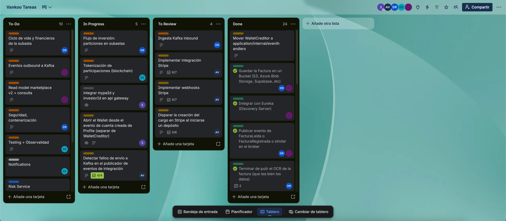

**Enlace público del Product Backlog:** [https://goo.su/eakALq](https://trello.com/invite/b/6a600400d41af9c7addef882/ATTIf3dc638540deeadd39c566dbb36b3433ED44E731/vankoo-tareas)

| # Orden | User Story Id | Título                                            | Descripción                                                                                                                                                             | Story Points (1 / 2 / 3 / 5 / 8) |
|---------|---------------|---------------------------------------------------|-------------------------------------------------------------------------------------------------------------------------------------------------------------------------|----------------------------------|
| 1       | LPS01         | Comprensión de la propuesta de valor              | Como visitante, quiero entender cómo Vankoo conecta a MYPES e inversionistas, para decidir si la solución responde a mi necesidad.                                      | 3                                |
| 2       | LPS02         | Simulador de adelanto                             | Como visitante, quiero simular el adelanto de una factura, para comprender el costo, el monto recibido y el rendimiento estimado.                                       | 5                                |
| 3       | LPS03         | Orientación de conversión y confianza             | Como visitante, quiero consultar el proceso, las clasificaciones de riesgo y las preguntas frecuentes, para elegir si deseo adelantar una factura o invertir.           | 3                                |
| 4       | US01          | Carga inteligente de facturas                     | Como empresario MYPE, quiero registrar mi factura en PDF o XML en la MYPE Web, para que el sistema extraiga sus datos y prepare la operación de liquidez.               | 8                                |
| 5       | US05          | Corrección manual de datos extraídos              | Como empresario MYPE, quiero corregir los datos extraídos de mi factura, para asegurar que la información legal y financiera sea exacta antes de continuar.             | 3                                |
| 6       | US02          | Clasificación de riesgo de la operación           | Como empresario MYPE, quiero conocer la clasificación de riesgo de mi factura, para saber si puede publicarse y comunicar sus condiciones a los inversionistas.         | 8                                |
| 7       | US03          | Simulación de costos y adelanto                   | Como empresario MYPE, quiero simular el costo del adelanto, para decidir cuánto recibiré antes de aceptar la operación.                                                 | 3                                |
| 8       | US06          | Solicitud de subasta                              | Como empresario MYPE, quiero enviar una factura elegible a subasta, para que los inversionistas puedan financiarla.                                                     | 5                                |
| 9       | US07          | Seguimiento del fondeo                            | Como empresario MYPE, quiero seguir el avance del fondeo, para conocer cuándo se completa y cuándo recibiré el adelanto.                                                | 3                                |
| 10      | US08          | Exploración del marketplace                       | Como inversionista, quiero consultar y filtrar las facturas disponibles, para elegir oportunidades según riesgo, plazo, moneda y rendimiento.                           | 5                                |
| 11      | US09          | Compra de fracciones                              | Como inversionista, quiero comprar una fracción de una factura, para diversificar mi riesgo con montos bajos.                                                           | 8                                |
| 12      | US12          | Gestión gráfica del portafolio                    | Como inversionista, quiero consultar el resumen de mis inversiones y ganancias, para monitorear mi rentabilidad.                                                        | 5                                |
| 13      | US14          | Carga de fondos a la billetera                    | Como inversionista, quiero abonar fondos a mi billetera, para tener capital disponible para invertir.                                                                   | 5                                |
| 14      | US15          | Retiro a cuenta bancaria                          | Como empresario MYPE o inversionista, quiero retirar fondos hacia una cuenta CCI verificada, para disponer de mi dinero.                                                | 5                                |
| 15      | US18          | Registro MYPE con RUC                             | Como empresario MYPE, quiero registrarme usando mi RUC, para que el sistema recupere mis datos legales y habilite mi perfil empresarial.                                | 5                                |
| 16      | US20          | Configuración de cuenta CCI                       | Como empresario MYPE o inversionista, quiero registrar una cuenta bancaria CCI, para recibir retiros y adelantos en el destino correcto.                                | 3                                |
| 17      | US19          | Verificación biométrica                           | Como empresario MYPE o inversionista, quiero validar mi identidad mediante DNI y biometría facial, para evitar suplantaciones antes de operar financieramente.          | 8                                |
| 18      | US04          | Firma digital de cesión                           | Como empresario MYPE, quiero firmar digitalmente el contrato de cesión, para formalizar el adelanto de mi factura sin trámites físicos.                                 | 5                                |
| 19      | US10          | Identificación de inversión verde                 | Como inversionista, quiero identificar las empresas con certificación ambiental, para realizar inversiones responsables.                                                | 3                                |
| 20      | US11          | Filtro de impacto positivo                        | Como inversionista, quiero filtrar las facturas de impacto positivo, para concentrar mis inversiones en empresas sostenibles.                                           | 3                                |
| 21      | US13          | Historial inmutable de transacciones              | Como empresario MYPE o inversionista, quiero consultar una línea de tiempo de mis transacciones, para tener trazabilidad sobre el dinero y las operaciones.             | 5                                |
| 22      | US16          | Notificaciones de nuevas oportunidades            | Como inversionista, quiero recibir alertas de nuevas operaciones que coincidan con mis preferencias, para evaluar oportunidades antes de que se complete el fondeo.     | 3                                |
| 23      | US17          | Alertas de vencimiento y mora                     | Como inversionista, quiero recibir alertas sobre el pago o retraso de las facturas en las que participé, para conocer el estado de mi inversión.                        | 5                                |
| 24      | TS01          | Contrato REST de IAM                              | Como Developer, quiero disponer de endpoints REST para registro, autenticación y recuperación de contraseña, para integrar las aplicaciones con una identidad segura.   | 5                                |
| 25      | TS02          | Contrato REST de perfiles y KYC                   | Como Developer, quiero integrar los endpoints de perfiles, documentos y KYC para MYPES e inversionistas, para habilitar operaciones solo a identidades verificadas.     | 5                                |
| 26      | TS03          | Contrato REST de ingreso y validación de facturas | Como Developer, quiero integrar el servicio de facturas para recibir, extraer y validar comprobantes, para que una operación no llegue a subasta con datos incompletos. | 8                                |
| 27      | TS04          | Contrato REST de evaluación de riesgo             | Como Developer, quiero integrar el servicio de evaluación de riesgo, para asignar una clasificación explicable y decidir si una factura puede continuar.                | 8                                |
| 28      | TS05          | Contrato REST de subastas e inversiones           | Como Developer, quiero integrar el ciclo REST de subastas, cotizaciones y participaciones, para coordinar la publicación y el fondeo de las facturas.                   | 8                                |
| 29      | TS06          | Contrato REST de depósitos, billetera y pagos     | Como Developer, quiero integrar depósitos, saldos, movimientos y webhooks de pago, para mantener los fondos trazables e idempotentes.                                   | 8                                |
| 30      | TS07          | Contrato de notificaciones y eventos de negocio   | Como Developer, quiero publicar y consumir eventos de fondeo, pagos, mora y preferencias de notificación, para informar a cada usuario sin duplicar mensajes.           | 5                                |

<hr class="page-break">

# Capítulo IV: Product Design


## 4.1. Style Guidelines

### 4.1.1. General Style Guidelines

En las guías de estilo generales se sientan los principios visuales fundamentales, las referencias de marca y las decisiones conceptuales que rigen la identidad visual de LiquiLabs.

#### Branding e Identidad de Marca
Vankoo combina la confianza y solidez del sector financiero con la agilidad y transparencia de las tecnologías emergentes. Su imagotipo representa el flujo dinámico de capitales y la conversión directa de facturas en liquidez.

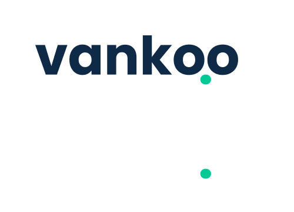  

#### Expresión y Tono de Comunicación
El lenguaje de Vankoo se articula mediante cuatro dimensiones clave para transmitir confianza técnica, claridad financiera y cercanía con los emprendedores e inversionistas:
* **Formal vs. Casual**: Balanceado hacia un tono profesional pero cercano, eliminando la opacidad y complejidad del lenguaje bancario tradicional.
* **Respetuoso vs. Irreverente**: Altamente respetuoso con el capital de los usuarios y riguroso en la comunicación de riesgos.
* **Entusiasta vs. Sereno**: Sereno y transparente, enfocado en mostrar datos objetivos e indicadores claros de rentabilidad y salud financiera.
* **Divertido vs. Serio**: Serio en la seguridad de las transacciones y la trazabilidad de fondos, con una interfaz moderna e interactiva.

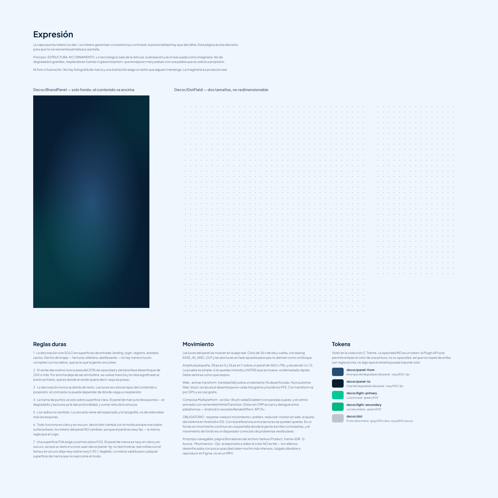  

#### Paleta de Colores (Color Palette)
El sistema cromático de Vankoo está diseñado para reducir la fatiga visual, combinada con tonos verdes de alto contraste que simbolizan el crecimiento económico y la propuesta distintiva de **Factoring Verde**. Incluye estados semánticos claros para informaciones financieras (éxito, advertencia, peligro y neutros).

  

#### Tipografía (Typography System)
Esta tipográfica limpia y geométrica optimizada para interfaces digitales y legibilidad de datos numéricos. La escala incluye jerarquías definidas para títulos de dashboards, encabezados de tarjetas, cuerpo de texto y etiquetas de datos.

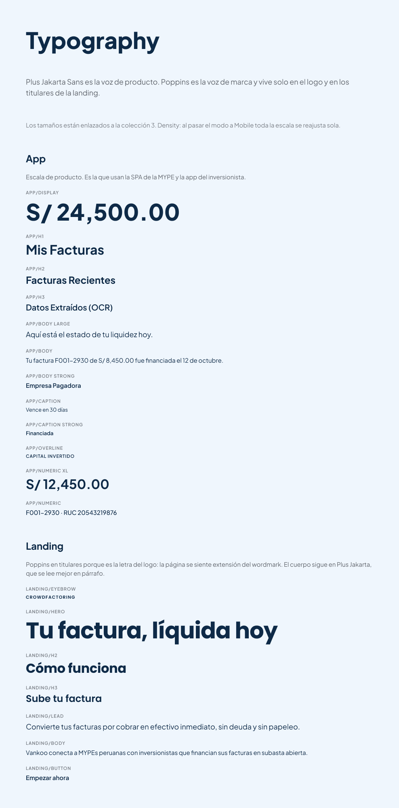  

#### Sistema de Espaciado y Bordes (Spacing & Radius)
Para mantener alineación y ritmo visual consistente en todas las pantallas, se utiliza una grilla basada en múltiplos de 8px (8px Grid System) para márgenes y rellenos internos. Los radios de borde (*border-radius*) otorgan un acabado redondeado y suave a tarjetas y botones.

  

#### Elevación y Sombras (Elevation & Depth)
Se definen niveles de profundidad mediante capas de sombra suaves (*box-shadows*) para crear jerarquía Z-index entre el fondo, los contenedores principales, las tarjetas interactivas y las ventanas modales o menús desplegables.

  

#### Iconografía (Icons System)
El conjunto de iconos vectoriales mantiene un estilo de línea limpia (*line art*) con grosor constante. Facilita la comprensión intuitiva de acciones clave como carga de documentos PDF/XML, calificaciones de riesgo, estados de cobranza y opciones de inversión.

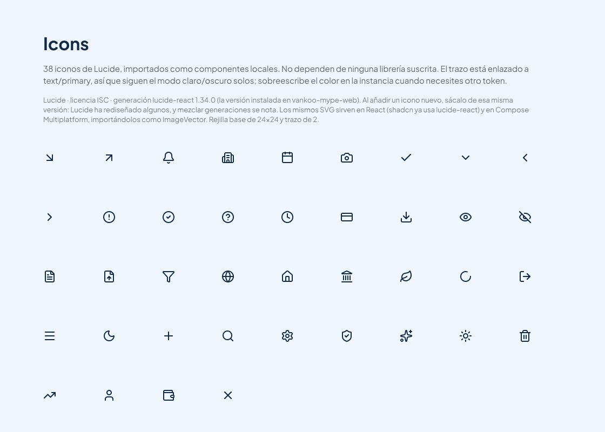  

### 4.1.2. Web Style Guidelines


#### Botones (Button Component)
Incluye botones primarios para acciones clave ("Descontar Factura", "Confirmar Inversión"), secundarios para acciones secundarias, botones de contorno (*Ghost*) e indicadores de estado deshabilitado.

  

#### Etiquetas de Estado (Badges & Chips)
Componentes visuales de tamaño compacto para clasificar el estado de las operaciones ("Aprobada", "En Subasta", "Cobrada"), niveles de scoring de riesgo y la etiqueta distintiva de "Factoring Verde".

  

#### Campos de Entrada (Input & Form Components)


Elementos para la captura de datos del usuario: campos de texto simples y con iconos, selectores desplegables, validación en tiempo real y el componente drag-and-drop para la lectura de facturas electrónicas.

  

#### Tarjetas e Indicadores (Cards & KPI)
Contenedores estructurados para mostrar información financiera sintetizada: fichas de facturas en subasta, resúmenes de portafolio de inversión y tarjetas KPI de salud financiera de la MYPE.

  

#### Navegación Web (Navigation Components)
Componentes que guían al usuario por la estructura de la aplicación y la landing page: barra de navegación superior (*Header/Navbar*), menú lateral (*Sidebar*) y barras de pestañas (*Tabs*).

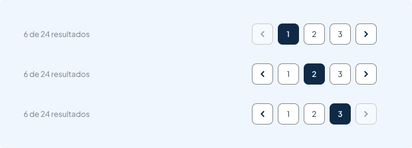  

#### Controles de Selección (Controls)
Interruptores de activación (*switches*), casillas de verificación (*checkboxes*) y botones de opción (*radio buttons*) utilizados en paneles de filtro de mercado, preferencias de reinversión y términos legales.

  

#### Tablas de Datos (DataTable Component)
Componente de grilla de datos optimizado para la visualización de grandes listas de facturas, historial de transacciones y estados de cobranza, con soporte para columnas ordenables y paginación.

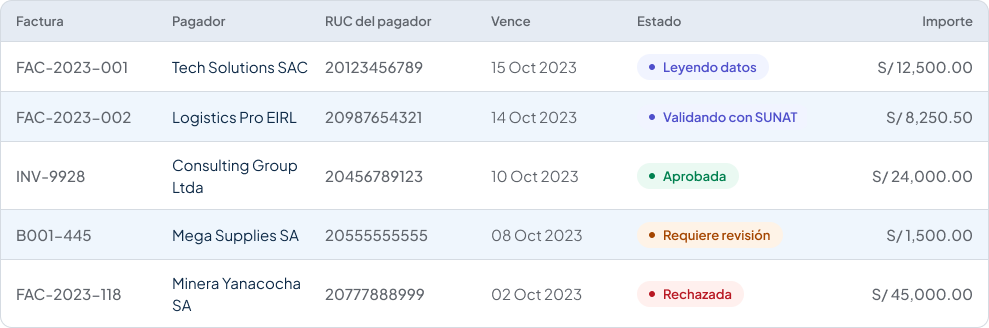  

#### Estructuras de Layout (Shells Component)
Plantillas de distribución de pantalla que organizan las vistas de la web app en zonas funcionales fijas (cabecera, navegación lateral y área principal de contenido).

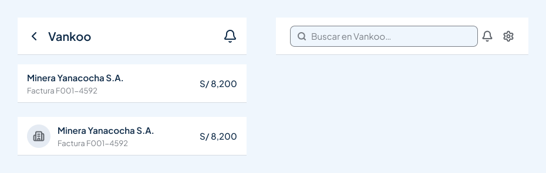  

#### Retroalimentación y Notificaciones (Feedback Components)
Elementos para notificar al usuario sobre el resultado de sus acciones o guiar procesos: ventanas modales de confirmación, mensajes emergentes (*Toast*), barras de progreso y spinners de carga.

  

<hr class="page-break">

## 4.2. Information Architecture

En esta sección se describe la arquitectura de la información de la plataforma **Vankoo** desarrollada por **LiquiLabs**, la cual ha sido diseñada para estructurar, organizar y etiquetar el contenido de manera que tanto los empresarios MYPE que necesitan liquidez como los inversionistas que buscan rentabilizar su capital encuentren la información financiera, técnica y operativa sin esfuerzo. El objetivo primordial es reducir la carga cognitiva mediante una jerarquía clara que facilite la toma de decisiones de inversión y la conversión rápida de cuentas por cobrar en efectivo.

### 4.2.1. Organization Systems

Para garantizar que el contenido de LiquiLabs sea accesible y lógico, se han aplicado diversos sistemas de organización adaptados a la naturaleza de los datos financieros y al perfil de cada segmento de usuario:

**Visual Organization Systems (Sistemas de Organización Visual):**

* **Organización Jerárquica (Visual Hierarchy):** Se aplica de forma predominante en los dashboards de la plataforma web. La información más crítica, como la disponibilidad de efectivo desembolsable, el Score de Riesgo del Pagador generado por IA, el porcentaje de fondeo acumulado de la factura y el distintivo de **Factoring Verde**, ocupa el nivel superior de la jerarquía visual mediante tarjetas (*cards*) destacadas y componentes KPI. Esto permite que el empresario e inversionista evalúen oportunidades de un vistazo.
* **Organización Secuencial (Step-by-step):** Este sistema es el eje central del flujo de descuento de facturas para la MYPE. El proceso se organiza como un flujo lineal guiado: Carga de factura PDF/XML → Lectura e extracción automática con IA (OCR+NLP) → Validación de constancia en SUNAT/CAVALI → Asignación de Score de Riesgo del Pagador → Publicación en el Marketplace.
* **Organización Matricial:** Se utiliza en las secciones de analítica avanzada y gestión de portafolios. Permite cruzar variables complejas como la tasa de rendimiento esperado (TCEA) frente a los plazos de vencimiento (30, 60, 90 o 120 días) y la concentración por sector industrial, facilitando la comparación de múltiples facturas en una sola vista.

**Content Categorization Schemes (Esquemas de Categorización de Contenido):**

* **Según Audiencia (Grupos de Usuarios):** Es el esquema principal de la plataforma. El contenido se segmenta estrictamente por rol: los Empresarios MYPE acceden a la gestión de cuentas por cobrar, carga de documentos y dashboards de salud financiera; los Inversionistas Minoristas a la subasta de facturas, billetera digital, reinversión automática y filtros ESG/Verdes; y los Administradores a herramientas de validación de riesgo y custodia de eventos.
* **Cronológico:** Aplicado al seguimiento de cobranza y trazabilidad inmutable mediante *Event Sourcing*. Las facturas y transacciones se organizan por fecha de emisión, fecha límite de pago y la secuencia temporal inmutable de eventos (*Registrada*, *Auditada por IA*, *Publicada*, *Fondeada*, *Desembolsada*, *Cobrada*).
* **Por Tópicos:** Se utiliza en el Marketplace de Inversión, categorizando las facturas por Nivel de Riesgo del Pagador (A+, A, B, C), Plazo de Retorno (30, 60, 90 días), Sector Comercial/Servicios y la etiqueta de impacto ambiental/social (**Factoring Verde**).
* **Alfabético:** Este esquema se aplica de forma auxiliar en los listados de pagadores corporativos registrados, directorio de empresas adquirientes y catálogos de documentos tributarios.

### 4.2.2. Labeling Systems

En esta sección se definen las etiquetas utilizadas en la plataforma para representar conjuntos de información financiera mediante términos breves, claros y significativos. El objetivo es asegurar que la asociación mental entre la etiqueta y la función sea inmediata, evitando ambigüedades técnicas en la gestión de capitales.

* **Descontar Factura:** Etiqueta principal de acción para el empresario MYPE. Agrupa el flujo de carga inteligente (PDF/XML), procesamiento con IA y solicitud de liquidez inmediata en menos de 48 horas.
* **Marketplace (u Oportunidades):** Concentra el catálogo de facturas negociables publicadas para financiamiento participativo por parte de los inversionistas.
* **Score de Riesgo (Salud del Pagador):** Representa el índice de riesgo crediticio del adquirente corporativo generado mediante algoritmos predictivos de IA, indicando la probabilidad real de cobro de la factura.
* **Factoring Verde:** Etiqueta distintiva para operaciones de empresas con impacto positivo o prácticas sostenibles, asociando comisiones preferenciales (descuento del 0.25%) y mayor velocidad de fondeo.
* **Billetera (Wallet):** Concentra la gestión de fondos del inversionista, mostrando saldo disponible, rendimientos ganados, retiros hacia cuenta bancaria y la configuración de "Billetera de Reinversión Automática".
* **Trazabilidad (Ledger):** Asocia la visualización en tiempo real del registro inmutable basado en *Event Sourcing*, permitiendo auditar cada cambio de estado de la factura.
* **Salud Financiera:** Dashboard analítico para el empresario MYPE que muestra proyecciones de flujo de caja, ciclo de efectivo y estado de facturas negociables ante CAVALI.
* **Soporte (Ayuda):** Concentra la documentación del modelo de crowdfactoring, simulador de tasas, guías de facturación electrónica y canales de atención.

### 4.2.3. SEO Tags and Meta Tags

Para optimizar la visibilidad del ecosistema LiquiLabs / Vankoo en motores de búsqueda y garantizar la seguridad en la plataforma web transaccional, se han definido las configuraciones de SEO Tags y Meta Tags para la Landing Page y la Web Application.

**Landing Page SEO Tags and Meta Tags**

La página de aterrizaje tiene como objetivo la captación de MYPES que requieren liquidez e inversionistas interesados en rentabilizar su capital.

| **Etiqueta** | **Contenido**                                                                                                                                     |
|---|---------------------------------------------------------------------------------------------------------------------------------------------------|
| Title | Vankoo - Crowdfactoring Inteligente y Liquidez Inmediata para MYPES                                                                               |
| Meta Description | Convierte tus facturas por cobrar en efectivo en menos de 48 horas sin deuda bancaria. Crowdfactoring impulsado por IA y Factoring Verde en Perú. |
| Meta Keywords | crowdfactoring Perú, liquidez MYPES, descuento de facturas, factoring verde, inversión en facturas, capital de trabajo, LiquiLabs, Vankoo         |
| Meta Author | LiquiLabs Team                                                                                                                                    |
| Meta Viewport | width=device-width, initial-scale=1.0                                                                                                             |
| Meta Charset | UTF-8                                                                                                                                             |
| Open Graph Title | Liquilabs: Liquidez inmediata para MYPES y retorno atractivo para inversionistas                                                                     |
| Open Graph Description | Transforma tus facturas en liquidez de forma rápida, transparente y segura con nuestra plataforma inteligente.                                    |
| Open Graph Image | https://www.liquilabs.pe/assets/images/liquilabs-og-preview.png                                                                                   |
| Open Graph URL | https://www.liquilabs.pe                                                                                                                          |

```html
<title>LiquiLabs - Crowdfactoring Inteligente y Liquidez Inmediata para MYPES</title>
<meta name="description" content="Convierte tus facturas por cobrar en efectivo en menos de 48 horas sin deuda bancaria. Crowdfactoring impulsado por IA y Factoring Verde en Perú.">
<meta name="keywords" content="crowdfactoring Perú, liquidez MYPES, descuento de facturas, factoring verde, inversión en facturas, capital de trabajo, LiquiLabs, Vankoo">
<meta name="author" content="LiquiLabs Team">
<meta property="og:title" content="Liquilabs: Liquidez inmediata para MYPES y retorno atractivo para inversionistas">
<meta property="og:description" content="Transforma tus facturas en liquidez de forma rápida, transparente y segura con nuestra plataforma inteligente.">
<meta property="og:image" content="https://www.liquilabs.pe/assets/images/liquilabs-og-preview.png">
<meta property="og:url" content="https://www.liquilabs.pe">
```

**Web Application SEO Tags and Meta Tags**

La aplicación web es un entorno transaccional (SPA) seguro accesible por usuarios autenticados. Se configura para restringir la indexación privada de datos financieros.

| **Etiqueta** | **Contenido** |
|---|---|
| Title | Plataforma Vankoo - Gestión de Crowdfactoring y Portafolio |
| Meta Description | Sistema de gestión de facturas, scoring predictivo de pagadores y mercado de inversión descentralizado para MYPES e inversionistas. |
| Meta Keywords | dashboard factoring, scoring riesgo IA, mercado de facturas, billetera digital, trazabilidad event sourcing |
| Meta Robots | noindex, nofollow (para proteger el acceso a datos financieros internos) |

```html
<title>Plataforma Vankoo - Gestión de Crowdfactoring y Portafolio</title>
<meta name="description" content="Sistema de gestión de facturas, scoring predictivo de pagadores y mercado de inversión descentralizado para MYPES e inversionistas.">
<meta name="robots" content="noindex, nofollow">
```

### 4.2.4. Searching Systems

Los sistemas de búsqueda en LiquiLabs / Vankoo han sido estructurados para evitar la sobrecarga de información, permitiendo que los usuarios encuentren rápidamente facturas específicas, evaluen la solvencia de adquirentes corporativos y filtren oportunidades de inversión según sus criterios de riesgo y sostenibilidad.

1. **Búsqueda en la Aplicación Web (Empresarios, Inversionistas y Administradores)**

* **Búsqueda Global y Predictiva:** Barra de búsqueda integrada en la cabecera superior de la Web App con autocompletado en tiempo real. Al ingresar el RUC o razón social del pagador, número de comprobante de la factura (ej. F001-00234) o RUC del emisor MYPE, el sistema ofrece sugerencias instantáneas.
* **Filtros Avanzados (Filtering System):** El inversionista y el empresario cuentan con paneles de filtrado para parametrizar las listas de datos:
  * **Por Score de Riesgo:** Filtrar facturas según la calificación de la IA (Nivel A+, A, B, C).
  * **Por Impacto (Factoring Verde):** Filtrar exclusivamente facturas con certificación o sello de impacto positivo ambiental/social.
  * **Por Plazo de Retorno:** Agrupar operaciones por vencimiento (1-30 días, 31-60 días, 61-90 días, >90 días).
  * **Por Rango de Monto de Entrada:** Buscar fracciones de facturas disponibles desde S/ 50 hasta montos institucionales.
  * **Por Tasa de Rendimiento (TCEA):** Ordenar oportunidades según la tasa de descuento ofrecida.
* **Visualización de Resultados:** Los datos se presentan en dos vistas intercambiables: vista de grilla de tarjetas (*Cards Grid*) para análisis rápido de inversión y vista de tabla de datos (*DataTable*) para gestión masiva, con ordenamiento por columnas y resaltado de coincidencias.

### 4.2.5. Navigation Systems

El sistema de navegación de LiquiLabs guía a los usuarios a través de sus objetivos fundamentales: la presentación del servicio (Landing Page), la gestión de liquidez MYPE y el fondeo de operaciones por parte de los inversionistas (Web App). Se emplean técnicas de navegación que minimizan los clics requeridos para realizar transacciones.

1. **Navegación en el Landing Page (Marketing y Captación)**

* **Navegación de Desplazamiento (Scrolling Navigation):** Estructura fluida de una sola página (*One-Page*) que lleva al visitante linealmente por la propuesta de valor, la problemática del crédito MYPE, el funcionamiento del crowdfactoring con IA, el simulador interactivo de tasas y los testimonios de éxito.
* **Menú Persistente (Sticky Navigation):** Cabecera superior fija que acompaña el desplazamiento, permitiendo saltar directamente a las secciones "Empresas", "Inversionistas", "Factoring Verde", "Simulador" y con un botón destacado de llamado a la acción (*CTA*) "Descontar Mi Factura / Registrarse".

2. **Navegación en la Aplicación Web (Dashboard Transaccional)**

* **Barra Lateral Estática (Side Navigation):** Menú vertical fijo a la izquierda adaptado según el rol del usuario autenticado (Empresario MYPE o Inversionista), permitiendo alternar entre el Dashboard principal, Marketplace, Carga de Facturas, Billetera y Reportes sin perder el contexto.
* **Navegación por Migas de Pan (Breadcrumbs):** Facilita el rastreo de ubicación en niveles profundos de la aplicación (ej. *Marketplace > Facturas de Servicios > Factura F001-9842 > Reporte de Riesgo IA*).
* **Navegación Contextual y Pestañas (Tabs):** Dentro del detalle de una factura, se utilizan pestañas para navegar entre "Datos del Documento", "Salud del Pagador (IA)", "Trazabilidad de Eventos (Ledger)" y "Participantes del Fondeo".

3. **Navegación entre Ecosistemas (Inter-product Navigation)**

* **Notificaciones en Tiempo Real y Deep Linking:** Notificaciones push en la web app y correo electrónico que incluyen enlaces directos (*deep links*) hacia facturas recién aprobadas que coinciden con los criterios de la "Billetera de Reinversión Automática" del inversionista o avisos inmediatos cuando una factura de una MYPE ha alcanzado el 100% de fondeo para su desembolso.

<hr class="page-break">

## 4.3. Landing Page UI Design

En esta sección se presentan los wireframes y mock-ups del Landing Page de la plataforma Vankoo, aplicando los principios de diseño, elementos de diseño, diseño inclusivo y arquitectura de información previamente establecidos.

### 4.3.1. Landing Page Wireframe

A continuación, se muestran los wireframes del Landing Page para Desktop Web Browser y Mobile Web Browser, elaborados en Figma. El diseño de media fidelidad evidencia la aplicación de principios de diseño, elementos de diseño, diseño inclusivo y arquitectura de información, asegurando una experiencia de usuario coherente y accesible.

**Hero**

Encabezado principal con un mensaje claro y conciso que comunica la propuesta de valor de la plataforma Vankoo. Se incluyen elementos visuales atractivos y un llamado a la acción destacado.

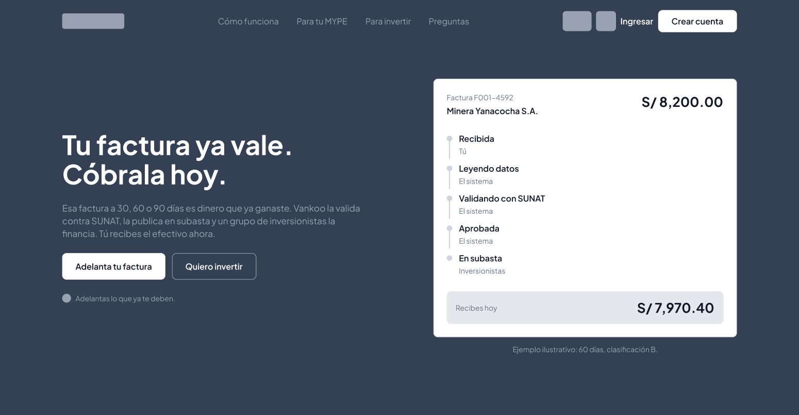
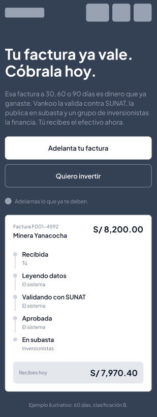

**Flujo del Proceso**

Se detallan los cinco hitos por los que pasa cada factura, especificando mediante etiquetas qué acciones realiza el usuario y cuáles ejecuta el sistema de forma automatizada (lectura OCR, validación con SUNAT y scoring). En la parte inferior se transparentan los estados de excepción y rechazo para brindar claridad operativa.

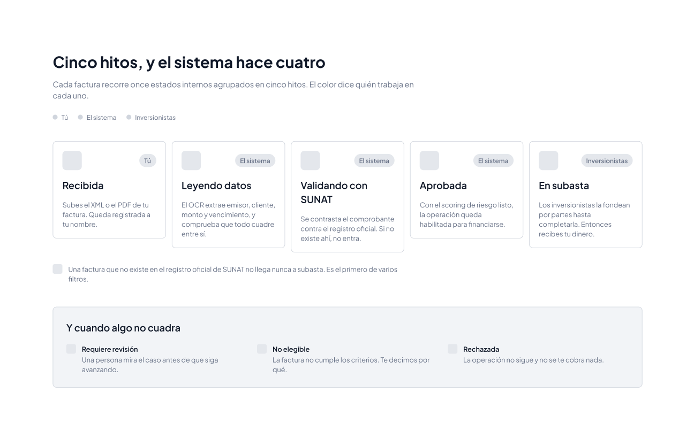


**Simulador de costos**

Herramienta interactiva de cotización que permite al usuario seleccionar moneda, ajustar el monto mediante un control deslizante, elegir el plazo y asignar el nivel de riesgo. Al lado, una tarjeta desglosa el cálculo en tiempo real mostrando el monto a recibir, el costo financiero, la tasa mensual y la TCEA.


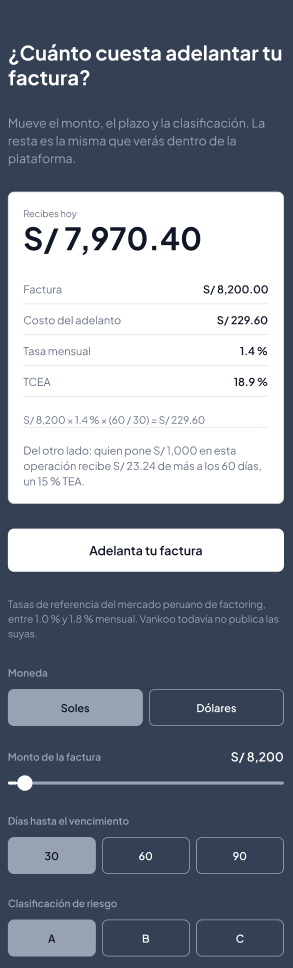

**Propuesta de valor por segmento**

Presenta los beneficios clave mediante un selector de rol (Para tu MYPE / Para invertir). Para las empresas, enfatiza la eliminación de brechas de crédito comercial a través de una cuadrícula de características con soporte visual que refuerza la trazabilidad y la agilidad de cobro.

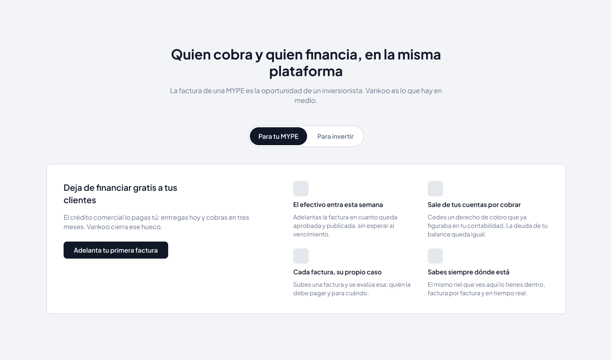


**Clasificación de riesgo**

Explica el sistema de scoring estandarizado mediante tres tarjetas comparativas (A, B y C). Cada bloque describe el perfil del deudor, el comportamiento de pago y el nivel de rentabilidad asociado, permitiendo que tanto emisores como inversionistas comprendan los criterios de evaluación.


**Preguntas frecuentes (FAQ)**

Estructura en acordeón desplegable que agrupa las dudas operativas y financieras más críticas (concepto de crowdfactoring, gestión de impagos, monedas admitidas y tiempos de respuesta) para resolver objeciones antes del registro.


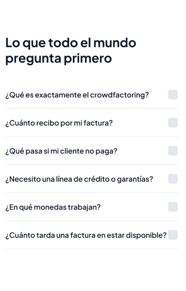

**Llamado a la acción final y Footer**

Módulo de cierre que sintetiza la promesa de liquidez con accesos directos a registro e inicio de sesión. Finaliza con un pie de página corporativo que organiza la navegación secundaria, enlaces a políticas legales y el aviso regulatorio correspondiente.


### 4.3.2. Landing Page Mock-up

A continuación, se presentan los mockups de alta fidelidad de la Landing Page tanto para Desktop Web Browser como para Mobile Web Browser. En esta fase se incorporan la identidad visual de Vankoo, paleta cromática corporativa, tipografía definitiva, microinteracciones, iconografía detallada y componentes visuales finales, consolidando los principios de accesibilidad, legibilidad y jerarquía visual.

**Hero**

Presentación de alta fidelidad con contrastes optimizados, tipografía de alto impacto y estilo visual consolidado. En desktop, la tarjeta preview emula la interfaz real del sistema con indicadores de estado cromáticos e importes destacados; en la variante móvil, los elementos se apilan verticalmente priorizando la legibilidad y el acceso táctil a los llamados a la acción primarios.

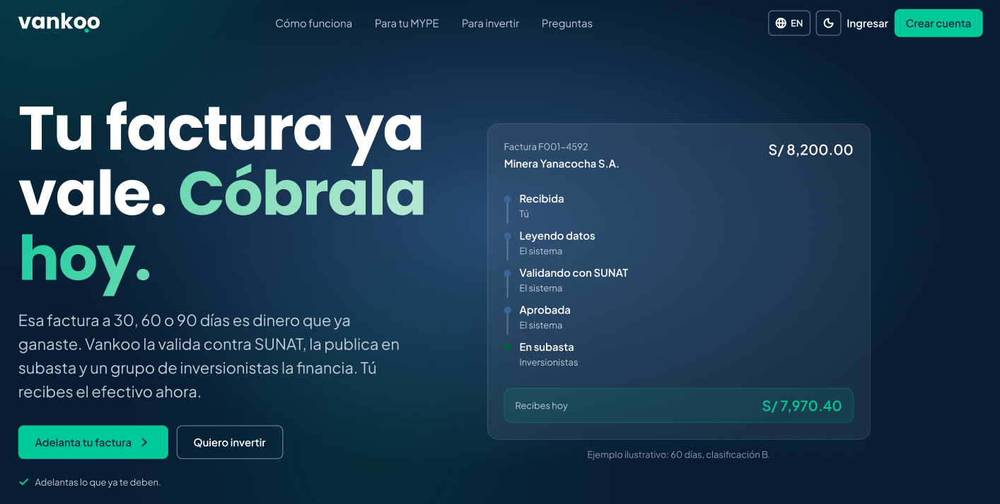


**Flujo del Proceso**

Representación visual de los cinco hitos operativos mediante una línea de tiempo limpia con badges de autoría diferenciados por color (Usuario, Sistema e Inversionistas). Los módulos inferiores de incidencias y excepciones utilizan estados cromáticos suaves de alerta para brindar transparencia operativa sin sobrecargar visualmente la pantalla.

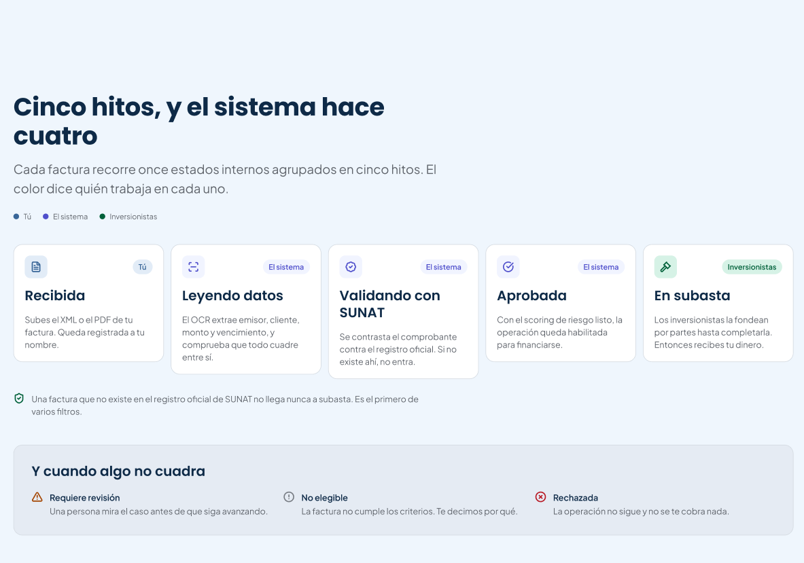
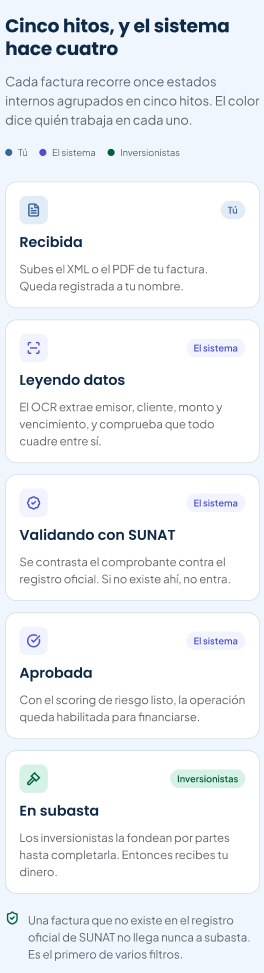

**Simulador de costos**

Diseño final e interactivo del panel de cotización con controles visuales pulidos (toggles segmentados, slider interactivo y chips de selección de plazo). El panel de resultados contrasta sobre fondo claro con números destacados, detallando visualmente el desglose financiero exacto de la operación tanto en escritorio como en navegación táctil móvil.

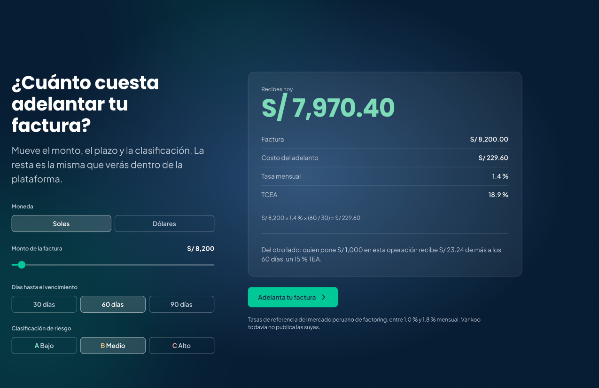


**Propuesta de valor por segmento**

Implementación del conmutador de audiencias (Para tu MYPE / Para invertir) con retroalimentación visual de estado activo. La cuadrícula de beneficios incorpora iconos finales representativos, espacios en blanco equilibrados y tarjetas con bordes suaves que jerarquizan las ventajas competitivas de la plataforma.

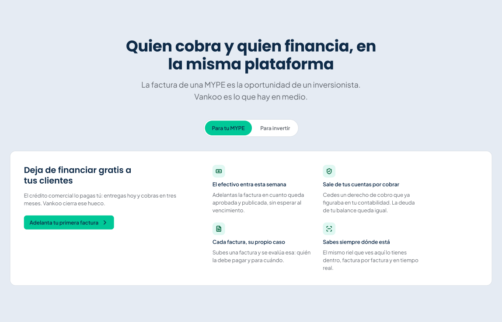


**Clasificación de riesgo** 

Tarjetas modulares de alta fidelidad para las categorías A, B y C con contenedores de badges diferenciados y jerarquía tipográfica definida. El diseño transmite confiabilidad y rigor financiero mediante microtextos concisos, facilitando la comprensión inmediata del riesgo y retorno esperado.

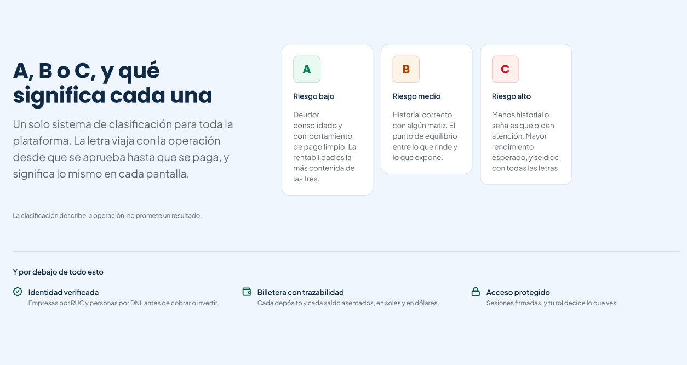
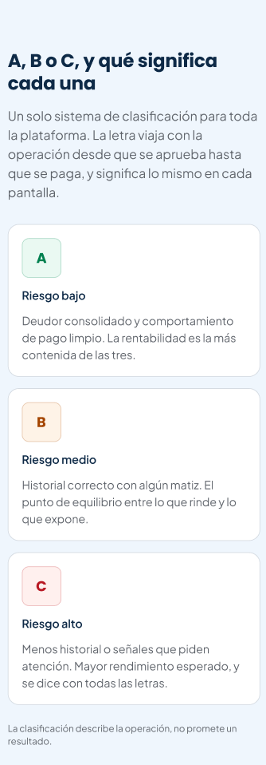

**Preguntas frecuentes (FAQ)**

Componente de acordeón con tratamiento visual acabado, separadores sutiles e indicadores de apertura/cierre claros. En la versión mobile, la separación entre filas y el área táctil de interacción están optimizadas para facilitar la navegación con el pulgar.


**Llamado a la acción final y Footer**

Bloque contenedor oscuro con contraste directo para guiar la conversión final del usuario hacia el registro o inicio de sesión. La sección culmina con un footer corporativo estructurado por columnas temáticas, tipografía de soporte en escala reducida y avisos legales dispuestos de forma equilibrada.

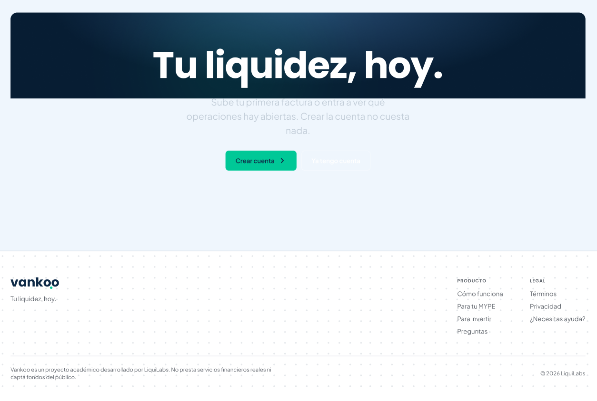
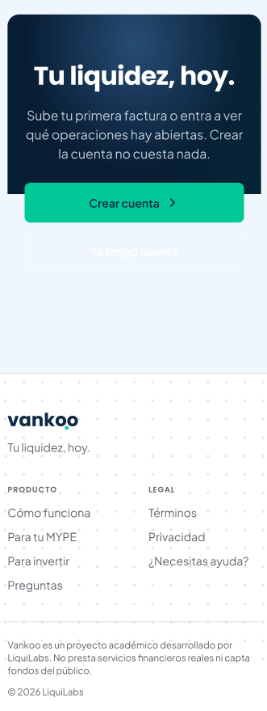

<hr class="page-break">

## 4.4. Web Applications UX/UI Design

En esta sección se presentan los wireframes y mock-ups de las aplicaciones de la plataforma Vankoo. Se describen las principales pantallas, funcionalidades y elementos visuales que componen estas aplicaciones.


### 4.4.1. Web Applications Wireframes

**IAM**

**Inicio de Sesión**

Está pantalla permite a los usuarios autenticarse en la plataforma mediante correo electrónico y contraseña. Se incluyen opciones de recuperación de contraseña y enlaces a registro para nuevos usuarios.

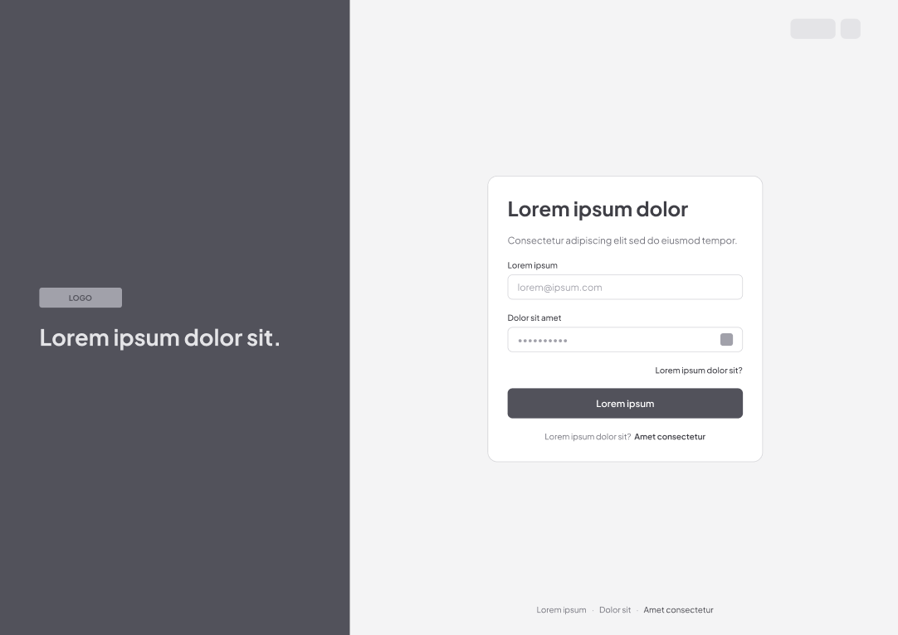

**Creación de Cuenta**

Permite a los nuevos usuarios registrarse en la plataforma proporcionando información básica como nombre, correo electrónico y contraseña. Se incluyen validaciones de campos y mensajes de error.


**Recuperación de Contraseña**

Facilita a los usuarios recuperar el acceso a su cuenta mediante un proceso de verificación por correo electrónico. Se incluyen instrucciones claras y mensajes de confirmación.

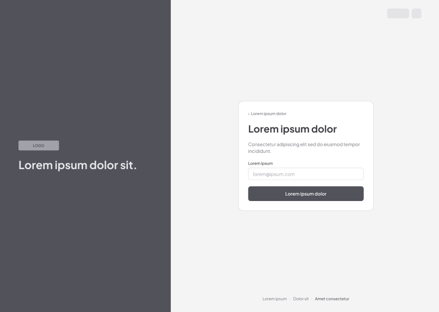

**Nueva Contraseña**

Permite a los usuarios establecer una nueva contraseña después de haber verificado su identidad. Se incluyen campos para la nueva contraseña y confirmación, junto con validaciones de seguridad.

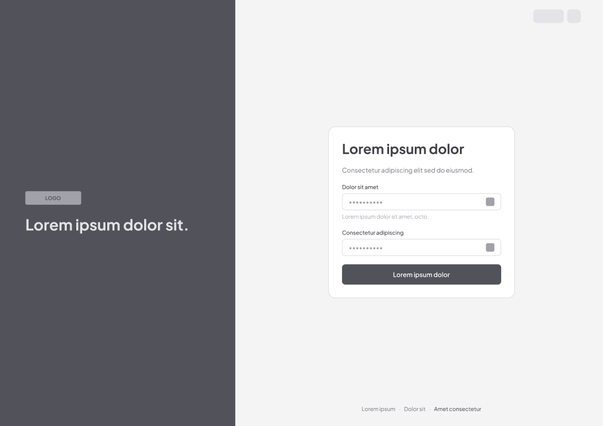

**Perfil**

**Completar Perfil**

Permite al usuario completar la información de su perfil, incluyendo ruc, nombre de la empresa, dirección y otros datos relevantes. Se incluyen validaciones de campos y mensajes de error.


**Perfil enviado**

Muestra un mensaje de confirmación al usuario indicando que su perfil ha sido enviado para revisión.


**Perfil Rechazado**

Muestra un mensaje de rechazo al usuario indicando que su perfil no cumple con los requisitos.

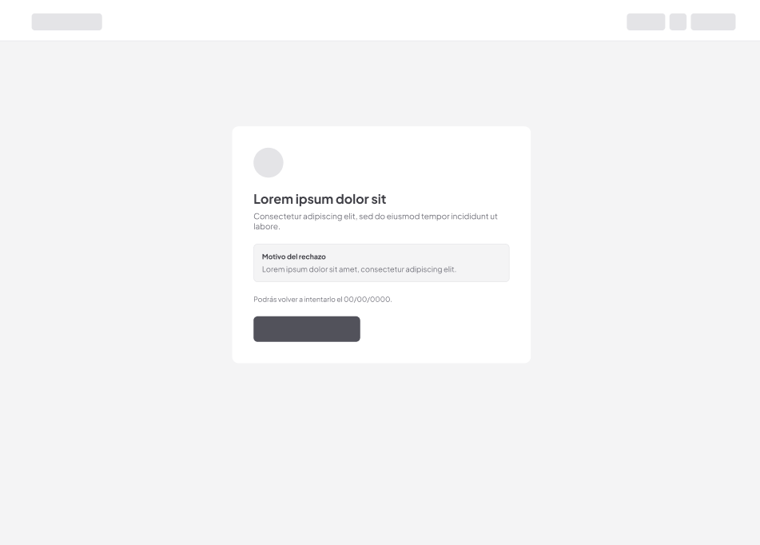

**Dashboard**

**Dashboard Principal**

Muestra un resumen, con el estado de las facturas. 

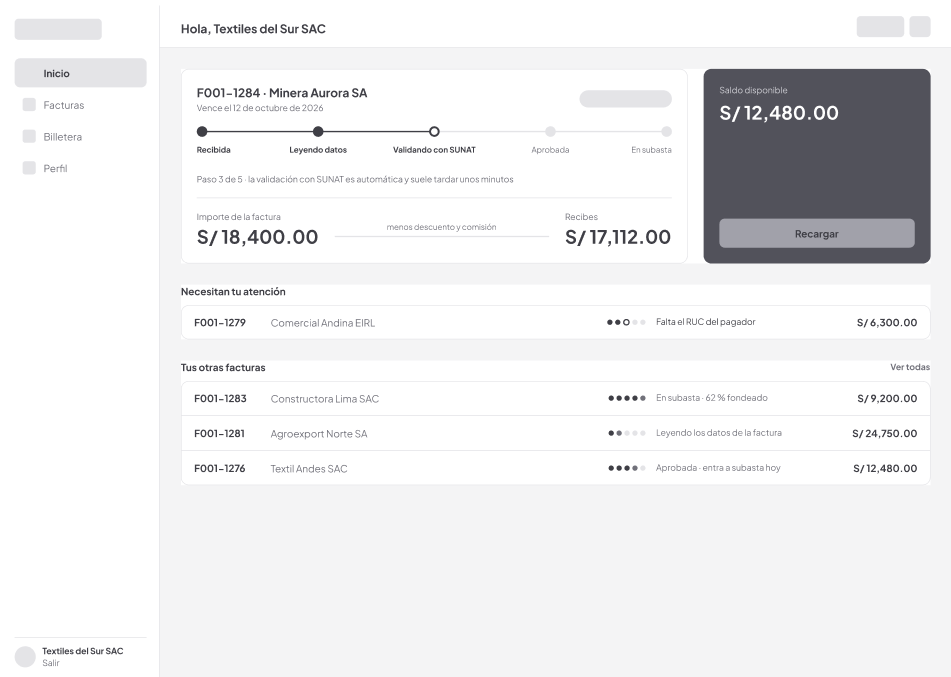

**Perfil en Revisión**

Muestra un mensaje al usuario indicando que su perfil está en proceso de revisión y que no puede acceder a ciertas funcionalidades hasta que sea aprobado.


**Facturas**

**Subir Factura**

Permite al usuario subir una factura para su procesamiento y un botón para cargar el archivo de la factura.

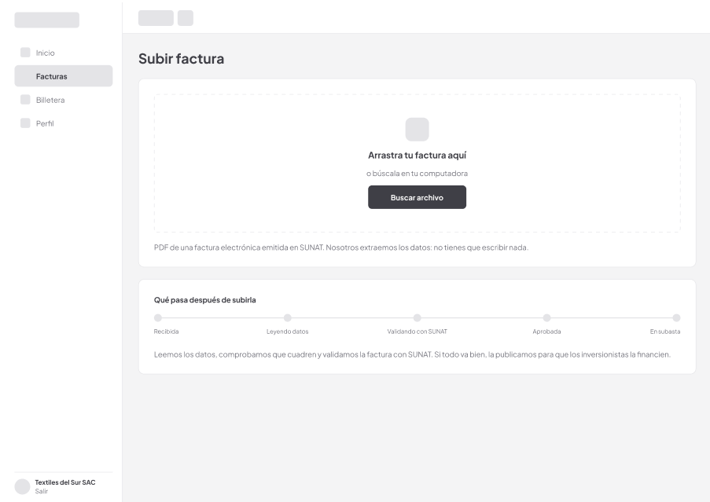

**Facturas en Proceso**

Muestra un listado de las facturas que están siendo procesadas, con información relevante como el estado de la factura.


**Lista de Facturas**

Muestra un listado de todas las facturas del usuario, con información relevante como el estado de la factura.

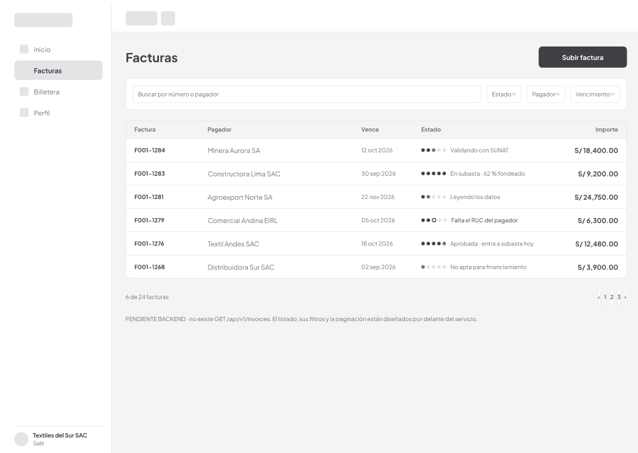

**Detalle de Factura**

Muestra los detalles de una factura específica, incluyendo información como el estado de la factura, el monto y la fecha de vencimiento.

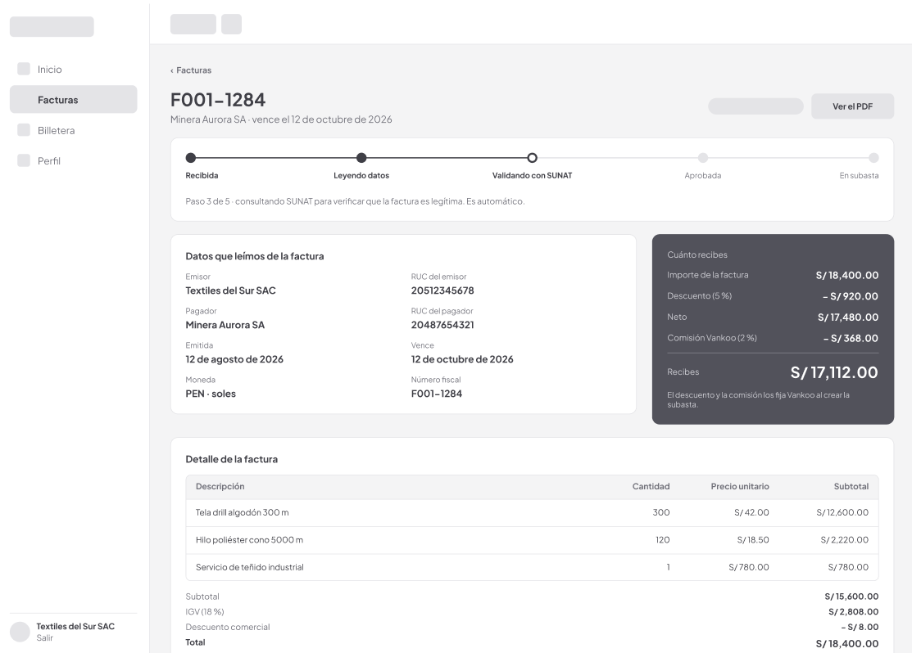

**Requiere Revisión**

Muestra un mensaje al usuario indicando que su factura requiere revisión y que no puede ser procesada hasta que se resuelvan los problemas.


**Factura Rechazada**

Muestra un mensaje al usuario indicando que su factura ha sido rechazada y que no puede ser procesada.


**Billetera y Perfil**

**Billetera**

Muestra un resumen del estado de la billetera del usuario, incluyendo el saldo disponible y las transacciones recientes.

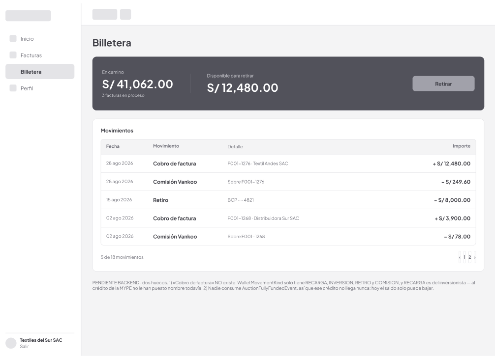

**Billetera Vacía**

Muestra un mensaje al usuario indicando que su billetera está vacía y que no tiene saldo disponible.

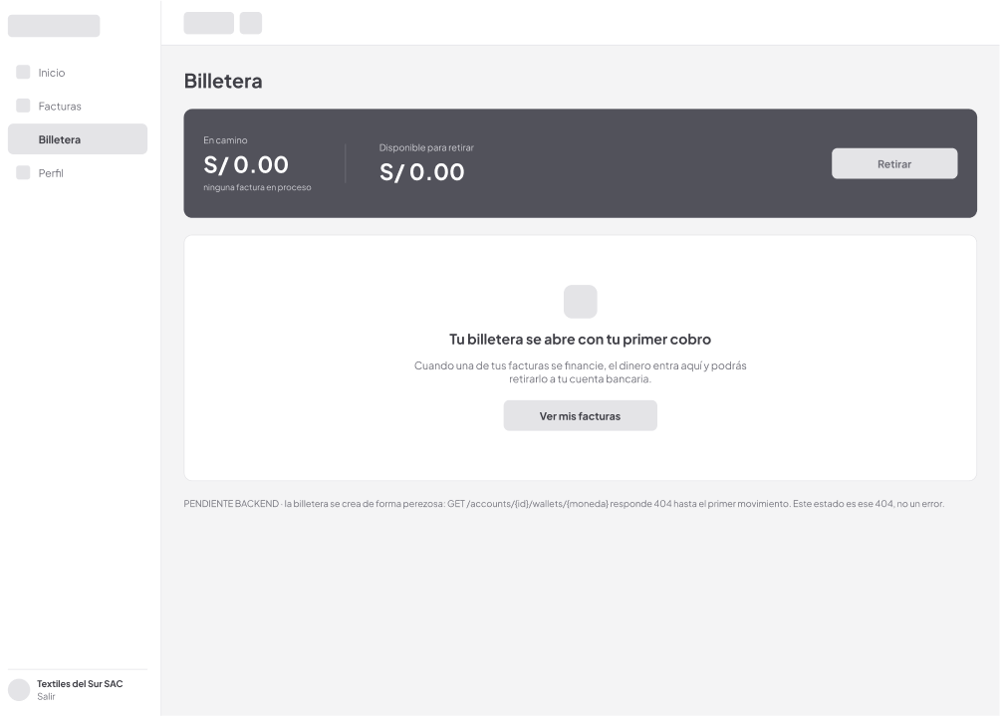

**Retiro de Fondos**

Permite al usuario retirar fondos de su billetera a su cuenta bancaria, incluyendo campos para ingresar el monto y seleccionar la cuenta bancaria.


**Confirmar Retiro de Fondos**

Confirma la solicitud de retiro de fondos del usuario, mostrando un resumen de la transacción.

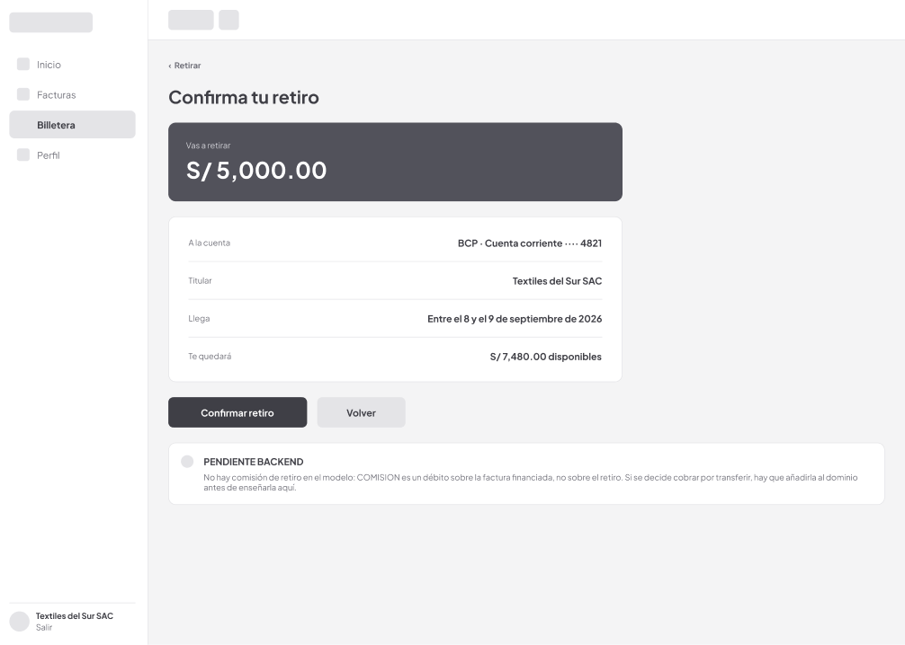

**Mi Perfil**

Permite al usuario ver de su perfil, su nombre, correo electrónico y contraseña.

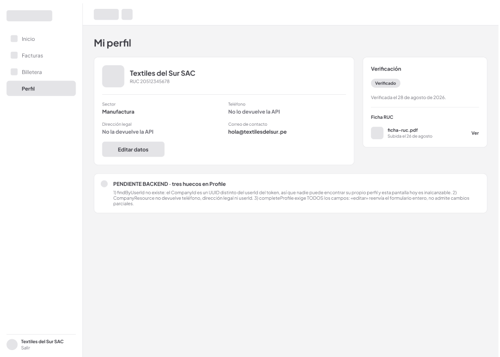

**Perfil en Revisión**

Muestra un mensaje al usuario indicando que su perfil está en proceso de revisión y que no puede acceder a ciertas funcionalidades hasta que sea aprobado.


**Página no encontrada (404)**

Muestra un mensaje al usuario indicando que la página solicitada no se encuentra disponible.


### 4.4.2. Web Applications Wireflow Diagrams

**Acceso y recuperación**

User goal 01: Como responsable de una MYPE quiero crear mi cuenta o recuperar mi acceso para entrar a Vankoo con mi rol reconocido.

El recorrido principal ocupa solo dos pantallas: 01, donde se crea la cuenta, y 02, donde se inicia sesión. Como IAM emite el token y la web decodifica directamente el claim «roles», el sistema ya sabe que quien entra es una MYPE, y por eso no existe una pantalla de «elige tu perfil». Los dos rombos representan decisiones del sistema, no de la persona, y sus ramas «no» no tienen wireframe propio: el error se muestra sobre el mismo formulario, así que ambas ramas se cierran con una cápsula que regresa al paso de origen. La fila inferior corresponde al sub-flujo de recuperación, que se activa desde «¿Olvidaste tu contraseña?» y termina devolviendo a la persona a 02 con la contraseña ya renovada.

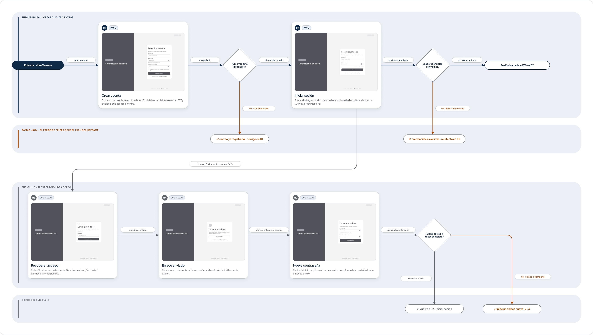

**Perfil y validación**

User goal 02: Como responsable de una MYPE quiero registrar los datos de mi empresa y que se validen para poder operar en Vankoo.

Como el rol ya viaja en el token, este flujo no necesita preguntar quién es la MYPE, sino pedirle los datos de su empresa. 01 es un formulario que el agregado solo acepta completo —no admite actualizaciones parciales (PATCH)—, por lo que su rama «no» no avanza: devuelve a la persona al mismo paso con el campo inválido marcado. El segundo rombo resuelve el estado del KYC y tiene tres salidas posibles: si es aprobado, se abre el dashboard; si queda en revisión, se permite el ingreso pero con las acciones bloqueadas; y si es rechazado, esa es la única ruta del flujo que no tiene salida.


**Factura y elegibilidad**

User goal 03: Como responsable de una MYPE quiero subir una factura y saber si es elegible para publicarla en subasta.

El flujo tiene cuatro pasos y un único rombo. 01 es el estado vacío desde el que parte la MYPE; 02 corresponde a la subida del documento, y 03 es ese mismo paso en su estado siguiente, mientras el pipeline —OCR, extracción de datos, verificación de consistencia y validación con SUNAT— se ejecuta de forma automática: en ese punto no hay interacción, solo espera. El rombo resuelve el enum InvoiceStatus: si la factura es aprobada, continúa a 04 y entra en subasta; si requiere revisión, el trabajo regresa a la MYPE; y si es no elegible o rechazada, el flujo se cierra sin salida.

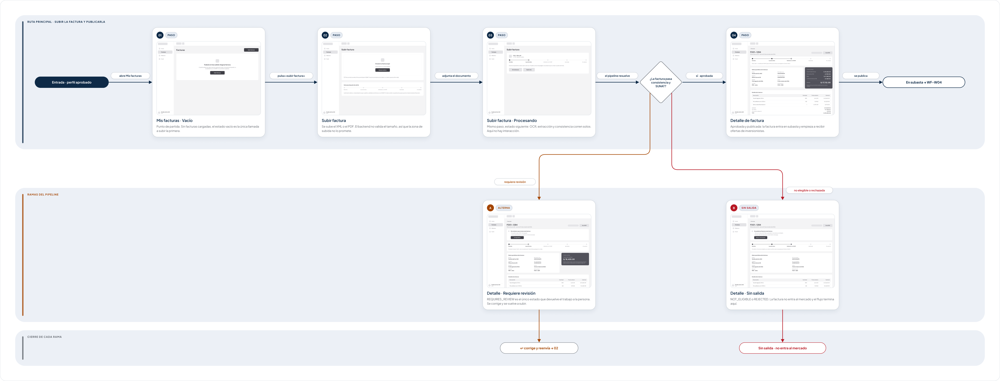

**Seguimiento del fondeo**

User goal 04: Como responsable de una MYPE quiero seguir cómo avanza el fondeo de mi factura y saber cuándo el dinero está disponible.

Este flujo no crea nada, solo permite observar. 01 y 02 son dos formas de llegar a la misma factura —el resumen inicial y la tabla completa—, mientras que 03 es donde realmente se sigue el fondeo, porque el riel de hitos indica en cada momento quién está trabajando. El rombo es la única bifurcación: mientras la subasta no alcance el 100 %, el flujo permanece a la espera en 03, y en cuanto lo alcanza, el dinero queda disponible en 04. Las dos ramas alternativas no son errores, sino estados vacíos: el punto en el que la MYPE todavía no tiene nada publicado.

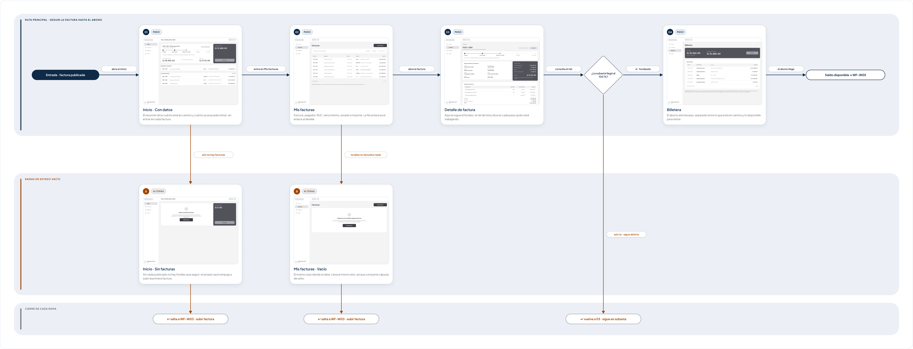

**Billetera y retiro**

User goal 05: Como responsable de una MYPE quiero retirar a mi cuenta bancaria el dinero disponible en mi billetera.

El retiro es el último tramo del recorrido de la MYPE y el único que saca dinero de Vankoo, por lo que el rombo se ubica antes del formulario y no después: verifica las dos condiciones —saldo disponible y KYC aprobado— en el momento en que la persona pulsa «retirar», no cuando envía el importe. 02 y 03 son el mismo paso en dos estados distintos, que es la forma en que el wireflow representa el efecto de confirmar la operación. Las tres ramas inferiores no son errores, sino las tres razones por las que el botón no puede continuar, y cada una remite al lugar donde esa condición se resuelve.


### 4.4.3. Web Applications Mock-ups

**IAM**

**Iniciar Sesión**

Pantalla de inicio de sesión con campos para correo electrónico y contraseña, botones de acción y enlaces a recuperación de contraseña y registro.


**Iniciar Sesión - Error**

Pantalla de inicio de sesión con mensaje de error indicando que las credenciales son incorrectas.

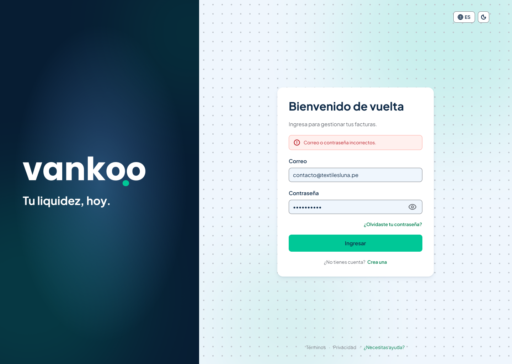

**Iniciar Sesión - Cargando**

Pantalla de inicio de sesión con indicador de carga mientras se procesa la autenticación.

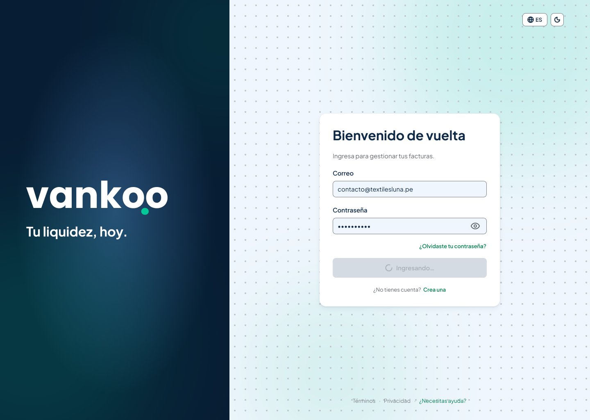

**Crear Cuenta**

Pantalla de registro de cuenta con campos para correo electrónico, contraseña y confirmación de contraseña, junto con botones de acción.


**Crear Cuenta - Error**

Pantalla de registro de cuenta con mensaje de error indicando que el correo electrónico ya está en uso.

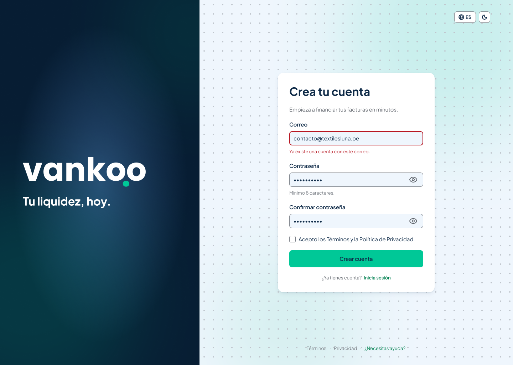

**Crear Cuenta - Cargando** 

Pantalla de registro de cuenta con indicador de carga mientras se procesa la creación de la cuenta.

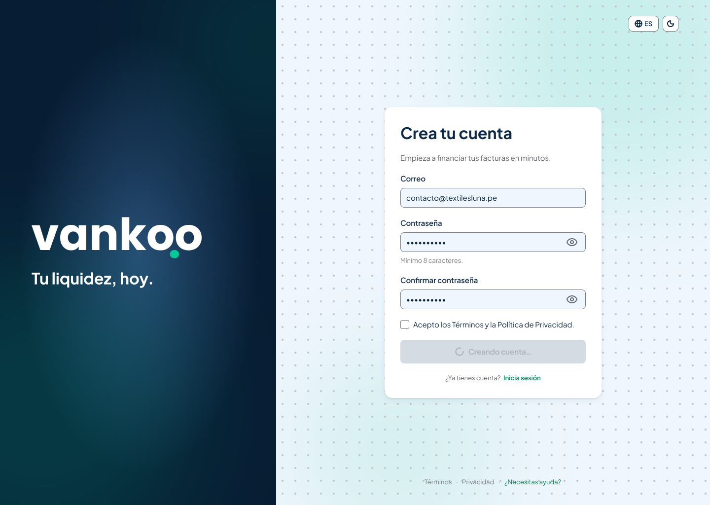

**Recuperar Contraseña**

Pantalla de recuperación de contraseña con campos para correo electrónico y botones de acción.


**Nueva Contraseña**

Pantalla para establecer una nueva contraseña con campos para la nueva contraseña y confirmación, junto con botones de acción.


**Nueva Contraseña - Enlace Incompleto**

Pantalla para establecer una nueva contraseña con mensaje de error indicando que el enlace de recuperación es inválido o ha expirado.


**Perfil**

**Completar Perfil**

Pantalla para completar el perfil de la empresa con campos para RUC, nombre de la empresa, dirección y otros datos relevantes, junto con botones de acción.


**Completar Perfil - Error**

Pantalla para completar el perfil de la empresa con mensaje de error indicando que algún campo es inválido o está incompleto.


**Perfil en Revisión**

Pantalla que indica al usuario que su perfil está en proceso de revisión y que no puede acceder a ciertas funcionalidades hasta que sea aprobado.


**Rechazo de Perfil**

Pantalla que indica al usuario que su perfil ha sido rechazado y que no puede acceder a ciertas funcionalidades.


**Dashboard**

**Inicio con Datos**

Pantalla principal del dashboard que muestra un resumen del estado de las facturas y otras métricas relevantes para el usuario.


**Inicio sin Datos**

Pantalla principal del dashboard que indica al usuario que no tiene facturas registradas y le invita a subir su primera factura. 


**KCY en Revisión**

Pantalla del dashboard que indica al usuario que su perfil está en proceso de revisión y que no puede acceder a ciertas funcionalidades hasta que sea aprobado.


**Facturas**

**Subir Factura**

Pantalla para subir una factura con campos para seleccionar el archivo y botones de acción.


**Facturas en Proceso**

Pantalla que muestra un listado de las facturas que están siendo procesadas, con información relevante como el estado de la factura.


**Mi Lista de Facturas**

Pantalla que muestra un listado de todas las facturas del usuario, con información relevante como el estado de la factura.


**Detalle de Factura**

Pantalla que muestra los detalles de una factura específica, incluyendo información como el estado de la factura, el monto y la fecha de vencimiento.


**Requiere Revisión**

Pantalla que indica al usuario que su factura requiere revisión y que no puede ser procesada hasta que se resuelvan los problemas.


**Factura Rechazada**

Pantalla que indica al usuario que su factura ha sido rechazada y que no puede ser procesada.


**Billetera y Perfil**

**Billetera**

Pantalla que muestra un resumen del estado de la billetera del usuario, incluyendo el saldo disponible y las transacciones recientes.


**Billetera Vacía**

Pantalla que indica al usuario que su billetera está vacía y que no tiene saldo disponible.


**Retiro de Fondos**

Pantalla que permite al usuario retirar fondos de su billetera a su cuenta bancaria, incluyendo campos para ingresar el monto y seleccionar la cuenta bancaria.


**Confirmar Retiro de Fondos**

Pantalla que confirma la solicitud de retiro de fondos del usuario, mostrando un resumen de la transacción.


**Mi Perfil**

Pantalla que permite al usuario ver su perfil, incluyendo campos para nombre, correo electrónico y contraseña.


**Mi Perfil en Revisión**

Pantalla que indica al usuario que su perfil está en proceso de revisión y que no puede acceder a ciertas funcionalidades hasta que sea aprobado.


**Pagina no encontrada (404)**

Pantalla que indica al usuario que la página solicitada no se encuentra disponible.


### 4.4.4. Web Applications User Flow Diagrams

**Acceso y recuperación**

User goal 01: Como responsable de una MYPE quiero crear mi cuenta o recuperar mi acceso para entrar a Vankoo con mi rol reconocido.

El happy path recorre 01 → 02: la MYPE crea la cuenta, IAM emite el token y la web decodifica el claim «roles» para saber que entra como MYPE — no hace falta preguntárselo. Las dos rutas alternativas de la fila central son recuperables y devuelven al mismo paso del que salieron, sin sacar al usuario de la pantalla. La fila inferior es el sub-flujo de recuperación: se entra desde «¿Olvidaste tu contraseña?» y se vuelve a 02 con la contraseña nueva.


**Perfil y validación**

User goal 02: Como responsable de una MYPE quiero completar el perfil de mi empresa y conocer el estado de su validación para poder operar.

El onboarding va antes del dashboard: con el KYC en PENDING la MYPE no puede operar, así que ésta es la antesala de la casa. El happy path recorre 01 → 03: se completan los datos, el perfil pasa a revisión y el inicio queda navegable pero sin operar, con los botones visibles y deshabilitados. La ruta A es un error de campo recuperable en el momento; la ruta B es el rechazo, que se reintenta con espera creciente.


**Factura y elegibilidad**

User goal 03: Como responsable de una MYPE quiero subir una factura y saber si es elegible para publicarla en subasta.

La factura recorre el pipeline del servicio Invoicing: se sube, el sistema la lee y decide si es elegible. El happy path recorre 01 → 03 y termina con la factura publicada para el fondeo. El paso 02 no pide nada al usuario: el estado avanza solo. Las dos rutas alternativas comparten tono a propósito — ámbar cuando el pipeline necesita a una persona y todavía se puede corregir, rojo cuando la factura ya no tiene salida.


**Seguimiento del fondeo**

User goal 04: Como responsable de una MYPE quiero seguir cómo avanza el fondeo de mi factura y saber cuándo el dinero está disponible.

Este flujo no crea nada: consulta. El happy path recorre 01 → 03, de la lista al detalle y del detalle al inicio, que repite el avance del fondeo de cada factura. La primera bifurcación es el estado vacío —la lista sin facturas manda al flujo de carga— y la segunda es la factura no encontrada, que aparece con un enlace roto o cuando la factura no pertenece a la empresa de la sesión.


**Billetera y retiro**

User goal 05: Como responsable de una MYPE quiero retirar a mi cuenta bancaria el dinero disponible en mi billetera y conocer el estado de la operación.

El retiro es la última milla del producto para la MYPE: el dinero ya cobrado sale de la billetera hacia su cuenta. El happy path recorre 01 → 03 y termina con el saldo actualizado. Las dos rutas alternativas no son errores del usuario sino condiciones del estado de la cuenta: la billetera vacía manda al flujo de carga de facturas, y el KYC sin verificar manda al de perfil, porque no se paga a quien todavía no está verificado.


## 4.5. Web Applications Prototyping

En esta sección se presentan los prototipos de alta fidelidad de las aplicaciones web de la plataforma Vankoo, junto con enlaces a los videos demostrativos y capturas de pantalla representativas. 


Enlace a los prototipos de alta fidelidad de las aplicaciones web de la plataforma Vankoo: [https://goo.su/OiJclnu](https://www.figma.com/proto/L4FrfBQBpsggk4qD67tpEa/Vankoo-Product?node-id=466-4300&p=f&viewport=214%2C181%2C0.05&t=moWZ438Gq7KhhDWt-1&scaling=min-zoom&content-scaling=fixed&starting-point-node-id=466%3A4300&page-id=177%3A9&show-proto-sidebar=1)

Enlace al video demostrativo de la aplicación web de la plataforma Vankoo: [https://goo.su/3CwwVi](https://upcedupe-my.sharepoint.com/:v:/g/personal/u20221g044_upc_edu_pe/IQB4QYHJMxA9SJ-DTv1I1UxmAUWxp0zdf6QblzAVYYo7EMQ?e=tSbVOD)

<hr class="page-break">

## 4.6. Domain-Driven Software Architecture

_Pendiente de elaboración: párrafo introductorio de la sección._

### 4.6.1. Software Architecture Context Diagram

<!-- Diagrama de contexto del C4 Model, elaborado en Structurizr. Fuente en src/, export en out/. -->
<!-- Assets: ./assets/cap4-product-design/software-architecture/context-diagram/ -->

_Pendiente de elaboración._

### 4.6.2. Software Architecture Container Diagrams

<!-- Diagramas de contenedores del C4 Model, elaborados en Structurizr. Fuente en src/, export en out/. -->
<!-- Assets: ./assets/cap4-product-design/software-architecture/container-diagrams/ -->

_Pendiente de elaboración._

### 4.6.3. Software Architecture Components Diagrams

<!-- Diagramas de componentes del C4 Model, elaborados en Structurizr. Fuente en src/, export en out/. -->
<!-- Assets: ./assets/cap4-product-design/software-architecture/components-diagrams/ -->

Los diagramas de componentes (C4 Nivel 3) profundizan en la organización interna de cada bounded context de Vankoo, elaborados en Structurizr a partir del código fuente real de cada microservicio. Se desarrollaron los cinco bounded contexts implementados a la fecha —IAM, Invoicing, Investment, Finance y Profile—, manteniendo la convención de capas Interface, Application, Domain e Infrastructure, más un adaptador ACL cuando el servicio integra un sistema externo (OCR, almacenamiento de archivos o pasarela de pagos).

**IAM**

El diagrama de componentes del IAM Service (Java / Spring Boot) distingue seis componentes: la `IAM Interface Layer` (AuthenticationController, UsersController) como punto de entrada REST validado por el API Gateway; la `IAM Application Layer`, que orquesta el registro, el login y las consultas; la `IAM Domain Layer` con el aggregate `User` y la entidad `Role`; y tres adaptadores de infraestructura — `IAM Security Infrastructure` (JWT y BCrypt), `IAM Persistence Infrastructure` (JPA hacia la IAM Database en PostgreSQL) e `IAM Messaging Infrastructure`, que publica el evento `UserCreatedEvent` al Message Broker una vez confirmado el commit.

**Código fuente (Structurizr DSL):** [`iam-service-components.dsl`](./assets/cap4-product-design/software-architecture/components-diagrams/src/iam-service-components.dsl)

**Invoicing**

El diagrama de componentes del Invoicing Service (C# / .NET) organiza en ocho componentes el flujo de carga y validación de facturas bajo el patrón MediatR/CQRS. La `Invoicing Interface Layer` recibe la carga, consulta y descarga de facturas; la `Invoicing Application Layer` coordina los command y query handlers; la `Invoicing Domain Layer` modela el aggregate `Invoice` como máquina de estados junto al servicio de dominio `InvoiceConsistencyValidator`. El procesamiento asíncrono corre en el `OCR Background Worker`, que reclama tareas pendientes y dispara la extracción vía el `OCR ACL Adapter` (Azure Document Intelligence) y el `Storage ACL Adapter` (Amazon S3); la persistencia en MongoDB y la publicación del evento de integración `InvoiceEligibleForFundingIntegrationEvent` hacia el Message Broker completan el flujo.

**Código fuente (Structurizr DSL):** [`invoicing-service-components.dsl`](./assets/cap4-product-design/software-architecture/components-diagrams/src/invoicing-service-components.dsl)

**Investment**

El diagrama de componentes del Investment Service (Java / Spring Boot) es el más simple de los cinco, con cinco componentes que soportan el marketplace de subastas. La `Investment Interface Layer` (AuctionsController) expone la creación de subastas, la inversión por fracciones y el listado del marketplace; la `Investment Application Layer` orquesta el aggregate `Auction` (entidad `Partition`) definido en la `Investment Domain Layer`; la `Investment Persistence Infrastructure` persiste subastas y actualiza la proyección de lectura CQRS sobre Oracle XE. La `Investment Messaging Infrastructure` consume el evento de facturas elegibles publicado por Invoicing y lo traduce en el comando `CreateAuctionCommand`. El código actual todavía no implementa el consumo del "Score Calculado" del Risk Service ni la publicación de "Inversión Realizada", por lo que ambos flujos no aparecen en este diagrama.

**Código fuente (Structurizr DSL):** [`investment-service-components.dsl`](./assets/cap4-product-design/software-architecture/components-diagrams/src/investment-service-components.dsl)

**Finance**

El diagrama de componentes del Finance Service (Java / Spring Boot con Axon Framework) es el más complejo de los cinco, con nueve componentes que reflejan un verdadero Event Sourcing/CQRS. La `Finance Command Application Layer` despacha comandos sobre los aggregates `Wallet` y `Deposit` (`Finance Domain Layer`) vía el CommandGateway de Axon, cuyos eventos se persisten en el Finance Event Store (Axon Server). Los `Finance Event Reactors (Sagas)` reaccionan a esos eventos para acreditar la billetera y crear el cargo en Stripe a través del `Stripe ACL Adapter`; la `Finance Query / Projection Layer` proyecta el estado hacia el read model en PostgreSQL, y el `Finance Integration Event Publisher` notifica al Message Broker. Dos componentes de infraestructura separan la persistencia de lectura (`finance_read_model`) de las tablas de borde e idempotencia (`finance_ops`).

**Código fuente (Structurizr DSL):** [`finance-service-components.dsl`](./assets/cap4-product-design/software-architecture/components-diagrams/src/finance-service-components.dsl)

**Profile**

El diagrama de componentes del Profile Service (TypeScript / NestJS) organiza en seis componentes la gestión de perfil y KYC de las Mypes (`Company`) y los Inversionistas (`Investor`). La `Profile Interface Layer` expone la actualización del perfil, la carga de documentos y la verificación/rechazo del KYC; la `Profile Application Layer` orquesta ambos aggregates (`Company`, `Investor`) definidos en la `Profile Domain Layer`, cada uno con su propia máquina de estados de KYC. El `Storage ACL Adapter` genera URLs prefirmadas hacia Amazon S3 para subir el RUC, el DNI, el logo y la foto de perfil. La `Profile Messaging Infrastructure` consume el evento publicado por el IAM Service para crear el perfil inicial según el rol del usuario, y publica los eventos `ProfileCompleted`, `KycVerified` y `KycRejected` hacia el Message Broker.

**Código fuente (Structurizr DSL):** [`profile-service-components.dsl`](./assets/cap4-product-design/software-architecture/components-diagrams/src/profile-service-components.dsl)

_Capturas de los diagramas renderizados: pendientes de incorporar en `./assets/cap4-product-design/software-architecture/components-diagrams/out/`._

<hr class="page-break">

## 4.7. Software Object-Oriented Design

_Pendiente de elaboración: párrafo introductorio de la sección._

### 4.7.1. Class Diagrams

<!-- Diagramas de clases UML, elaborados en LucidChart o PlantUML. Fuente en src/, export en out/. -->
<!-- Assets: ./assets/cap4-product-design/class-diagrams/ -->

_Pendiente de elaboración._

### 4.7.2. Class Dictionary

<!-- Diccionario de clases: por cada clase, su propósito, atributos y métodos. -->

_Pendiente de elaboración._

<hr class="page-break">

## 4.8. Database Design

_Pendiente de elaboración: párrafo introductorio de la sección._

### 4.8.1. Database Diagram

<!-- Diagrama de base de datos, elaborado en LucidChart / Vertabelo. Fuente (.sql) en src/, export en out/. -->
<!-- Assets: ./assets/cap4-product-design/database-design/ -->

_Pendiente de elaboración._

<hr class="page-break">

# Capítulo V: Product Implementation, Validation & Deployment

<!-- Proceso de implementar, comprobar, desplegar y validar la solución: Landing Page, RESTful Web Services y Frontend Web Applications, aplicando responsive web design. -->

_Pendiente de elaboración: párrafo introductorio del capítulo._

## 5.1. Software Configuration Management

<!-- Decisiones y convenciones que permitirán mantener la consistencia durante el ciclo de vida. -->
<!-- Assets: ./assets/cap5-product-implementation/configuration-management/ -->

_Pendiente de elaboración._

### 5.1.1. Software Development Environment Configuration

<!-- Por cada producto de software: nombre, propósito de uso en el proyecto y ruta de referencia (SaaS) o de descarga. Cubrir Project Management, Requirements Management, Product UX/UI Design, Software Development, Software Testing, Software Deployment y Software Documentation. -->

_Pendiente de elaboración._

| Categoría | Producto | Propósito de uso | Ruta de referencia / descarga |
|---|---|---|---|
| Project Management |  |  |  |
| Requirements Management |  |  |  |
| Product UX/UI Design |  |  |  |
| Software Development |  |  |  |
| Software Testing |  |  |  |
| Software Deployment |  |  |  |
| Software Documentation |  |  |  |

### 5.1.2. Source Code Management

<!-- URL del repositorio de GitHub por cada producto: Landing Page, Web Services y Frontend Web Applications. Explicar la implementación de GitFlow: qué branches se crean además de main, convenciones para feature, release y hotfix branches, Semantic Versioning 2.0.0 para los releases y Conventional Commits para los mensajes. -->

_Pendiente de elaboración._

| Producto | Repositorio |
|---|---|
| Landing Page |  |
| Frontend Web Application |  |
| Web Services |  |
| Informe del proyecto | [liquilabshq/vankoo-tsp-report](https://github.com/liquilabshq/vankoo-tsp-report) |

**GitFlow Workflow**

_Pendiente de elaboración._

**Conventional Commits**

_Pendiente de elaboración._

**Semantic Versioning 2.0.0**

_Pendiente de elaboración._

### 5.1.3. Source Code Style Guide & Conventions

<!-- Referencias que se adoptarán para nombrar elementos y programar en los lenguajes de la solución (HTML, CSS, JavaScript, TypeScript, Java y Gherkin para los archivos .feature). Nomenclatura en inglés para todos los lenguajes. -->

_Pendiente de elaboración._

### 5.1.4. Software Deployment Configuration

Se utilizarán las siguientes plataformas para el despliegue de los diferentes productos del proyecto:

| **Producto** | **Plataforma de Despliegue** | **Propósito** | **Enlace / Ruta de Acceso** |
|---|---|---|---|
| **Landing Page** | **Netlify** | Plataforma utilizada para el despliegue automático y continuo de la landing page estática. | [https://www.netlify.com](https://www.netlify.com) |
| **Frontend Web Application** | **Netlify** | Alojamiento y despliegue continuo de la aplicación web cliente, con soporte para rutas y variables de entorno. | [https://www.netlify.com](https://www.netlify.com) |
| **Microservices** | **Microsoft Azure (Azure Container Instances / ACR)** | Ejecución de microservicios contenedorizados sin servidor (serverless containers), alimentados desde imágenes privadas en Azure Container Registry. | [https://portal.azure.com](https://portal.azure.com) |
| **Discovery Server** | **Microsoft Azure (Dapr / Azure Container Apps)** | Descubrimiento de servicios y resolución dinámica de nombres entre componentes mediante la integración de Dapr en Azure. | [https://dapr.io](https://dapr.io) |
| **Message Broker** | **Microsoft Azure (Azure Event Hubs)** | Plataforma de transmisión masiva de datos y desacoplamiento de eventos asíncronos en tiempo real entre microservicios. | [https://azure.microsoft.com/services/event-hubs](https://azure.microsoft.com/services/event-hubs) |
| **Kotlin Multiplatform Mobile App (Android)** | **Google Play Console** | Publicación, gestión de versiones y distribución del artefacto Android generado desde la base de código compartida. | [https://play.google.com/console](https://play.google.com/console) |
| **Kotlin Multiplatform Mobile App (iOS)** | **Apple App Store Connect** | Publicación, pruebas beta (TestFlight) y distribución de la aplicación compilada para dispositivos iOS. | [https://appstoreconnect.apple.com](https://appstoreconnect.apple.com) |


**Netlify (Landing Page & Frontend Web Application)**

Netlify es una plataforma de nube especializada en la automatización del ciclo de vida de aplicaciones frontend y sitios web modernos. Ofrece integración nativa con repositorios Git, facilitando la integración continua (CI/CD) mediante webhooks que ejecutan pipelines de build y publicación instantánea con invalidación automática de caché en su CDN global.

Para configurar el despliegue tanto de la Landing Page como del Frontend Web Application en Netlify, se siguen los siguientes pasos:
1. Iniciar sesión en [Netlify](https://www.netlify.com) y conectar la cuenta de GitHub de la organización o proyecto.
2. Seleccionar la opción **"Add new site" > "Import an existing project"** y vincular el repositorio correspondiente.
3. Especificar la rama de producción (`main`) o de pruebas (`develop`) según el entorno a configurar.
4. Definir los parámetros de compilación:
   - **Build command:** Por ejemplo, `npm run build` o `pnpm build`.
   - **Publish directory:** El directorio generado por el empaquetador (por ejemplo, `dist/` o `build/`).
5. Configurar las variables de entorno necesarias (API Gateway URLs, tokens públicos de autenticación) en la sección **Site configuration > Environment variables**.
6. Añadir las reglas de redirección en un archivo `_redirects` o `netlify.toml` para asegurar el correcto enrutamiento SPA (*Single Page Application*).
7. Desplegar el sitio y verificar la generación del subdominio provisto por Netlify o la configuración de un dominio personalizado con certificado SSL automático.


**Microsoft Azure (Ecosistema Backend y Mensajería)**

Microsoft Azure centraliza la infraestructura de backend del proyecto, garantizando alta disponibilidad, seguridad por aislamiento y escalabilidad mediante soluciones gestionadas y serverless.

Los microservicios son empaquetados como imágenes Docker y gestionados mediante dos servicios complementarios:
* **Azure Container Registry (ACR):** Repositorio privado y seguro administrado en la nube donde se compilan y almacenan las imágenes de cada microservicio a través de pipelines de CI/CD.
* **Azure Container Instances (ACI):** Entorno de ejecución serverless que permite inicializar contenedores de forma aislada, rápida y sin necesidad de gestionar la infraestructura de un clúster de máquinas virtuales subyacente.

**Flujo de despliegue:**
1. Crear un recurso de Azure Container Registry en el grupo de recursos del proyecto.
2. Construir la imagen Docker de cada microservicio y publicarla (`docker push`) en ACR utilizando credenciales administradas o un Service Principal.
3. Crear y configurar instancias en Azure Container Instances vinculando la imagen correspondiente desde ACR.
4. Definir las variables de entorno (cadenas de conexión a bases de datos, perfiles de entorno) y especificaciones de cómputo (CPU y memoria).
5. Asignar redes virtuales (VNet) o puertos públicos para permitir la comunicación entre servicios.

**Discovery Server (Azure con Dapr)**
Para la orquestación, resolución de endpoints y comunicación directa service-to-service, se utiliza **Dapr (Distributed Application Runtime)** integrado en el entorno de Azure (Azure Container Apps / ACI con sidecars).
* Dapr actúa como capa de abstracción desacoplada, permitiendo que cada microservicio descubra y consuma a otros componentes mediante llamadas seguras gRPC/HTTP utilizando identificadores lógicos (`app-id`), eliminando el acoplamiento a direcciones IP o puertos dinámicos.
* Proporciona resiliencia automática mediante políticas de reintento, balanceo de carga en el lado del cliente y cifrado mutuo TLS (mTLS).

**Message Broker (Azure Event Hubs)**
Azure Event Hubs es el motor de ingesta y mensajería distribuida de baja latencia utilizado para habilitar una arquitectura orientada a eventos (Event-Driven Architecture):
* Permite el desacoplamiento asíncrono entre productores y consumidores de eventos del dominio.
* Cuenta con particionamiento de datos para procesamiento paralelo concurrente y compatibilidad nativa con el protocolo AMQP y la API de Apache Kafka.
* Se aprovisiona un espacio de nombres (*Event Hubs Namespace*) donde se crean los temas/hubs requeridos por los distintos flujos de negocio del proyecto.


**Google Play Console (Kotlin Multiplatform - Android)**

Google Play Console es la consola oficial para publicar y gestionar el artefacto Android generado a partir de la lógica compartida y la interfaz de Kotlin Multiplatform.

Para publicar la versión de Android en Google Play Console, se siguen los siguientes pasos:
1. Acceder a la cuenta de desarrollador en [Google Play Console](https://play.google.com/console).
2. Crear una nueva aplicación ingresando el nombre oficial, idioma predeterminado y tipo de distribución (gratuita o de pago).
3. Generar el paquete firmado en formato Android App Bundle (`.aab`) mediante Gradle en el proyecto (`./gradlew :composeApp:bundleRelease`).
4. Crear un lanzamiento en el canal de pruebas internas o producción y cargar el archivo `.aab`.
5. Completar la ficha de Play Store (descripción breve y completa, capturas de pantalla de la app en móvil y tablet, e icono en alta resolución).
6. Configurar la clasificación de contenido, la política de privacidad y la declaración de permisos de la app.
7. Enviar la versión a revisión para su posterior publicación en Google Play Store.


**Apple App Store Connect (Kotlin Multiplatform - iOS)**

Apple App Store Connect administra el ciclo de vida, distribución de compilaciones y publicación de la versión para iOS generada a partir del proyecto Kotlin Multiplatform.

Para publicar la versión de iOS en Apple App Store Connect, se siguen los siguientes pasos:
1. Iniciar sesión con la cuenta de desarrollador en [Apple App Store Connect](https://appstoreconnect.apple.com).
2. Crear un nuevo registro de aplicación asociándolo al Bundle ID registrado previamente en el Apple Developer Portal.
3. Compilar el target de iOS desde el entorno de desarrollo y generar el archivo binario empaquetado (`.ipa`) con los perfiles de aprovisionamiento correspondientes.
4. Subir la compilación a App Store Connect utilizando Xcode Cloud, la herramienta Transporter o pipelines de CI/CD automatizados (Fastlane/GitHub Actions).
5. (Opcional) Distribuir la versión a través de TestFlight para validaciones de pruebas internas y beta testers externos.
6. Completar la ficha de la App Store: metadatos, palabras clave de búsqueda, URLs de soporte y capturas de pantalla para los tamaños de pantalla requeridos.
7. Enviar la compilación final al equipo de revisión de Apple (App Review).

> **Nota:**  La publicación en Apple App Store está considerada fuera del alcance de este proyecto debido a limitaciones de recursos.


<hr class="page-break">

## 5.2. Landing Page, Services & Applications Implementation

<!-- Proceso de implementación, pruebas, documentación y despliegue del Landing Page, Web Services y Frontend Web Applications, con una sección interna por cada Sprint. -->

### 5.2.1. Sprint 1

El Sprint 1 inicia la implementación de Vankoo con una primera entrega enfocada en comunicar la propuesta de valor y establecer las bases de registro, perfiles e integración técnica para MYPES e inversionistas.

#### 5.2.1.1. Sprint Planning 1

<!-- Aspectos principales del Sprint Planning Meeting, según el cuadro del enunciado. -->

El Sprint Planning 1 establece el alcance de la primera iteración de Vankoo. Para seleccionar las historias se consideró una proyección de seis sprints: primero se habilitan la propuesta de valor, el onboarding y los contratos base; después se implementan la gestión de facturas, la evaluación de riesgo, el fondeo, las inversiones, la billetera y las notificaciones. Este sprint prioriza una primera experiencia pública de Vankoo y las capacidades técnicas necesarias para iniciar el registro de MYPES e inversionistas.

| Sprint # | Sprint 1 |
|---|---|
| **Sprint Planning Background** | |
| Date | 24 de agosto de 2026 |
| Time | 3:00 p. m. |
| Location | Llamada grupal en la plataforma Discord |
| Prepared By | Salim Ramirez |
| Attendees (to planning meeting) | Paúl Sulca<br>Daniel Crispin<br>Diego Vilca<br>Anjali Amaro |
| Sprint n – 1 Review Summary | No aplica, es el primer Sprint. |
| Sprint n – 1 Retrospective Summary | No aplica, es el primer Sprint. |
| **Sprint Goal & User Stories** | |
| Sprint 1 Goal | Construir la primera entrega usable de Vankoo: comunicar la propuesta de valor a los visitantes y dejar habilitados el registro inicial de la MYPE, los perfiles y los contratos REST de identidad y KYC para continuar el desarrollo del ecosistema. |
| User Stories | LPS01, LPS02, LPS03, US18, TS01 y TS02 |
| Sprint 1 Velocity | 26 story points planificados para el primer sprint; todavía no existe una velocidad histórica. |
| Sum of Story Points | 26 |

#### 5.2.1.2. Sprint Backlog 1

El Sprint Backlog 1 descompone las historias `LPS01`, `LPS02`, `LPS03`, `US18`, `TS01` y `TS02`. El objetivo es publicar una experiencia inicial comprensible para los dos segmentos y construir la base de registro, perfiles e integración REST que permitirá continuar con la gestión de facturas en el siguiente sprint. La captura del board se presenta a continuación.


Enlace público del board: [*Ver en Trello*](https://trello.com/invite/b/6a600400d41af9c7addef882/ATTIf3dc638540deeadd39c566dbb36b3433ED44E731/vankoo-tareas)

<div style="font-size:80%; overflow-x:auto;">
  <table border="1" cellspacing="0" cellpadding="5">
    <thead>
      <tr>
        <th colspan="2">Sprint #</th>
        <th colspan="6">Sprint 1</th>
      </tr>
      <tr>
        <th colspan="2">User Story</th>
        <th colspan="6">Work-Item / Task</th>
      </tr>
      <tr>
        <th>Id</th>
        <th>Title</th>
        <th>Id</th>
        <th>Title</th>
        <th>Description</th>
        <th>Estimation (Hours)</th>
        <th>Assigned To</th>
        <th>Status (To-do / In-Process / To-Review / Done)</th>
      </tr>
    </thead>
    <tbody>
      <tr>
        <td>GEN-01</td>
        <td>Preparar entorno del Sprint 1</td>
        <td>Configurar variables de entorno, ramas de trabajo, convenciones de integración y criterios comunes para Landing Page, MYPE Web y servicios.</td>
        <td>6</td>
        <td>Salim Ramirez</td>
        <td>To-do</td>
      </tr>
      <tr>
        <td>LPS01-T01</td>
        <td>Comprensión de la propuesta de valor</td>
        <td>Definir la estructura de contenido para visitantes MYPE e inversionistas, incluyendo el problema, la solución y el alcance académico de Vankoo.</td>
        <td>4</td>
        <td>Salim Ramirez</td>
        <td>To-do</td>
      </tr>
      <tr>
        <td>LPS01-T02</td>
        <td>Comprensión de la propuesta de valor</td>
        <td>Implementar las secciones de la Landing Page que explican el valor para la MYPE y para el inversionista.</td>
        <td>8</td>
        <td>Diego Vilca</td>
        <td>To-do</td>
      </tr>
      <tr>
        <td>LPS01-T03</td>
        <td>Comprensión de la propuesta de valor</td>
        <td>Validar el contenido responsive, la navegación entre audiencias y la consistencia de los textos en español e inglés.</td>
        <td>4</td>
        <td>Anjali Amaro</td>
        <td>To-do</td>
      </tr>
      <tr>
        <td>LPS02-T01</td>
        <td>Simulador de adelanto</td>
        <td>Implementar las entradas de moneda, monto, plazo y clasificación de riesgo con los rangos definidos para el ejemplo ilustrativo.</td>
        <td>6</td>
        <td>Daniel Crispin</td>
        <td>To-do</td>
      </tr>
      <tr>
        <td>LPS02-T02</td>
        <td>Simulador de adelanto</td>
        <td>Implementar el cálculo del costo, monto adelantado, rendimiento estimado y TCEA informativa.</td>
        <td>8</td>
        <td>Salim Ramirez</td>
        <td>To-do</td>
      </tr>
      <tr>
        <td>LPS02-T03</td>
        <td>Simulador de adelanto</td>
        <td>Agregar validaciones para rangos inválidos y el aviso de que las tasas y resultados son referenciales.</td>
        <td>4</td>
        <td>Anjali Amaro</td>
        <td>To-do</td>
      </tr>
      <tr>
        <td>LPS03-T01</td>
        <td>Orientación de conversión y confianza</td>
        <td>Implementar el proceso de cinco hitos, la explicación de las clasificaciones A, B y C y las preguntas frecuentes.</td>
        <td>6</td>
        <td>Diego Vilca</td>
        <td>To-do</td>
      </tr>
      <tr>
        <td>LPS03-T02</td>
        <td>Orientación de conversión y confianza</td>
        <td>Configurar los CTA y enlaces diferenciados para iniciar el flujo de la MYPE o del inversionista.</td>
        <td>4</td>
        <td>Daniel Crispin</td>
        <td>To-do</td>
      </tr>
      <tr>
        <td>LPS03-T03</td>
        <td>Orientación de conversión y confianza</td>
        <td>Revisar el disclaimer académico, los textos legales y la traducción de la información de confianza.</td>
        <td>3</td>
        <td>Paúl Sulca</td>
        <td>To-do</td>
      </tr>
      <tr>
        <td>US18-T01</td>
        <td>Registro MYPE con RUC</td>
        <td>Definir el contrato de registro, los estados tributarios aceptados y los mensajes de rechazo del RUC.</td>
        <td>4</td>
        <td>Paúl Sulca</td>
        <td>To-do</td>
      </tr>
      <tr>
        <td>US18-T02</td>
        <td>Registro MYPE con RUC</td>
        <td>Implementar en la MYPE Web el flujo de registro y captura del RUC del empresario.</td>
        <td>8</td>
        <td>Daniel Crispin</td>
        <td>To-do</td>
      </tr>
      <tr>
        <td>US18-T03</td>
        <td>Registro MYPE con RUC</td>
        <td>Integrar la consulta y validación del RUC, incluyendo los casos de RUC activo, inexistente, inactivo o dado de baja.</td>
        <td>8</td>
        <td>Salim Ramirez</td>
        <td>To-do</td>
      </tr>
      <tr>
        <td>TS01-T01</td>
        <td>Contrato REST de IAM</td>
        <td>Documentar las solicitudes y respuestas de registro, inicio de sesión y recuperación de contraseña.</td>
        <td>4</td>
        <td>Salim Ramirez</td>
        <td>To-do</td>
      </tr>
      <tr>
        <td>TS01-T02</td>
        <td>Contrato REST de IAM</td>
        <td>Integrar el consumo de los endpoints de registro e inicio de sesión desde las aplicaciones correspondientes.</td>
        <td>8</td>
        <td>Daniel Crispin</td>
        <td>To-do</td>
      </tr>
      <tr>
        <td>TS01-T03</td>
        <td>Contrato REST de IAM</td>
        <td>Preparar pruebas para credenciales inválidas, correo duplicado, solicitudes de recuperación y tokens no válidos.</td>
        <td>6</td>
        <td>Anjali Amaro</td>
        <td>To-do</td>
      </tr>
      <tr>
        <td>TS02-T01</td>
        <td>Contrato REST de perfiles y KYC</td>
        <td>Definir los recursos REST para perfiles de MYPE e inversionista, documentos y estados de verificación.</td>
        <td>6</td>
        <td>Paúl Sulca</td>
        <td>To-do</td>
      </tr>
      <tr>
        <td>TS02-T02</td>
        <td>Contrato REST de perfiles y KYC</td>
        <td>Integrar el flujo de actualización de perfil y generación de URLs prefirmadas para documentos de identidad y empresa.</td>
        <td>8</td>
        <td>Salim Ramirez</td>
        <td>To-do</td>
      </tr>
      <tr>
        <td>TS02-T03</td>
        <td>Contrato REST de perfiles y KYC</td>
        <td>Preparar pruebas de respuestas exitosas, identificadores inexistentes y documentos inválidos.</td>
        <td>6</td>
        <td>Anjali Amaro</td>
        <td>To-do</td>
      </tr>
    </tbody>
  </table>
</div>

#### 5.2.1.3. Development Evidence for Sprint Review

Durante el Sprint 1, el equipo de desarrollo se enfocó en construir la base de la plataforma **Vankoo** de **LiquiLabs**, abarcando tanto las aplicaciones de cara al usuario (**Landing Page** y **Web Application**) como la arquitectura de microservicios backend (**IAM Service**, **Profile Service**, **Invoicing Service**, **Investment Service** y **Finance Service**). A continuación, se presentan las evidencias de desarrollo organizadas por repositorio, detallando la URL oficial de GitHub y el registro de commits realizados durante este Sprint.

---

**Repositorio: Landing Page**

URL del repositorio: [https://github.com/liquilabshq/vankoo-landing-page](https://github.com/liquilabshq/vankoo-landing-page)

La Landing Page pública constituye el canal principal de captación y presentación de LiquiLabs para las MYPES e inversionistas. En este Sprint 1 se implementó la estructura base del proyecto, configuración del sistema de diseño visual, soporte PWA, localización i18n, presentación, calculadora/simulador de liquidez y sección de pie de página (footer).

| Repository | Branch  | Commit Id | Commit Message | Commit Message Body | Committed on (Date) |
|---------------------------|---------|-----------|-------------------------------------------------------------------------------------------------------------------------|-------------------------------|---------------------|
| liquilabshq/vankoo-landing-page | develop | 26227bc | Merge pull request #7 from liquilabshq/chore/drop-the-eyebrows | - | 07/09/2026 |
| liquilabshq/vankoo-landing-page | develop | 78b92d6 | refactor: drop every eyebrow, and paint the figure with the panel's own green | - | 07/09/2026 |
| liquilabshq/vankoo-landing-page | develop | ac9f728 | Merge pull request #6 from liquilabshq/feature/section-rhythm | - | 07/09/2026 |
| liquilabshq/vankoo-landing-page | develop | 3942aac | refactor: colour the milestones by actor and dissolve the trust section | - | 07/09/2026 |
| liquilabshq/vankoo-landing-page | develop | 97fd296 | Merge pull request #5 from liquilabshq/chore/refresh-figma-tokens | - | 07/09/2026 |
| liquilabshq/vankoo-landing-page | develop | 95dfa03 | chore: refresh the Figma dump and let the generator assert instead of patch | - | 07/09/2026 |
| liquilabshq/vankoo-landing-page | develop | 2250f30 | Merge pull request #4 from liquilabshq/feature/discount-calculator | - | 07/09/2026 |
| liquilabshq/vankoo-landing-page | develop | 946b724 | feat: show the discount arithmetic in a section of its own | - | 07/09/2026 |
| liquilabshq/vankoo-landing-page | develop | 3de22ca | Merge pull request #3 from liquilabshq/fix/header-pin-threshold | - | 07/09/2026 |
| liquilabshq/vankoo-landing-page | develop | 9f169b0 | fix: pin the header on the hero's position, not on the sentinel's visibility | - | 07/09/2026 |
| liquilabshq/vankoo-landing-page | develop | 3b56519 | Merge pull request #2 from liquilabshq/fix/header-pinning-and-rail-tokens | - | 07/09/2026 |
| liquilabshq/vankoo-landing-page | develop | d5585da | fix: run the header script after the document and bind the rail to the right tokens | - | 07/09/2026 |
| liquilabshq/vankoo-landing-page | develop | 4e634c9 | Merge pull request #1 from liquilabshq/feature/landing-page | - | 07/09/2026 |
| liquilabshq/vankoo-landing-page | develop | 5e221de | feat: build the landing page in Spanish and English | - | 07/09/2026 |
| liquilabshq/vankoo-landing-page | develop | c219338 | feat: generate the design tokens from Figma and set up the toolchain | - | 07/09/2026 |
| liquilabshq/vankoo-landing-page | develop | a8b8d75 | chore: pin toolchain and vendor design skills | - | 07/09/2026 |
| liquilabshq/vankoo-landing-page | main    | d6aee77 | Initial commit from Astro | - | 07/09/2026 |

---

**Repositorio: Web Application (MYPE & Investor Web App)**

URL del repositorio: [https://github.com/liquilabshq/vankoo-mype-web]()

La aplicación web transaccional permite la interacción directa de los empresarios MYPE para descontar facturas y de los inversionistas para explorar la subasta de oportunidades. En el Sprint 1 se construyó el cascarón de la aplicación (*AdminShell*), sistema de autenticación, integración con PrimeNG, componentes de layout (Sidebar, Navbar, Cards) y ruteo base por roles.

| Repository | Branch | Commit Id | Commit Message | Commit Message Body | Committed on (Date) |
|---------------------------|-------------------------------------|-----------|-------------------------------------------------------------------------------------------------------------------------|-------------------------------|---------------------|
| liquilabshq/vankoo-mype-web | develop | 06bb503 | Merge pull request #12 from liquilabshq/feature/preferences-outline | - | 06/09/2026 |
| liquilabshq/vankoo-mype-web | develop | aedc85b | fix(a11y): give the preferences switcher an outline that can be seen | - | 06/09/2026 |
| liquilabshq/vankoo-mype-web | develop | 529aeb2 | Merge pull request #11 from liquilabshq/feature/preferences-switcher | - | 06/09/2026 |
| liquilabshq/vankoo-mype-web | develop | 0b61573 | feat(ui): let the web pick its language and theme | - | 06/09/2026 |
| liquilabshq/vankoo-mype-web | develop | c5ab8e2 | fix(ui): size the small button from the design system, not from shadcn | - | 06/09/2026 |
| liquilabshq/vankoo-mype-web | develop | 3aadf8a | Merge pull request #10 from liquilabshq/feature/password-recovery | - | 06/09/2026 |
| liquilabshq/vankoo-mype-web | develop | e8a408e | feat(iam): wire password recovery to the real endpoints | - | 06/09/2026 |
| liquilabshq/vankoo-mype-web | develop | eaafd40 | Merge pull request #8 from liquilabshq/feature/i18n | - | 05/09/2026 |
| liquilabshq/vankoo-mype-web | develop | 4525192 | Merge pull request #7 from liquilabshq/feature/iam-problem-details | - | 05/09/2026 |
| liquilabshq/vankoo-mype-web | develop | fb563d4 | Merge pull request #9 from liquilabshq/feature/iam-context | - | 05/09/2026 |
| liquilabshq/vankoo-mype-web | develop | 72dc477 | Merge pull request #5 from liquilabshq/feature/decor-tokens | - | 05/09/2026 |
| liquilabshq/vankoo-mype-web | develop | 0ad1122 | feat(i18n): translate the app with i18next and locale files | - | 05/09/2026 |
| liquilabshq/vankoo-mype-web | develop | e896bbb | feat(iam): map problem+json codes to user-facing copy | - | 05/09/2026 |
| liquilabshq/vankoo-mype-web | develop | 18dea25 | fix(ui): fill the inputs with surface/raised and top-align the mobile form | - | 05/09/2026 |
| liquilabshq/vankoo-mype-web | develop | 67c3d0d | fix(ui): bind the shadcn primitives to the design system's own measurements | - | 05/09/2026 |
| liquilabshq/vankoo-mype-web | develop | ffbb1db | fix(iam): match the dot field's real size and calm the lights on mobile | - | 05/09/2026 |
| liquilabshq/vankoo-mype-web | develop | f1455ce | fix(iam): make the brand panel hold its proportions, and use the real wordmark | - | 05/09/2026 |
| liquilabshq/vankoo-mype-web | develop | f5347c6 | feat(iam): build the identity context and the app's first real routes | - | 05/09/2026 |
| liquilabshq/vankoo-mype-web | develop | 9831edd | feat(tokens): add the decor tokens for fixed-brand surfaces | - | 05/09/2026 |
| liquilabshq/vankoo-mype-web | develop | 0fd9f74 | Merge pull request #4 from liquilabshq/fix/type-tracking | - | 03/09/2026 |
| liquilabshq/vankoo-mype-web | develop | b4fbf5a | fix(tokens): carry letter spacing from the Figma text styles | - | 03/09/2026 |
| liquilabshq/vankoo-mype-web | develop | a8e613c | Merge pull request #3 from liquilabshq/fix/elevation-tokens | - | 03/09/2026 |
| liquilabshq/vankoo-mype-web | develop | eb844c9 | fix(tokens): add elevation, and stop border/focus colliding with itself | - | 03/09/2026 |
| liquilabshq/vankoo-mype-web | develop | 65cec9d | Merge pull request #2 from liquilabshq/fix/weight-tokens | - | 03/09/2026 |
| liquilabshq/vankoo-mype-web | develop | ac6c1ee | fix(tokens): add the font-weight tokens that were dropped in the export | - | 03/09/2026 |
| liquilabshq/vankoo-mype-web | develop | efc5399 | Merge pull request #1 from liquilabshq/feature/project-setup | - | 01/09/2026 |
| liquilabshq/vankoo-mype-web | develop | 08eeaf4 | feat(ui): wire the figma design tokens into tailwind and shadcn | - | 31/08/2026 |
| liquilabshq/vankoo-mype-web | develop | b87944d | chore(setup): add tailwind 4 and configure the @ path alias | - | 31/08/2026 |
| liquilabshq/vankoo-mype-web | develop | 4396104 | feat(skills): add shadcn skill to the project | - | 31/08/2026 |
| liquilabshq/vankoo-mype-web | develop | 2442166 | feat(skills): add ddd-react skill to the project | - | 31/08/2026 |
| liquilabshq/vankoo-mype-web | main | 64a686e | chore: initial commit | - | 31/08/2026 |


---

**Repositorio: IAM Service (Identity & Access Management)**

URL del repositorio: [https://github.com/liquilabshq/vankoo-iam-service](https://github.com/liquilabshq/vankoo-iam-service)

Microservicio encargado del registro, autenticación, emisión de tokens JWT, hashing seguro de contraseñas y control de acceso basado en roles (RBAC) para empresarios, inversionistas y administradores.

| Repository                     | Branch                     | Commit Id | Commit Message | Commit Message Body | Committed on (Date) |
|--------------------------------|----------------------------|-----------|-------------------------------------------------------------------------------------------------------------------------|-------------------------------|---------------------|
| liquilabshq/vankoo-iam-service | develop                    | ff142f6 | Merge pull request #11 from liquilabshq/feature/password-recovery | - | 06/09/2026 |
| liquilabshq/vankoo-iam-service | feature/password-recovery  | 72294de | feat(iam): expose forgot-password and reset-password | - | 06/09/2026 |
| liquilabshq/vankoo-iam-service | feature/password-recovery  | f7ba2b6 | feat(iam): send the reset link by mail through a port | - | 06/09/2026 |
| liquilabshq/vankoo-iam-service | feature/password-recovery  | 9bbd983 | feat(iam): model the password reset token | - | 06/09/2026 |
| liquilabshq/vankoo-iam-service | feature/password-recovery  | 3177da1 | Merge pull request #10 from liquilabshq/refactor/domain-exceptions-package | - | 05/09/2026 |
| liquilabshq/vankoo-iam-service | feature/password-recovery  | 6bfc0a4 | refactor(iam): move the domain exceptions up beside model | - | 05/09/2026 |
| liquilabshq/vankoo-iam-service | feature/password-recovery  | 684b5d5 | Merge pull request #9 from liquilabshq/feature/rfc9457-error-handling | - | 05/09/2026 |
| liquilabshq/vankoo-iam-service | feature/password-recovery  | 0970483 | fix(iam): stop logging the JWT | - | 05/09/2026 |
| liquilabshq/vankoo-iam-service | feature/password-recovery  | 2808415 | fix(iam): restrict self-assignable roles on sign-up | - | 05/09/2026 |
| liquilabshq/vankoo-iam-service | feature/password-recovery  | 36b53cd | feat(iam): return errors as application/problem+json (RFC 9457) | - | 05/09/2026 |
| liquilabshq/vankoo-iam-service | feature/password-recovery  | 88c12cf | docs: actualizar README y setup con información adicional sobre la documentación del proyecto y dependencias clave | - | 15/03/2026 |
| liquilabshq/vankoo-iam-service | feature/password-recovery  | 560acba | Merge pull request #8 from proyecto-verano-2026/feature/optimizaciones | - | 14/03/2026 |
| liquilabshq/vankoo-iam-service | feature/password-recovery  | 93dc87b | feat: mejorar la carga de roles de usuario y optimizar consultas para evitar problemas de N+1 | - | 14/03/2026 |
| liquilabshq/vankoo-iam-service | feature/password-recovery  | 71c4089 | fix: corregir formato de generación de UserId en el constructor | - | 14/03/2026 |
| liquilabshq/vankoo-iam-service | feature/password-recovery  | aac859e | feat: actualizar configuración de JPA y logging en archivos de aplicación para entornos de desarrollo, Docker y producción | - | 14/03/2026 |
| liquilabshq/vankoo-iam-service | feature/password-recovery  | b1c0a45 | fix: actualizar URLs de documentación en configuración de Docker | - | 14/03/2026 |
| liquilabshq/vankoo-iam-service | feature/password-recovery  | e22bb10 | feat: agregar configuración de documentación para entornos de desarrollo y Docker en YAML y OpenAPI | - | 14/03/2026 |
| liquilabshq/vankoo-iam-service | feature/password-recovery  | 07e3232 | chore: agregar comentario sobre la configuración de CORS en WebSecurityConfiguration | - | 14/03/2026 |
| liquilabshq/vankoo-iam-service | feature/password-recovery  | 0ef2806 | fix: cambiar UserDetailsServiceImpl para usar UserId en vez de Email | - | 09/03/2026 |
| liquilabshq/vankoo-iam-service | feature/password-recovery  | c50bd9d | Merge pull request #7 from proyecto-verano-2026/feature/mejoras-eventos | - | 08/03/2026 |
| liquilabshq/vankoo-iam-service | feature/password-recovery  | 1037ae9 | feat: actualizar configuración de Kafka y renombrar bindings de eventos | - | 08/03/2026 |
| liquilabshq/vankoo-iam-service | feature/password-recovery  | e70ddc4 | feat: mejorar servicio de eventos y manejar eventos de usuario creado | - | 08/03/2026 |
| liquilabshq/vankoo-iam-service | feature/password-recovery  | d657403 | Merge pull request #6 from proyecto-verano-2026/feature/contenerizacion | - | 04/03/2026 |
| liquilabshq/vankoo-iam-service | feature/password-recovery  | 4e5f806 | docs: agregar documentación inicial sobre la configuración del proyecto en setup.md | - | 03/03/2026 |
| liquilabshq/vankoo-iam-service | feature/password-recovery  | 684a6ad | docs: agregar documentación inicial para el servicio IAM en README.md | - | 03/03/2026 |
| liquilabshq/vankoo-iam-service | feature/password-recovery  | b7f5116 | fix: actualizar variables de configuración de Kafka en archivos YAML | - | 03/03/2026 |
| liquilabshq/vankoo-iam-service | feature/password-recovery  | 7e54558 | feat: agregar rutas de acceso para Actuator en la configuración de seguridad | - | 03/03/2026 |
| liquilabshq/vankoo-iam-service | feature/password-recovery  | 5c8075e | build: agregar Dockerfile para la construcción y ejecución del servicio IAM | - | 03/03/2026 |
| liquilabshq/vankoo-iam-service | feature/password-recovery  | 89765df | fix: corregir nombres de variables de configuración de base de datos en archivos YAML | - | 03/03/2026 |
| liquilabshq/vankoo-iam-service | feature/password-recovery  | 8972bbc | Merge pull request #5 from proyecto-verano-2026/feature/implementacion-eureka | - | 03/03/2026 |
| liquilabshq/vankoo-iam-service | feature/password-recovery  | a0a08ad | build(application): agregar configuración de Eureka y soporte para Docker en el servicio IAM | - | 03/03/2026 |
| liquilabshq/vankoo-iam-service | feature/password-recovery  | ba8c7d6 | feat: agregar soporte para Eureka en el servicio de autenticación y actualizar dependencias | - | 03/03/2026 |
| liquilabshq/vankoo-iam-service | feature/password-recovery  | dcd39f4 | Merge pull request #4 from proyecto-verano-2026/feature/implementacion-ddd | - | 03/03/2026 |
| liquilabshq/vankoo-iam-service | feature/password-recovery  | 714a277 | feat: actualizar TokenService para incluir ID de usuario, correo electrónico y roles en la generación de tokens | - | 01/03/2026 |
| liquilabshq/vankoo-iam-service | feature/password-recovery  | 7564b16 | feat: mejorar la documentación OpenAPI para los endpoints de registro e inicio de sesión | - | 01/03/2026 |
| liquilabshq/vankoo-iam-service | feature/password-recovery  | d68e965 | feat: agregar documentación OpenAPI para los endpoints de autenticación y consulta de usuario | - | 01/03/2026 |
| liquilabshq/vankoo-iam-service | feature/password-recovery  | 379a865 | feat: implementar consulta de usuario por correo electrónico en el servicio de usuarios | - | 01/03/2026 |
| liquilabshq/vankoo-iam-service | feature/password-recovery  | f4e20fe | feat: agregar opción de tema 'kepler' en la configuración de scalar | - | 01/03/2026 |
| liquilabshq/vankoo-iam-service | feature/password-recovery  | b03f9c2 | feat: agregar configuración de documentación OpenAPI y esquema de seguridad JWT | - | 01/03/2026 |
| liquilabshq/vankoo-iam-service | feature/password-recovery  | 5898f5f | feat: implementar funcionalidad de inicio de sesión con validación de usuario y generación de token | - | 01/03/2026 |
| liquilabshq/vankoo-iam-service | feature/password-recovery  | b1e09de | feat: implementar autenticación con JWT y autorización con bcrypt | - | 01/03/2026 |
| liquilabshq/vankoo-iam-service | feature/password-recovery  | eb53f57 | refactor: mover archivo iam-context.puml a docs/diagrams/ | - | 01/03/2026 |
| liquilabshq/vankoo-iam-service | feature/password-recovery  | 2730ff7 | build(pom): actualizar versiones de dependencias y mitigar vulnerabilidad CVE-2025-66566 | - | 01/03/2026 |
| liquilabshq/vankoo-iam-service | feature/versionamiento-api | 19cdc9d | feat: implementar versionamiento de API con Spring Boot 4 y configuración de OpenAPI | - | 01/03/2026 |
| liquilabshq/vankoo-iam-service | feature/versionamiento-api | ebd6245 | feat: implementación automática de población de data en la tabla roles | - | 01/03/2026 |
| liquilabshq/vankoo-iam-service | feature/versionamiento-api | ee81dc9 | Merge remote-tracking branch 'origin/feature/implementacion-ddd' into feature/implementacion-ddd | - | 01/03/2026 |
| liquilabshq/vankoo-iam-service | feature/versionamiento-api | 159dcc2 | refactor: cambiar la implementación de la creación del usuario para ser mas fiel a ddd | - | 01/03/2026 |
| liquilabshq/vankoo-iam-service | feature/versionamiento-api | a3816b5 | refactor: cambiar la implementación de la creación del usuario para ser mas fiel a ddd | - | 01/03/2026 |
| liquilabshq/vankoo-iam-service | feature/versionamiento-api | aa96b9d | feat: implementar entidad Role y sus value objects RoleId y RoleName | - | 28/02/2026 |
| liquilabshq/vankoo-iam-service | feature/versionamiento-api | ebe73f2 | docs: agregar diagrama de modelo de dominio para el contexto IAM | - | 28/02/2026 |
| liquilabshq/vankoo-iam-service | feature/versionamiento-api | 4a06ec5 | feat: implementar Email como value object en la entidad User y actualizar servicios relacionados | - | 28/02/2026 |
| liquilabshq/vankoo-iam-service | feature/versionamiento-api | 748aadd | feat: agregar estrategia de nombrado físico para tablas en snake_case y pluralizar nombres de tablas | - | 28/02/2026 |
| liquilabshq/vankoo-iam-service | feature/versionamiento-api | ed1b40d | feat: implementar UserId como value object y agregar soporte de auditoría en la entidad User | - | 28/02/2026 |
| liquilabshq/vankoo-iam-service | feature/versionamiento-api | 76b5bff | Merge pull request #3 from proyecto-verano-2026/feature/real-integracion-kafka | - | 28/02/2026 |
| liquilabshq/vankoo-iam-service | feature/versionamiento-api | ce7683d | feat: implementar creación de usuario y publicación de eventos en Kafka | - | 28/02/2026 |
| liquilabshq/vankoo-iam-service | feature/versionamiento-api | 6f65169 | Merge pull request #2 from proyecto-verano-2026/feature/test-integracion-kafka | - | 25/02/2026 |
| liquilabshq/vankoo-iam-service | feature/versionamiento-api | 63e86e0 | feat: actualizar la dependencia equivocada por la dependencia real de kafka test para pruebas | - | 24/02/2026 |
| liquilabshq/vankoo-iam-service | feature/versionamiento-api | e1fdfb7 | feat: agregar integración inicial de kafka | - | 23/02/2026 |
| liquilabshq/vankoo-iam-service | feature/versionamiento-api | fa3df18 | Merge pull request #1 from proyecto-verano-2026/feature/estructura-inicial | - | 23/02/2026 |
| liquilabshq/vankoo-iam-service | feature/versionamiento-api | 3710416 | feat: estructura inicial con Scalar y API de HelloWorld | - | 22/02/2026 |
| liquilabshq/vankoo-iam-service | main                       | 9bcfd88 | chore: commit inicial | - | 15/02/2026 |

---

**Repositorio: Profile Service (Gestión de Perfiles y KYC)**

URL del repositorio: [https://github.com/liquilabshq/vankoo-profile-service](https://github.com/liquilabshq/vankoo-profile-service)

Microservicio responsable de gestionar los perfiles de usuario, datos empresariales de MYPES (RUC, razón social), información de inversionistas y el proceso de verificación biométrica y legal (KYC).

| Repository | Branch | Commit Id | Commit Message | Commit Message Body | Committed on (Date) |
|---------------------------|-------------------------------------|-----------|-------------------------------------------------------------------------------------------------------------------------|-------------------------------|---------------------|
| liquilabshq/vankoo-profile-service | feature/profile-tests | 38f8b18 | test: add unit and integration tests for company/investor aggregates | - | 22/08/2026 |
| liquilabshq/vankoo-profile-service | main | 6978f15 | Merge pull request #8 from liquilabshq/develop | - | 21/08/2026 |
| liquilabshq/vankoo-profile-service | develop | 2bf9a0b | Merge pull request #7 from liquilabshq/feature/amazon-s3-integration | - | 21/08/2026 |
| liquilabshq/vankoo-profile-service | feature/amazon-s3-integration | 9cda68d | fix(storage): sign MinIO presigned URLs against the public host | - | 21/08/2026 |
| liquilabshq/vankoo-profile-service | develop | 65d5d75 | Merge pull request #5 from liquilabshq/feature/amazon-s3-integration | - | 21/08/2026 |
| liquilabshq/vankoo-profile-service | feature/amazon-s3-integration | f6fa721 | feat: add minio for local development | - | 21/08/2026 |
| liquilabshq/vankoo-profile-service | main | 7183db0 | Merge pull request #4 from liquilabshq/develop | - | 20/08/2026 |
| liquilabshq/vankoo-profile-service | main | 87d75fb | Merge pull request #3 from liquilabshq/feature/amazon-s3-integration | - | 20/08/2026 |
| liquilabshq/vankoo-profile-service | feature/amazon-s3-integration | 35246c1 | feat: add amazon s3 integration | - | 20/08/2026 |
| liquilabshq/vankoo-profile-service | feature/amazon-s3-integration | 6469ef3 | Merge pull request #2 from liquilabshq/feature/eureka-integration | - | 19/08/2026 |
| liquilabshq/vankoo-profile-service | feature/eureka-integration | 7019b4e | feat(kyc): add kyc endpoints | - | 13/08/2026 |
| liquilabshq/vankoo-profile-service | feature/eureka-integration | 0ff5a84 | fix(docker): update dockerfile to install pnpm 10.30.2 version | - | 13/08/2026 |
| liquilabshq/vankoo-profile-service | feature/eureka-integration | 59603a9 | feat(discovery): add discovery server eureka integration | - | 13/08/2026 |
| liquilabshq/vankoo-profile-service | feature/eureka-integration | 0070627 | Merge pull request #1 from liquilabshq/feature/estructura-inicial | - | 28/07/2026 |
| liquilabshq/vankoo-profile-service | feature/estructura-inicial | f6c64cf | docs: add user-stories.md | - | 28/07/2026 |
| liquilabshq/vankoo-profile-service | feature/estructura-inicial | b8cdf02 | docs: update README.md with description of presigned URL pattern | - | 28/07/2026 |
| liquilabshq/vankoo-profile-service | feature/estructura-inicial | bca02a1 | feat: publish ProfileCompleted event to Kafka | - | 27/07/2026 |
| liquilabshq/vankoo-profile-service | feature/estructura-inicial | e2a5a45 | fix: allow multiple profiles without DNI/RUC via nullable columns | - | 27/07/2026 |
| liquilabshq/vankoo-profile-service | feature/estructura-inicial | ef1ae55 | fix: allow multiple profiles without DNI/RUC via nullable columns | - | 27/07/2026 |
| liquilabshq/vankoo-profile-service | feature/estructura-inicial | ce643a3 | feat(docker): add Dockerfile | - | 23/07/2026 |
| liquilabshq/vankoo-profile-service | feature/estructura-inicial | d18d956 | style: remove redundant comments | - | 23/07/2026 |
| liquilabshq/vankoo-profile-service | feature/estructura-inicial | 4a35564 | feat: profile orejon ahora escucha eventos | - | 12/03/2026 |
| liquilabshq/vankoo-profile-service | feature/estructura-inicial | 8115ffa | feat: super refactorizaci├│n | - | 08/03/2026 |
| liquilabshq/vankoo-profile-service | feature/estructura-inicial | 1c17d29 | feat: agregar estructura inicial | - | 27/02/2026 |
| liquilabshq/vankoo-profile-service | main | 9834860 | feat: agregar logger para inicio de la aplicaci├│n en main.ts | - | 25/02/2026 |
| liquilabshq/vankoo-profile-service | main | 926bd5d | feat: agregar ProfilesModule y actualizar nombre del paquete a @vankoo/profile-service | - | 25/02/2026 |
| liquilabshq/vankoo-profile-service | main | 800a77c | docs: agregar documentaci├│n sobre NestJS y su arquitectura en README.md y crear nest.md | - | 25/02/2026 |
| liquilabshq/vankoo-profile-service | main | 1a3fb22 | docs: agregar secci├│n de pruebas y configuraci├│n en WebStorm al README.md | - | 25/02/2026 |
| liquilabshq/vankoo-profile-service | main | a710f36 | docs: actualizar README.md con informaci├│n sobre el microservicio Vankoo y configuraci├│n de pnpm | - | 25/02/2026 |
| liquilabshq/vankoo-profile-service | main | 7ba43de | build: actualizar .gitignore, y .nvmrc, y configurar el pnpm workspace | - | 25/02/2026 |
| liquilabshq/vankoo-profile-service | main | d6bb546 | chore: primer commit | - | 25/02/2026 |


---

**Repositorio: Invoicing Service (Gestión de Facturas Negociables)**

URL del repositorio: [https://github.com/liquilabshq/vankoo-invoicing-service](https://github.com/liquilabshq/vankoo-invoicing-service)

Microservicio encargado de la recepción de archivos PDF/XML de facturas electrónicas, extracción automática de metadatos con IA (OCR+NLP), validación de constancias ante SUNAT/CAVALI y gestión del estado de comprobantes.

| Repository | Branch | Commit Id | Commit Message | Commit Message Body | Committed on (Date) |
|---------------------------|-------------------------------------|-----------|-------------------------------------------------------------------------------------------------------------------------|-------------------------------|---------------------|
| liquilabshq/vankoo-invoicing-service | develop | dfa5199 | Merge pull request #14 from liquilabshq/refactor/ocr-implementation-improvements | - | 06/08/2026 |
| liquilabshq/vankoo-invoicing-service | refactor/ocr-implementation-improvements | 2b0dcfe | Merge remote-tracking branch 'origin/develop' into refactor/ocr-implementation-improvements | - | 06/08/2026 |
| liquilabshq/vankoo-invoicing-service | refactor/ocr-implementation-improvements | c78fe0d | feat: add tests for Azure OCR mapping and invoice consistency validation | - | 06/08/2026 |
| liquilabshq/vankoo-invoicing-service | refactor/ocr-implementation-improvements | ab48d82 | feat: enhance invoice processing with improved data structures and error handling | - | 06/08/2026 |
| liquilabshq/vankoo-invoicing-service | refactor/ocr-implementation-improvements | c4a5bcf | Merge pull request #13 from liquilabshq/feature/add-aws-s3-storage-provider | - | 28/07/2026 |
| liquilabshq/vankoo-invoicing-service | feature/add-aws-s3-storage-provider | 54e12cb | feat(storage): add AWS S3 provider | - | 28/07/2026 |
| liquilabshq/vankoo-invoicing-service | feature/add-aws-s3-storage-provider | 3ecc325 | Merge pull request #12 from liquilabshq/feature/setup-harness-engineering | - | 28/07/2026 |
| liquilabshq/vankoo-invoicing-service | feature/setup-harness-engineering | b6bb988 | chore: add engineering setup harness | - | 28/07/2026 |
| liquilabshq/vankoo-invoicing-service | feature/setup-harness-engineering | bacbb3b | Merge pull request #11 from proyecto-verano-2026/feature/invoicing-documentation | - | 16/03/2026 |
| liquilabshq/vankoo-invoicing-service | feature/invoicing-documentation | 865f52c | feat: add README.md for invoicing service documentation | - | 16/03/2026 |
| liquilabshq/vankoo-invoicing-service | feature/invoicing-documentation | 3ef6f53 | feat: add CLAUDE.md for AI agent guidelines and project architecture | - | 16/03/2026 |
| liquilabshq/vankoo-invoicing-service | feature/invoicing-documentation | 9c4deaf | Merge pull request #10 from proyecto-verano-2026/feature/invoicing-docker | - | 16/03/2026 |
| liquilabshq/vankoo-invoicing-service | feature/invoicing-docker | 47dcd3e | feat: remove compose.yaml from solution items | - | 16/03/2026 |
| liquilabshq/vankoo-invoicing-service | feature/invoicing-docker | c463d21 | feat: a├▒adir verificaci├│n de salud para MinIO mediante un health check | - | 16/03/2026 |
| liquilabshq/vankoo-invoicing-service | feature/invoicing-docker | f86f08a | feat: actualizar configuraciones de conexi├│n y a├▒adir soporte para OCR y Kafka en archivos de configuraci├│n | - | 16/03/2026 |
| liquilabshq/vankoo-invoicing-service | feature/invoicing-docker | 798e81e | feat: a├▒adir endpoints de health checks para MongoDB, Kafka y MinIO | - | 16/03/2026 |
| liquilabshq/vankoo-invoicing-service | feature/invoicing-docker | 968c29e | feat: a├▒adir referencias de paquetes para salud de servicios y descubrimiento en Docker | - | 16/03/2026 |
| liquilabshq/vankoo-invoicing-service | feature/invoicing-docker | b946d06 | feat: mejorar Dockerfile con m├║ltiples etapas y optimizaciones de seguridad | - | 16/03/2026 |
| liquilabshq/vankoo-invoicing-service | feature/invoicing-documentation | a80e424 | Merge pull request #9 from proyecto-verano-2026/feature/internal-ocr-task-worker | - | 15/03/2026 |
| liquilabshq/vankoo-invoicing-service | feature/internal-ocr-task-worker | f164d7e | feat: añadir clase OcrWorkerSettings para configurar parámetros del trabajador de OCR | - | 15/03/2026 |
| liquilabshq/vankoo-invoicing-service | feature/internal-ocr-task-worker | 43eeee6 | feat: a├▒adir clase OcrTaskWorker para gestionar el procesamiento de tareas de OCR en segundo plano | - | 15/03/2026 |
| liquilabshq/vankoo-invoicing-service | feature/internal-ocr-task-worker | 8d6e917 | feat: a├▒adir enumeraci├│n OcrTaskStatus para gestionar estados de tareas de OCR | - | 15/03/2026 |
| liquilabshq/vankoo-invoicing-service | feature/internal-ocr-task-worker | ba3b95e | feat: a├▒adir implementaci├│n de OcrTaskRepository para gestionar tareas de OCR en MongoDB | - | 15/03/2026 |
| liquilabshq/vankoo-invoicing-service | feature/internal-ocr-task-worker | ea7ce94 | feat: a├▒adir clase OcrTask para gestionar tareas de procesamiento OCR | - | 15/03/2026 |
| liquilabshq/vankoo-invoicing-service | feature/internal-ocr-task-worker | 56a7f0f | feat: a├▒adir interfaz IOcrTaskRepository para gestionar tareas de OCR | - | 15/03/2026 |
| liquilabshq/vankoo-invoicing-service | feature/internal-ocr-task-worker | 13067f4 | feat: a├▒adir IncompleteOcrDataException para manejar escenarios de datos de OCR incompletos | - | 15/03/2026 |
| liquilabshq/vankoo-invoicing-service | feature/internal-ocr-task-worker | e0eee2c | feat: eliminar propiedad MypeId de UploadInvoiceResource | - | 15/03/2026 |
| liquilabshq/vankoo-invoicing-service | feature/internal-ocr-task-worker | 1d99809 | feat: configurar OcrWorkerSettings y registrar OcrTaskWorker en el contenedor de servicios | - | 15/03/2026 |
| liquilabshq/vankoo-invoicing-service | feature/internal-ocr-task-worker | 73b657c | feat: mejorar el manejo del estado de la factura en el procesamiento OCR, incluyendo validaciones y re-publicaci├│n de eventos | - | 15/03/2026 |
| liquilabshq/vankoo-invoicing-service | feature/internal-ocr-task-worker | 21a07a8 | refactor: añadir comentario sobre la creación dinámica de tópicos en KafkaEventBus | - | 15/03/2026 |
| liquilabshq/vankoo-invoicing-service | feature/internal-ocr-task-worker | e5d4768 | feat: actualizar InvoicesController para generar un nuevo MypeId al subir una factura | - | 15/03/2026 |
| liquilabshq/vankoo-invoicing-service | feature/internal-ocr-task-worker | d351d08 | feat: utilizar m├®todo EnsureReadyForOcrProcessedEvent en InvoiceOcrProcessedEventHandler para validar el estado de la factura antes de crear el evento de OCR procesado | - | 15/03/2026 |
| liquilabshq/vankoo-invoicing-service | feature/internal-ocr-task-worker | ac787c9 | feat: actualizar InvoiceCreatedEventHandler para encolar tareas OCR internas en lugar de procesar OCR de forma síncrona | - | 15/03/2026 |
| liquilabshq/vankoo-invoicing-service | feature/internal-ocr-task-worker | 68b4e70 | feat: a├▒adir el m├®todo EnsureReadyForOcrProcessedEvent para validar el estado de la factura antes de publicar el evento de OCR procesado | - | 15/03/2026 |
| liquilabshq/vankoo-invoicing-service | feature/invoicing-documentation | 58488bf | Merge pull request #8 from proyecto-verano-2026/feature/add-event-for-upload-invoice | - | 15/03/2026 |
| liquilabshq/vankoo-invoicing-service | feature/add-event-for-upload-invoice | 763db1f | refactor: refactorizar el m├®todo UploadInvoice para usar el request UploadInvoiceResource y a├▒adir la respuesta InvoiceResource | - | 05/03/2026 |
| liquilabshq/vankoo-invoicing-service | feature/add-event-for-upload-invoice | 1a0b494 | feat: agregar funcionalidad para subir y descargar facturas mediante comandos y consultas | - | 05/03/2026 |
| liquilabshq/vankoo-invoicing-service | feature/add-event-for-upload-invoice | b1783e0 | feat: implementar descarga de archivos desde MinIO en MinioStorageService y ajustar procesamiento de OCR | - | 05/03/2026 |
| liquilabshq/vankoo-invoicing-service | feature/add-event-for-upload-invoice | c1c41fb | Merge pull request #7 from proyecto-verano-2026/refactor/ocr-implementation-improvements | - | 05/03/2026 |
| liquilabshq/vankoo-invoicing-service | feature/add-event-for-upload-invoice | 3d09d86 | refactor: remove unused CreateInvoice method from InvoicesController | - | 05/03/2026 |
| liquilabshq/vankoo-invoicing-service | feature/add-event-for-upload-invoice | b4bdc83 | refactor: update OCR exception handling to use Azure-specific namespaces | - | 03/03/2026 |
| liquilabshq/vankoo-invoicing-service | feature/add-event-for-upload-invoice | bcff487 | refactor: reorganize OCR exception handling by moving exceptions | - | 03/03/2026 |
| liquilabshq/vankoo-invoicing-service | feature/add-event-for-upload-invoice | aa3d8b9 | refactor: update MinioStorageService to inject S3 client for improved dependency management | - | 03/03/2026 |
| liquilabshq/vankoo-invoicing-service | feature/add-event-for-upload-invoice | 2289082 | refactor: enhance OCR processing with improved error handling and field extraction | - | 03/03/2026 |
| liquilabshq/vankoo-invoicing-service | feature/add-event-for-upload-invoice | 0a8e4ce | refactor: implement domain and infrastructure exception handling for improved error management | - | 03/03/2026 |
| liquilabshq/vankoo-invoicing-service | feature/add-event-for-upload-invoice | f472f23 | refactor: implement global exception handler for improved error responses | - | 03/03/2026 |
| liquilabshq/vankoo-invoicing-service | feature/add-event-for-upload-invoice | 51f1141 | refactor: enhance OCR exception handling with specific error codes | - | 03/03/2026 |
| liquilabshq/vankoo-invoicing-service | feature/add-event-for-upload-invoice | 20c6d79 | refactor: mejorar manejo de excepciones en el servicio de OCR de Azure | - | 03/03/2026 |
| liquilabshq/vankoo-invoicing-service | feature/add-event-for-upload-invoice | 834c472 | Merge pull request #6 from proyecto-verano-2026/feature/error-handling-strategy | - | 01/03/2026 |
| liquilabshq/vankoo-invoicing-service | feature/error-handling-strategy | 4a82e7d | feat: agrega clase MongoDbOperationException para manejo de errores en operaciones de MongoDB | - | 01/03/2026 |
| liquilabshq/vankoo-invoicing-service | feature/error-handling-strategy | 729ac4d | feat: agrega clase OcrProcessingException para manejo de errores en el procesamiento de OCR | - | 01/03/2026 |
| liquilabshq/vankoo-invoicing-service | feature/error-handling-strategy | 338e4ed | feat: agrega clase StorageException para manejo de errores de almacenamiento | - | 01/03/2026 |
| liquilabshq/vankoo-invoicing-service | feature/error-handling-strategy | a6b5b13 | feat: implementa UploadInvoiceCommand y su manejador para subir facturas | - | 01/03/2026 |
| liquilabshq/vankoo-invoicing-service | feature/error-handling-strategy | 975c258 | feat: implementa el GlobalExceptionHandler para manejo centralizado de excepciones | - | 01/03/2026 |
| liquilabshq/vankoo-invoicing-service | feature/error-handling-strategy | 7ba4993 | feat: agrega excepciones específicas para manejo de errores de almacenamiento en MinIO | - | 01/03/2026 |
| liquilabshq/vankoo-invoicing-service | feature/error-handling-strategy | 0afc917 | feat: agrega excepciones base para operaciones de base de datos y respuesta de error | - | 01/03/2026 |
| liquilabshq/vankoo-invoicing-service | feature/error-handling-strategy | e3f9115 | feat: agrega excepciones base para manejo de errores de dominio | - | 01/03/2026 |
| liquilabshq/vankoo-invoicing-service | feature/error-handling-strategy | 8527b86 | feat: agrega el global exception handler y el soporte de detalle de problemas en Program.cs | - | 01/03/2026 |
| liquilabshq/vankoo-invoicing-service | feature/error-handling-strategy | d42cdfd | feat: implementa el MinioStorageService para upload, download, and deletion con manejo de errores | - | 01/03/2026 |
| liquilabshq/vankoo-invoicing-service | feature/error-handling-strategy | f95443f | feat: refactoriza el LowOcrConfidenceException para extender de BusinessRuleViolationException y mejora el mensaje de error | - | 01/03/2026 |
| liquilabshq/vankoo-invoicing-service | feature/error-handling-strategy | 3ff5e5c | feat: actuliza el InvoiceNotFoundException para extender de EntityNotFoundException y mejora el mensaje de error | - | 01/03/2026 |
| liquilabshq/vankoo-invoicing-service | feature/error-handling-strategy | 36d5884 | feat: mejora el manejo de errores en InvoiceDocument remplazando por InvoiceDomainException por InvalidValueException | - | 01/03/2026 |
| liquilabshq/vankoo-invoicing-service | feature/error-handling-strategy | cb42611 | feat: enhance error handling in Invoice class by refining exception messages and types | - | 01/03/2026 |
| liquilabshq/vankoo-invoicing-service | feature/error-handling-strategy | 51d0f86 | feat: refactor InvalidRucException to extend InvalidValueException and enhance error messaging | - | 01/03/2026 |
| liquilabshq/vankoo-invoicing-service | feature/error-handling-strategy | 03b7120 | feat: refactor InvalidInvoiceStateException to extend BusinessRuleViolationException and improve error handling | - | 01/03/2026 |
| liquilabshq/vankoo-invoicing-service | feature/error-handling-strategy | 7698145 | feat: reorganizar m├®todos en IInvoiceRepository para mejorar la legibilidad y consistencia | - | 01/03/2026 |
| liquilabshq/vankoo-invoicing-service | feature/error-handling-strategy | 307cc28 | feat: actualizar referencia de excepciones en AzureOcrService para mejorar la gesti├│n de errores | - | 01/03/2026 |
| liquilabshq/vankoo-invoicing-service | feature/add-event-for-upload-invoice | 7e962ee | Merge pull request #5 from proyecto-verano-2026/feature/azure-ocr-integration | - | 28/02/2026 |
| liquilabshq/vankoo-invoicing-service | feature/azure-ocr-integration | 58a5639 | feat: agregar configuracion de servicio y mediatr al Program.cs | - | 28/02/2026 |
| liquilabshq/vankoo-invoicing-service | feature/azure-ocr-integration | 6d3fa23 | feat: agregar metodos para procesamiento de ocr al aggregate Invoice | - | 28/02/2026 |
| liquilabshq/vankoo-invoicing-service | feature/azure-ocr-integration | e3461f8 | feat: agregar endpoint en controller para el proceso de extraer data de factura | - | 28/02/2026 |
| liquilabshq/vankoo-invoicing-service | feature/azure-ocr-integration | aece6cb | feat: actualizar dependencias del proyecto | - | 28/02/2026 |
| liquilabshq/vankoo-invoicing-service | feature/azure-ocr-integration | 2132593 | feat: actualizar interfaz e implementacion del servico de OCR Azure | - | 28/02/2026 |
| liquilabshq/vankoo-invoicing-service | feature/azure-ocr-integration | 011494f | chore: remover archivos no usados | - | 28/02/2026 |
| liquilabshq/vankoo-invoicing-service | feature/azure-ocr-integration | 536c85a | feat: agregar mediator en el handler para publicar el evento de dominio | - | 28/02/2026 |
| liquilabshq/vankoo-invoicing-service | feature/azure-ocr-integration | 4221c51 | chore: remover evento de factura creada | - | 28/02/2026 |
| liquilabshq/vankoo-invoicing-service | feature/azure-ocr-integration | adebfee | feat: agregar mapper para convertir respuesta de azure al dominio | - | 28/02/2026 |
| liquilabshq/vankoo-invoicing-service | feature/azure-ocr-integration | 08c7f55 | feat: agregar configuracion de kafka | - | 28/02/2026 |
| liquilabshq/vankoo-invoicing-service | feature/azure-ocr-integration | dcbc63e | feat: agregar event handler de una factura procesada | - | 28/02/2026 |
| liquilabshq/vankoo-invoicing-service | feature/azure-ocr-integration | baa9281 | feat: agregar interfaz e implementacionde event bus | - | 28/02/2026 |
| liquilabshq/vankoo-invoicing-service | feature/azure-ocr-integration | ce3157f | feat: agregar integration event para una factura procesada por ocr | - | 28/02/2026 |
| liquilabshq/vankoo-invoicing-service | feature/azure-ocr-integration | 7d6e524 | feat: agregar domain event para una factura procesada por ocr | - | 28/02/2026 |
| liquilabshq/vankoo-invoicing-service | feature/azure-ocr-integration | b234016 | feat: agregar implementacion del repositorio | - | 28/02/2026 |
| liquilabshq/vankoo-invoicing-service | feature/azure-ocr-integration | 0315991 | feat: agregar base de sorage service | - | 28/02/2026 |
| liquilabshq/vankoo-invoicing-service | feature/azure-ocr-integration | cc5aaf7 | feat: agregar configuraci├│n para Azure OCR en appsettings.json | - | 28/02/2026 |
| liquilabshq/vankoo-invoicing-service | feature/azure-ocr-integration | 4cb3b6c | feat: quitar clases AzureOcrResponseDto y AzureOcrService para integraci├│n con Azure Form Recognizer | - | 28/02/2026 |
| liquilabshq/vankoo-invoicing-service | feature/azure-ocr-integration | ebc5b9b | feat: agregar clase AzureOcrSettings para configuraci├│n de OCR de Azure | - | 28/02/2026 |
| liquilabshq/vankoo-invoicing-service | feature/azure-ocr-integration | ca29c71 | feat: agregar clases FileKey e InvoiceDocument para manejo de documentos de factura | - | 28/02/2026 |
| liquilabshq/vankoo-invoicing-service | feature/azure-ocr-integration | 13588f8 | feat: agregar excepci├│n personalizada para el procesamiento de OCR | - | 28/02/2026 |
| liquilabshq/vankoo-invoicing-service | feature/azure-ocr-integration | 10f1647 | feat: agregar comando y manejador para procesamiento OCR síncrono de facturas | - | 28/02/2026 |
| liquilabshq/vankoo-invoicing-service | feature/azure-ocr-integration | 92a3569 | feat: agregar comando y manejador para consultar resultados de OCR | - | 28/02/2026 |
| liquilabshq/vankoo-invoicing-service | feature/azure-ocr-integration | 9cff590 | feat: implementar comando y manejador para iniciar procesamiento OCR de facturas | - | 28/02/2026 |
| liquilabshq/vankoo-invoicing-service | feature/azure-ocr-integration | 1363aa3 | feat: agregar comportamiento de validaci├│n para solicitudes en el pipeline | - | 28/02/2026 |
| liquilabshq/vankoo-invoicing-service | feature/azure-ocr-integration | 6069cf3 | feat: agregar mapeo de respuesta de Azure Form Recognizer y DTOs asociados | - | 28/02/2026 |
| liquilabshq/vankoo-invoicing-service | feature/azure-ocr-integration | 2da3bef | feat: agregar m├®todos as├¡ncronos para manejo de facturas en IInvoiceRepository | - | 28/02/2026 |
| liquilabshq/vankoo-invoicing-service | feature/azure-ocr-integration | 7e9efb1 | feat: implementar servicio de procesamiento OCR con m├®todos s├¡ncronos y as├¡ncronos | - | 28/02/2026 |
| liquilabshq/vankoo-invoicing-service | feature/azure-ocr-integration | fdbfe3e | feat: agregar OcrOperationId como vo para operacion de Azure | - | 28/02/2026 |
| liquilabshq/vankoo-invoicing-service | feature/add-event-for-upload-invoice | 49207ce | Merge pull request #3 from proyecto-verano-2026/feature/minio-storage | - | 25/02/2026 |
| liquilabshq/vankoo-invoicing-service | feature/minio-storage | 3d5d168 | feat: implementar MinioStorageService con operaciones de carga, descarga y eliminaci├│n de archivos en S3 | - | 22/02/2026 |
| liquilabshq/vankoo-invoicing-service | feature/minio-storage | f845335 | chore: agregar referencia a AWSSDK.S3, carpetas de proyecto y archivos de soluci├│n para soporte de MinIO y Docker | - | 22/02/2026 |
| liquilabshq/vankoo-invoicing-service | feature/minio-storage | e973c56 | feat: refactorizacion de Invoice para usar el InvoiceDocument y actualizaciond el metodo factory | - | 22/02/2026 |
| liquilabshq/vankoo-invoicing-service | feature/minio-storage | eda1cd2 | feat: agregar configuraci├│n de MinioSettings en appsettings.Development.json | - | 22/02/2026 |
| liquilabshq/vankoo-invoicing-service | feature/minio-storage | 6691d93 | feat: agregar configuraci├│n de MinioSettings en appsettings.json | - | 22/02/2026 |
| liquilabshq/vankoo-invoicing-service | feature/minio-storage | 5f9b83c | feat: configurar Minio como cliente S3 y agregar límites de tamaño de archivo | - | 22/02/2026 |
| liquilabshq/vankoo-invoicing-service | feature/minio-storage | 8d9a685 | feat: agregar MinioSettings para la configuraci├│n del almacenamiento en MinIO | - | 22/02/2026 |
| liquilabshq/vankoo-invoicing-service | feature/minio-storage | c878db1 | feat: agregar IStorageService para manejo de operaciones de almacenamiento | - | 22/02/2026 |
| liquilabshq/vankoo-invoicing-service | feature/minio-storage | 8b940a9 | feat: actualizar InvoiceCreatedEvent para usar FileKey en lugar de FileUrl | - | 22/02/2026 |
| liquilabshq/vankoo-invoicing-service | feature/minio-storage | e232cf7 | feat: agregar InvoiceDocument value object para el manejo de la subida de archivos | - | 22/02/2026 |
| liquilabshq/vankoo-invoicing-service | feature/minio-storage | 324cf95 | feat: agregar FileKey value object para la identificacion unica de los archivos | - | 22/02/2026 |
| liquilabshq/vankoo-invoicing-service | feature/minio-storage | 7921f86 | feat: agregar Docker Compose configuracion para el servicio de Invoicing | - | 22/02/2026 |
| liquilabshq/vankoo-invoicing-service | feature/minio-storage | f1c7b6b | feat: add Dockerfile and .dockerignore for containerization | - | 22/02/2026 |
| liquilabshq/vankoo-invoicing-service | feature/add-event-for-upload-invoice | 7cde706 | Merge pull request #2 from proyecto-verano-2026/feature/modelo-dominio | - | 18/02/2026 |
| liquilabshq/vankoo-invoicing-service | feature/modelo-dominio | f8cd93b | feat: agregar aggregate y vo's | - | 18/02/2026 |
| liquilabshq/vankoo-invoicing-service | feature/modelo-dominio | ef2db6d | Merge pull request #1 from proyecto-verano-2026/feature/estructura-inicial | - | 15/02/2026 |
| liquilabshq/vankoo-invoicing-service | feature/estructura-inicial | 002bae3 | chore: agregar configuraci├│n inicial de base de datos y ajustes de token | - | 15/02/2026 |
| liquilabshq/vankoo-invoicing-service | feature/estructura-inicial | 4191da1 | chore: actualizar ajustes para los ambientes de desarrollo y productos con la base de datos y el token | - | 15/02/2026 |
| liquilabshq/vankoo-invoicing-service | feature/estructura-inicial | 5b453bb | chore: agregar paquetes para MongoDB, MediatR, FluentValidation, Humanizer, JWT authentication, y OpenAPI documentation | - | 15/02/2026 |
| liquilabshq/vankoo-invoicing-service | main | b33e8b8 | chore: primer commit | - | 14/02/2026 |


---

**Repositorio: Investment Service (Mercado de Subastas y Fondeo)**

URL del repositorio: [https://github.com/liquilabshq/vankoo-investment-service](https://github.com/liquilabshq/vankoo-investment-service)

Microservicio que orquesta el Marketplace de subastas participativas, permitiendo el fraccionamiento (tokenización) de deuda, la compra de partes de facturas desde S/ 50 y la lógica de asignación automática de fondos.

| Repository | Branch | Commit Id | Commit Message                                                                                       | Commit Message Body | Committed on (Date) |
|---------------------------|-------------------------------------|-----------|------------------------------------------------------------------------------------------------------|-------------------------------|---------------------|
| liquilabshq/vankoo-investment-service | develop | 5838e67 | Merge pull request #5 from liquilabshq/feature/auction-financial-lifecycle                           | - | 07/09/2026 |
| liquilabshq/vankoo-investment-service | develop | 01484de | test: cover auction financial lifecycle                                                              | - | 07/09/2026 |
| liquilabshq/vankoo-investment-service | develop | e2d0ddb | feat: implement auction financial lifecycle                                                          | - | 07/09/2026 |
| liquilabshq/vankoo-investment-service | feature/add-harness-engineering | 08aaa0e | feat: agregar documentaci├│n sobre la arquitectura y el flujo de trabajo del harness                 | - | 26/08/2026 |
| liquilabshq/vankoo-investment-service | feature/add-harness-engineering | 76f818e | Merge pull request #4 from liquilabshq/feature/investment-partitions                                 | - | 19/08/2026 |
| liquilabshq/vankoo-investment-service | feature/investment-partitions | a2f17ff | chore: update .gitignore                                                                             | - | 19/08/2026 |
| liquilabshq/vankoo-investment-service | feature/investment-partitions | fac2ba6 | feat: implement investment flow for auction partitions                                               | - | 19/08/2026 |
| liquilabshq/vankoo-investment-service | feature/add-harness-engineering | 4eaf07a | Merge pull request #2 from liquilabshq/feature/interfaces-events                                     | - | 19/08/2026 |
| liquilabshq/vankoo-investment-service | feature/interfaces-events | cb12a2d | feat: implement event consumer for invoices eligible for financing and update auction logic          | - | 19/08/2026 |
| liquilabshq/vankoo-investment-service | feature/add-harness-engineering | e512952 | Merge pull request #1 from proyecto-verano-2026/feature/interfaces-events                            | - | 15/03/2026 |
| liquilabshq/vankoo-investment-service | feature/interfaces-events | cf160d0 | feat: agregar consumidor de eventos OCR y ensamblador de comandos para la creaci├│n de subastas      | - | 15/03/2026 |
| liquilabshq/vankoo-investment-service | feature/interfaces-rest | b78bbf2 | feat: agregar controlador y recursos para la gestion de subastas                                     | - | 13/03/2026 |
| liquilabshq/vankoo-investment-service | feature/servicios-de-aplicacion | b2c531b | feat: implementar servicios de comandos y consultas para la gesti├│n de subastas                     | - | 13/03/2026 |
| liquilabshq/vankoo-investment-service | feature/infraestructura-y-proyecciones | 34b5094 | feat: actualizar destino de eventos de inversi├│n en la configuraci├│n de aplicaci├│n                | - | 11/03/2026 |
| liquilabshq/vankoo-investment-service | feature/infraestructura-y-proyecciones | fec95d6 | feat: actualizar configuraci├│n de base de datos y agregar repositorios para la gesti├│n de subastas | - | 11/03/2026 |
| liquilabshq/vankoo-investment-service | feature/domain-model | 6d287bf | feat: agregar clase principal para el servicio de inversi├│n Vankoo                                  | - | 11/03/2026 |
| liquilabshq/vankoo-investment-service | feature/domain-model | 4910c83 | feat: agregar servicios de comandos y consultas para la gesti├│n de subastas                         | - | 11/03/2026 |
| liquilabshq/vankoo-investment-service | feature/domain-model | fbaa1e5 | feat: agregar eventos para la gesti├│n de subastas                                                   | - | 11/03/2026 |
| liquilabshq/vankoo-investment-service | feature/domain-model | 5f5547d | feat: agregar comandos y consultas para la gesti├│n de subastas (Auctions)                           | - | 11/03/2026 |
| liquilabshq/vankoo-investment-service | feature/domain-model | 9159d2a | feat: agregar Auction y Partition con value objects                                                  | - | 11/03/2026 |
| liquilabshq/vankoo-investment-service | feature/domain-model | 9d81f03 | feat: agregar value objects para el aggregate root Auction                                           | - | 11/03/2026 |
| liquilabshq/vankoo-investment-service | feature/domain-model | 22f9d31 | chore: initial commit                                                                                | - | 09/03/2026 |

---

**Repositorio: Finance Service (Core Financiero, Billetera y Ledger)**

URL del repositorio: [https://github.com/liquilabshq/vankoo-finance-service](https://github.com/liquilabshq/vankoo-finance-service)

Microservicio encargado del libro contable inmutable (*Event Sourcing / Ledger*), la gestión de transacciones monetarias, la custodia de la Billetera Digital del inversionista y los retornos de capital.

| Repository | Branch | Commit Id | Commit Message | Commit Message Body | Committed on (Date) |
|---------------------------|-------------------------------------|-----------|-------------------------------------------------------------------------------------------------------------------------|-------------------------------|---------------------|
| liquilabshq/vankoo-finance-service | develop | 2c54644 | Merge pull request #21 from liquilabshq/fix/finance-kafka-send-failures | - | 05/09/2026 |
| liquilabshq/vankoo-finance-service | fix/finance-kafka-send-failures | dd430ad | docs(finance): record how Kafka send failures are detected | - | 05/09/2026 |
| liquilabshq/vankoo-finance-service | fix/finance-kafka-send-failures | ac055a8 | test(finance): cover Kafka send failures and a broker outage | - | 05/09/2026 |
| liquilabshq/vankoo-finance-service | fix/finance-kafka-send-failures | 011f013 | fix(finance): detect Kafka send failures in the integration publisher | - | 05/09/2026 |
| liquilabshq/vankoo-finance-service | develop | 871e22b | Merge pull request #20 from liquilabshq/feature/finance-deposit-charge-creation | - | 04/09/2026 |
| liquilabshq/vankoo-finance-service | feature/finance-deposit-charge-creation | 33d1f0f | docs(finance): keep local secrets out of the packaged jar | - | 04/09/2026 |
| liquilabshq/vankoo-finance-service | feature/finance-deposit-charge-creation | 0ee5e27 | docs(finance): drop .env.example, Spring Boot never reads it | - | 02/09/2026 |
| liquilabshq/vankoo-finance-service | feature/finance-deposit-charge-creation | d268fc0 | feat(finance): create the Stripe charge when a deposit is initiated | - | 02/09/2026 |
| liquilabshq/vankoo-finance-service | feature/finance-deposit-charge-creation | 79fd5f3 | docs(finance): document the environment variables Stripe needs | - | 02/09/2026 |
| liquilabshq/vankoo-finance-service | develop | 7b7d213 | Merge pull request #19 from liquilabshq/chore/finance-service-eureka-name | - | 31/08/2026 |
| liquilabshq/vankoo-finance-service | chore/finance-service-eureka-name | 7a178e9 | chore(finance): drop the vankoo prefix from spring.application.name | - | 31/08/2026 |
| liquilabshq/vankoo-finance-service | chore/finance-service-eureka-name | 33348c2 | Merge pull request #18 from liquilabshq/feature/wallet-rest-endpoints | - | 30/08/2026 |
| liquilabshq/vankoo-finance-service | chore/finance-service-eureka-name | 597b7fe | feat(finance): add read-only REST endpoints for Wallet | - | 30/08/2026 |
| liquilabshq/vankoo-finance-service | chore/finance-service-eureka-name | f853591 | Merge pull request #17 from liquilabshq/feature/deposit-rest-endpoints | - | 27/08/2026 |
| liquilabshq/vankoo-finance-service | chore/finance-service-eureka-name | 1c8c855 | feat(finance): add REST endpoints for Deposit | - | 27/08/2026 |
| liquilabshq/vankoo-finance-service | chore/finance-service-eureka-name | 562c429 | Merge pull request #16 from liquilabshq/fix/wallet-creditor-eventhandlers-layering | - | 25/08/2026 |
| liquilabshq/vankoo-finance-service | chore/finance-service-eureka-name | 2ebab9f | refactor(finance): move WalletCreditor to application/internal/eventhandlers | - | 25/08/2026 |
| liquilabshq/vankoo-finance-service | chore/finance-service-eureka-name | 614fb9c | Merge pull request #15 from liquilabshq/feature/finance-integrations-events | - | 22/08/2026 |
| liquilabshq/vankoo-finance-service | feature/finance-integrations-events | 4ef4ffc | docs(finance): mark the integration event tests as pending, not present | - | 22/08/2026 |
| liquilabshq/vankoo-finance-service | feature/finance-integrations-events | a3e7f2c | docs(finance): document the integration event topic and headers | - | 22/08/2026 |
| liquilabshq/vankoo-finance-service | feature/finance-integrations-events | c1a3af1 | feat(finance): publish deposit outcomes to vankoo.finance.events.v1 | - | 22/08/2026 |
| liquilabshq/vankoo-finance-service | feature/finance-integrations-events | 6346644 | feat(finance): add the integration event port and its Kafka producer | - | 22/08/2026 |
| liquilabshq/vankoo-finance-service | feature/finance-integrations-events | 0263568 | build(finance): add the Kafka binder for integration events | - | 22/08/2026 |
| liquilabshq/vankoo-finance-service | feature/finance-deposit-charge-creation | fa3820a | Merge pull request #14 from liquilabshq/feature/finance-webhook-inbox | - | 22/08/2026 |
| liquilabshq/vankoo-finance-service | feature/finance-webhook-inbox | 7d836a8 | docs(finance): record where the inbox pieces live after the move | - | 22/08/2026 |
| liquilabshq/vankoo-finance-service | feature/finance-webhook-inbox | a3e87d3 | refactor(finance): apply the layering rules to the webhook inbox | - | 22/08/2026 |
| liquilabshq/vankoo-finance-service | feature/finance-deposit-charge-creation | ef727a2 | Merge pull request #13 from liquilabshq/feature/wallet-aggregate | - | 21/08/2026 |
| liquilabshq/vankoo-finance-service | feature/wallet-aggregate | ebf989c | feat(finance): add Wallet aggregate (event-sourced) | - | 21/08/2026 |
| liquilabshq/vankoo-finance-service | feature/wallet-aggregate | e793ec8 | Merge pull request #12 from liquilabshq/docs/wallet-uml-diagram | - | 21/08/2026 |
| liquilabshq/vankoo-finance-service | docs/wallet-uml-diagram | 3a85e1d | docs(finance): add Wallet's members to the domain model diagram | - | 21/08/2026 |
| liquilabshq/vankoo-finance-service | docs/wallet-uml-diagram | cde24d4 | Merge pull request #11 from liquilabshq/docs/wallet-contract | - | 21/08/2026 |
| liquilabshq/vankoo-finance-service | docs/wallet-contract | 9c623b6 | docs(finance): draft the Wallet aggregate contract | - | 21/08/2026 |
| liquilabshq/vankoo-finance-service | docs/wallet-contract | 4866da4 | Merge pull request #10 from liquilabshq/docs/deposit-read-model-followups | - | 20/08/2026 |
| liquilabshq/vankoo-finance-service | docs/deposit-read-model-followups | b7c5800 | docs(finance): record replay/rebuild procedure and the no-Redis decision | - | 20/08/2026 |
| liquilabshq/vankoo-finance-service | docs/deposit-read-model-followups | facb506 | Merge pull request #9 from liquilabshq/feature/deposit-read-models | - | 20/08/2026 |
| liquilabshq/vankoo-finance-service | feature/deposit-read-models | 19f8b2d | feat(finance): add deposit read model (deposit_views projection + query handlers) | - | 20/08/2026 |
| liquilabshq/vankoo-finance-service | feature/deposit-read-models | 36f4c02 | Merge pull request #8 from liquilabshq/feature/finance-webhook-inbox | - | 12/08/2026 |
| liquilabshq/vankoo-finance-service | feature/deposit-read-models | 5e6d42b | docs(finance): record the webhook inbox decisions in the contract | - | 12/08/2026 |
| liquilabshq/vankoo-finance-service | feature/deposit-read-models | 84b32de | feat(finance): add Stripe webhook endpoint | - | 12/08/2026 |
| liquilabshq/vankoo-finance-service | feature/deposit-read-models | 7605eaf | feat(finance): add webhook inbox with deduplication, parking and retries | - | 12/08/2026 |
| liquilabshq/vankoo-finance-service | feature/deposit-read-models | 425a03d | fix(finance): move @EnableJpaAuditing off the application class | - | 12/08/2026 |
| liquilabshq/vankoo-finance-service | feature/deposit-read-models | 441f01a | feat(finance): add finance_ops inbox and provider reference tables | - | 12/08/2026 |
| liquilabshq/vankoo-finance-service | feature/deposit-read-models | 06e687d | refactor(finance): rebuild PaymentProvider port on domain types | - | 12/08/2026 |
| liquilabshq/vankoo-finance-service | feature/deposit-read-models | 26f0b28 | Merge pull request #7 from liquilabshq/feature/deposit-optimistic-concurrency-test | - | 08/08/2026 |
| liquilabshq/vankoo-finance-service | feature/deposit-optimistic-concurrency-test | 9d10d8a | test(finance): prove Axon Server's optimistic concurrency by sequence number | - | 08/08/2026 |
| liquilabshq/vankoo-finance-service | feature/deposit-optimistic-concurrency-test | 7f4d33a | Merge pull request #6 from liquilabshq/feature/deposit-aggregate | - | 08/08/2026 |
| liquilabshq/vankoo-finance-service | feature/deposit-aggregate | 58c50da | refactor(finance): move business exceptions to domain/exceptions, leave the PaymentProvider port untouched | - | 08/08/2026 |
| liquilabshq/vankoo-finance-service | feature/deposit-aggregate | 2cce23b | test(finance): add Given-When-Then coverage for the Deposit aggregate | - | 08/08/2026 |
| liquilabshq/vankoo-finance-service | feature/deposit-aggregate | d7bb43b | feat(finance): rebuild PaymentProvider port on the real domain types | - | 08/08/2026 |
| liquilabshq/vankoo-finance-service | feature/deposit-aggregate | e9afb15 | feat(finance): add Deposit domain model | - | 08/08/2026 |
| liquilabshq/vankoo-finance-service | feature/deposit-aggregate | 9d61c14 | build(finance): add axon-test dependency for aggregate testing | - | 08/08/2026 |
| liquilabshq/vankoo-finance-service | feature/deposit-optimistic-concurrency-test | 738d326 | Merge pull request #5 from liquilabshq/feature/finance-stripe-provider | - | 08/08/2026 |
| liquilabshq/vankoo-finance-service | feature/finance-stripe-provider | cf8d3e4 | feat(finance): add stripe configuration properties to application.yaml | - | 08/08/2026 |
| liquilabshq/vankoo-finance-service | feature/finance-stripe-provider | 6d46be0 | feat(finance): add stripewebhookcontroller for handling webhook events | - | 08/08/2026 |
| liquilabshq/vankoo-finance-service | feature/finance-stripe-provider | 0df5648 | feat(finance): implement stripe payment provider with configuration properties and webhook handling | - | 08/08/2026 |
| liquilabshq/vankoo-finance-service | feature/finance-stripe-provider | 6441016 | feat(finance): add stripe java sdk dependency and clean up paymentprovider interface | - | 08/08/2026 |
| liquilabshq/vankoo-finance-service | feature/finance-stripe-provider | 0cb64b2 | refactor(finance): clean up PaymentProvider interface by commenting out unused methods | - | 31/07/2026 |
| liquilabshq/vankoo-finance-service | feature/finance-stripe-provider | 43af398 | chore(finance): remove provisional files for payment provider port | - | 31/07/2026 |
| liquilabshq/vankoo-finance-service | feature/deposit-optimistic-concurrency-test | 289c9fb | Merge pull request #4 from liquilabshq/feature/project-bootstrap | - | 29/07/2026 |
| liquilabshq/vankoo-finance-service | feature/project-bootstrap | f9de072 | chore: make mvnw executable | - | 29/07/2026 |
| liquilabshq/vankoo-finance-service | feature/project-bootstrap | fed1b3f | feat(finance): add OpenAPI documentation config with Scalar UI | - | 29/07/2026 |
| liquilabshq/vankoo-finance-service | feature/project-bootstrap | 042ccb0 | docs(finance): fix Axon Server context name in ADR-0001 (finance  default) | - | 29/07/2026 |
| liquilabshq/vankoo-finance-service | feature/project-bootstrap | d1fe97b | feat(finance): connect to Axon Server and add an event store smoke test | - | 29/07/2026 |
| liquilabshq/vankoo-finance-service | feature/project-bootstrap | 5ef4488 | feat(finance): bootstrap persistence with Postgres, Flyway and a custom naming strategy | - | 29/07/2026 |
| liquilabshq/vankoo-finance-service | feature/project-bootstrap | a95ec9e | build(finance): add Axon Framework, Flyway, UUIDv7 and OpenAPI dependencies | - | 29/07/2026 |
| liquilabshq/vankoo-finance-service | feature/project-bootstrap | dc74259 | docs: add AGENTS.md for AI coding agents | - | 28/07/2026 |
| liquilabshq/vankoo-finance-service | feature/project-bootstrap | a972e90 | docs(finance): reconcile the contract after merging the payment port | - | 28/07/2026 |
| liquilabshq/vankoo-finance-service | feature/project-bootstrap | 2b55bbe | Merge remote-tracking branch 'origin/develop' into feature/project-bootstrap | - | 28/07/2026 |
| liquilabshq/vankoo-finance-service | feature/deposit-optimistic-concurrency-test | d2e87cd | Merge pull request #3 from liquilabshq/feature/payment-provider-port | - | 28/07/2026 |
| liquilabshq/vankoo-finance-service | feature/project-bootstrap | cbe1ebe | docs(finance): switch to Axon 4 and record Axon Server licensing | - | 28/07/2026 |
| liquilabshq/vankoo-finance-service | feature/payment-provider-port | ecc509d | test: prove paymentprovider port with an in-memory fake | - | 28/07/2026 |
| liquilabshq/vankoo-finance-service | feature/payment-provider-port | fa60fa7 | feat: define PaymentProvider outbound port | - | 28/07/2026 |
| liquilabshq/vankoo-finance-service | feature/payment-provider-port | 1bf5943 | feat: add sealed payment provider error hierarchy | - | 28/07/2026 |
| liquilabshq/vankoo-finance-service | feature/payment-provider-port | 1be67c1 | feat: add paymentprovider port models and opaque identifiers | - | 28/07/2026 |
| liquilabshq/vankoo-finance-service | feature/payment-provider-port | c850e9f | docs: settle paymentprovider port contract and open decisions | - | 28/07/2026 |
| liquilabshq/vankoo-finance-service | feature/payment-provider-port | d466512 | Merge pull request #2 from liquilabshq/feature/initial-documentation | - | 27/07/2026 |
| liquilabshq/vankoo-finance-service | feature/initial-documentation | 025e2ab | docs(finance): settle currency catalog and event visibility | - | 27/07/2026 |
| liquilabshq/vankoo-finance-service | feature/initial-documentation | 7cf22e9 | docs(finance): add the remaining card 1 diagrams | - | 27/07/2026 |
| liquilabshq/vankoo-finance-service | feature/initial-documentation | 3cfdcdf | Merge pull request #1 from liquilabshq/feature/initial-documentation | - | 27/07/2026 |
| liquilabshq/vankoo-finance-service | feature/initial-documentation | 3a52691 | docs(finance): show Wallet in the domain model diagram | - | 27/07/2026 |
| liquilabshq/vankoo-finance-service | feature/initial-documentation | d0455a4 | docs(finance): add Deposit domain model diagram | - | 27/07/2026 |
| liquilabshq/vankoo-finance-service | feature/initial-documentation | e6aa5b0 | refactor(finance): classify adapter packages by transport and by role | - | 26/07/2026 |
| liquilabshq/vankoo-finance-service | feature/initial-documentation | 98e14bf | docs(finance): rework contracts around Deposit aggregate and Axon 5 | - | 26/07/2026 |
| liquilabshq/vankoo-finance-service | feature/initial-documentation | c3a996b | docs(finance): rename C4 diagrams for consistency | - | 26/07/2026 |
| liquilabshq/vankoo-finance-service | feature/initial-documentation | 6080212 | docs(finance): correct C4 platform topology diagrams | - | 26/07/2026 |
| liquilabshq/vankoo-finance-service | feature/initial-documentation | 6c1730a | docs(finance): add C4 architecture diagrams in PlantUML | - | 26/07/2026 |
| liquilabshq/vankoo-finance-service | feature/initial-documentation | 5a4c149 | docs(finance): define initial domain and integration contracts | - | 26/07/2026 |
| liquilabshq/vankoo-finance-service | feature/initial-documentation | 64ca120 | docs(finance): add ADR for Axon Server and PostgreSQL read model | - | 26/07/2026 |
| liquilabshq/vankoo-finance-service | main | f31f2d5 | initial commit | - | 22/07/2026 |


#### 5.2.1.4. Testing Suite Evidence for Sprint Review

<!-- Unit Tests, Integration Tests y Acceptance Tests automatizados para los Web Services relacionados con los User Stories del Sprint. En los Unit Tests indicar con qué clases y comportamientos se relacionan; en los tests BDD incluir el código de los .feature (Gherkin) y con qué User Stories se relacionan. Tabla con los commits relacionados con testing. -->
<!-- Assets: ./assets/cap5-product-implementation/sprint-1/testing-evidence/ -->

_Pendiente de elaboración._

| Repository | Branch | Commit Id | Commit Message | Commit Message Body | Commited on (Date) |
|---|---|---|---|---|---|
|  |  |  |  |  |  |

#### 5.2.1.5. Execution Evidence for Sprint Review

<!-- Resumen de lo alcanzado en el Sprint, screenshots de las principales vistas implementadas y enlace a un video que ilustre y explique la visualización y navegación logradas. -->
<!-- Assets: ./assets/cap5-product-implementation/sprint-1/execution-evidence/ -->

_Pendiente de elaboración._

#### 5.2.1.6. Services Documentation Evidence for Sprint Review

<!-- Relación de Endpoints documentados con OpenAPI relacionados con el alcance del Sprint. Por cada endpoint: verbo HTTP, sintaxis de llamada, parámetros posibles, ejemplo y explicación del response, más el enlace a la documentación desplegada. Incluir capturas de la interacción con la documentación y los commits relacionados. -->
<!-- Assets: ./assets/cap5-product-implementation/sprint-1/services-documentation/ -->

_Pendiente de elaboración._

| Endpoint | Acción | Verbo HTTP | Sintaxis de llamada | Parámetros | Ejemplo de response | Enlace a la documentación |
|---|---|---|---|---|---|---|
|  |  |  |  |  |  |  |

| Repository | Branch | Commit Id | Commit Message | Commit Message Body | Commited on (Date) |
|---|---|---|---|---|---|
|  |  |  |  |  |  |

#### 5.2.1.7. Software Deployment Evidence for Sprint Review

Para este primer Sprint se desplegó el microservicio de Invoicing, al ser un componente Core de la solución, y se le configuró adicionalmente un API Gateway aprovechando el servicio administrado de Azure.

**1) Azure Container Registry (ACR)**

Primero, creamos una instancia de Azure Container Registry para almacenar las imágenes de nuestros contenedores.


Tras validar la configuración y presionar en **Review + Create**, el registro queda aprovisionado.


Luego nos dirigimos a la sección **Claves de acceso (Access keys)** del recurso, habilitamos la opción **Usuario administrador (Admin User)** y copiamos las credenciales generadas.


**2) Build y Push de la Imagen Docker**

Construimos la imagen localmente y la subimos a nuestro registro privado en Azure.


 **3) Azure Document Intelligence**

Aprovisionamos el recurso de Document Intelligence para el procesamiento inteligente de comprobantes.


Comprobamos que el recurso se desplegó correctamente.


**4) Amazon Web Services (AWS S3)**

Se creó un bucket dedicado con acceso público bloqueado por defecto (*Block Public Access* habilitado), garantizando que los comprobantes financieros no queden expuestos directamente a Internet.


Se creó un usuario de IAM bajo el principio de privilegio mínimo (*Least Privilege*), restringiendo sus permisos exclusivamente a operaciones de lectura y escritura sobre el bucket.


Se generó un par de claves de acceso programático (`Access Key ID` y `Secret Access Key`) para integrar el SDK de AWS (`AWSSDK.S3`) en el microservicio backend, las cuales se configuran de forma segura mediante variables de entorno en el contenedor.


Evidencia de las credenciales de acceso generadas para la integración técnica:


**5) Despliegue de Azure Cosmos DB for MongoDB (DocumentDB vCore)**

Completamos la configuración básica seleccionando la región East US 2, el nivel gratuito (Free Tier), asignamos el nombre del clúster e ingresamos las credenciales de autenticación.


En la pestaña de redes, habilitamos el acceso público y permitimos el tráfico desde servicios y recursos dentro de Azure.


Procedemos a crear el clúster.


Comprobamos que el recurso esté desplegado y en estado activo.


Ingresamos al recurso para obtener la cadena de conexión correspondiente.


Copiamos la cadena de conexión principal del clúster y reemplazamos el marcador de posición con la contraseña definida.

**6) Creación de Azure Container Instances (ACI)**

Iniciamos el despliegue del contenedor seleccionando la imagen previamente cargada en el ACR.


En la configuración de redes, exponemos el puerto 8080 bajo el protocolo TCP y asignamos una etiqueta de nombre DNS pública (FQDN).


Deshabilitamos la opción de supervisión para este entorno inicial y cargamos las variables de entorno requeridas por la aplicación (cadenas de conexión, credenciales y secretos).


Confirmamos la creación y verificamos que el contenedor quede en ejecución activa (*Running*).


**7) Configuración de Azure API Management (APIM)**

Iniciamos la creación del recurso Azure API Management para gestionar la puerta de enlace de los servicios.


Completamos los campos obligatorios bajo el nivel de consumo (Consumption) y validamos que el recurso se cree correctamente.


Accedemos al recurso, ingresamos a la sección **APIs** y seleccionamos la opción **+ HTTP** para registrar manualmente una nueva API.


Completamos el nombre, el sufijo de URL `/invoicing` y la dirección del backend apuntando al FQDN de nuestro ACI en el puerto 8080.


Añadimos una operación con el verbo `GET` y la ruta comodín `/{*path}`. De esta forma, el gateway actúa como un proxy transparente (*Pass-Through*), permitiendo agregar, renombrar o consultar endpoints en el código .NET sin requerir reconfiguraciones continuas en Azure Portal.


Añadimos una segunda operación con el verbo `POST` y la misma ruta `/{*path}`. Esto permite procesar solicitudes como `POST /api/v1/invoices` enviando los PDFs en formato `multipart/form-data` directamente hacia el contenedor.


En la pestaña *Settings*, desmarcamos la casilla **Subscription required** para eliminar el requisito de la API Key propietaria de Azure (`Ocp-Apim-Subscription-Key`), habilitando el consumo directo de las rutas.


Se validó la conectividad del API Gateway consultando el endpoint de salud (`/health/live`), confirmando la correcta comunicación con el microservicio en ACI bajo HTTPS con estado `200 OK`.


Para este primer sprint, la comunicación entre Azure API Management y el contenedor ACI se realiza a través de su FQDN público con HTTPS, postergando el aislamiento en una Red Virtual (VNet) privada para fases posteriores.


#### 5.2.1.8. Team Collaboration Insights during Sprint

<!-- Cómo se han desarrollado las actividades de implementación, con capturas de los analíticos de colaboración y commits en GitHub. Todos los miembros deben tener participación en la implementación de cada producto según corresponda en el Sprint. -->
<!-- Assets: ./assets/cap5-product-implementation/sprint-1/collaboration-insights/ -->

_Pendiente de elaboración._

| Integrante | Usuario GitHub | Actividad en el Sprint |
|---|---|---|
| Amaro Villar, Anjali |  |  |
| Crispin Ramos, Daniel Franco |  |  |
| Ramirez Mestanza, Salim Ignacio |  |  |
| Sulca Gonzales, Paúl Fernando |  |  |
| Vilca Saboya, Diego Alejandro |  |  |

#### 5.2.1.9. Actas de reunión

<!-- Registro de las reuniones del equipo durante el Sprint: fecha, hora, lugar, asistentes, temas tratados y acuerdos. Adjuntar la captura de evidencia de cada reunión. -->
<!-- Assets: ./assets/cap5-product-implementation/sprint-1/actas-reunion/ -->

_Pendiente de elaboración._

**Acta de reunión 1**

| Campo | Detalle |
| :---: | :--- |
| Fecha |  |
| Hora |  |
| Lugar |  |
| Asistentes |  |
| Temas tratados |  |
| Acuerdos |  |
| Evidencia |  |

<hr class="page-break">

# Avance de Conclusiones

<!-- Conclusiones sobre el trabajo en relación a los Problem Statements, los assumptions frente al comportamiento real de los segmentos, los Hypothesis Statements y los criterios de éxito del proceso Lean UX, contrastados con los resultados de las validaciones. Incluir recomendaciones sobre los siguientes pasos del roadmap de los productos digitales. -->

**Conclusiones**

_Pendiente de elaboración._

**Recomendaciones**

_Pendiente de elaboración._

<hr class="page-break">

# Bibliografía

<div>
<p class="ref">CAVALI. (2024). <em>Reporte de desempeño de facturas negociables</em>. <a href="https://www.cavali.com.pe/factrack/uploads/shares/home/Reporte_Estadistico_FN_2024__1_.pdf">https://www.cavali.com.pe/factrack/uploads/shares/home/Reporte_Estadistico_FN_2024__1_.pdf</a></p>
<p class="ref">ComexPerú. (2025). <em>Inclusión financiera de las MYPE: avances y retos</em>. <a href="https://www.comexperu.org.pe/articulo/inclusion-financiera-de-las-mypes-avances-y-retos">https://www.comexperu.org.pe/articulo/inclusion-financiera-de-las-mypes-avances-y-retos</a></p>
<p class="ref">Contadores y Empresas. (2025). <em>Operaciones de factoring crecieron 14% en 2024</em>. <a href="https://www.contadoresyempresas.com.pe/operaciones-de-factoring-crecieron-14-en-2024/">https://www.contadoresyempresas.com.pe/operaciones-de-factoring-crecieron-14-en-2024/</a></p>
<p class="ref">Innova Funding. (2022). <em>Ley de pago de facturas para MYPE a 30 días en Perú</em>. <a href="https://innova-funding.com/claves-del-pago-de-facturas-mype-a-treinta-dias/">https://innova-funding.com/claves-del-pago-de-facturas-mype-a-treinta-dias/</a></p>
<p class="ref">LP. (2021). <em>Ley 31362, MYPE podrán cobrar facturas en un plazo máximo de 30 días</em>. <a href="https://lpderecho.pe/ley-31362-pago-facturas-mype-treinta-dias/">https://lpderecho.pe/ley-31362-pago-facturas-mype-treinta-dias/</a></p>
<p class="ref">PRODUCE. (2025). <em>Estado de la inclusión financiera - MYPE</em>. <a href="https://www.producempresarial.pe/wp-content/uploads/2025/03/268-Reporte-de-Factoring-DIC-2024.pdf">https://www.producempresarial.pe/wp-content/uploads/2025/03/268-Reporte-de-Factoring-DIC-2024.pdf</a></p>
</div>

<hr class="page-break">

# Anexos

<!-- Tablas, documentos, gráficos u otros elementos que por su extensión o importancia ameriten aparecer en esta sección. Cada anexo inicia en una nueva página, diferenciado con una letra mayúscula. -->
<!-- Assets: ./assets/anexos/ -->

## Anexo A: Videos de Exposiciones

<!-- Enlace privado del video de exposición, especificando la entrega a la que corresponde. -->

_Pendiente de elaboración._

| Entrega | Enlace al video | Duración |
|---|---|---|
| TB1 |  |  |

<hr class="page-break">

## Anexo B: Enlaces a los repositorios del proyecto

| Producto                    | Repositorio                                                                                           |
|-----------------------------|-------------------------------------------------------------------------------------------------------|
| Vankoo API Gateway          | [liquilabshq/vankoo-api-gateway](https://github.com/liquilabshq/vankoo-api-gateway)                   |
| Vankoo Discovery Server     | [liquilabshq/vankoo-discovery-server](https://github.com/liquilabshq/vankoo-discovery-server)         |
| Vankoo Docs                 | [liquilabshq/vankoo-docs](https://github.com/liquilabshq/vankoo-docs)                                 |
| Vankoo Finance Service      | [liquilabshq/vankoo-finance-service](https://github.com/liquilabshq/vankoo-finance-service)           |
| Vankoo IAM Service          | [liquilabshq/vankoo-iam-service](https://github.com/liquilabshq/vankoo-iam-service)                   |
| Vankoo Infrastructure       | [liquilabshq/vankoo-infra](https://github.com/liquilabshq/vankoo-infra)                               |
| Vankoo Investment Service   | [liquilabshq/vankoo-investment-service](https://github.com/liquilabshq/vankoo-investment-service)     |
| Vankoo Invoicing Service    | [liquilabshq/vankoo-invoicing-service](https://github.com/liquilabshq/vankoo-invoicing-service)       |
| Vankoo Investor Mobile      | [liquilabshq/vankoo-investor-mobile](https://github.com/liquilabshq/vankoo-investor-mobile)           |
| Vankoo Landing Page         | [liquilabshq/vankoo-landing-page](https://github.com/liquilabshq/vankoo-landing-page)                 |
| Vankoo MYPE Web             | [liquilabshq/vankoo-mype-web](https://github.com/liquilabshq/vankoo-mype-web)                         |
| Vankoo Notification Service | [liquilabshq/vankoo-notification-service](https://github.com/liquilabshq/vankoo-notification-service) |
| Vankoo Profile Service      | [liquilabshq/vankoo-profile-service](https://github.com/liquilabshq/vankoo-profile-service)           |
| Vankoo Risk Service         | [liquilabshq/vankoo-risk-service](https://github.com/liquilabshq/vankoo-risk-service)                 |
| Vankoo Report               | [liquilabshq/vankoo-tsp-report](https://github.com/liquilabshq/vankoo-tsp-report)                     |


## Anexo C: Enlaces a los videos de entrevistas de los segmentos objetivo

Enlace: [https://goo.su/j42cb8](https://upcedupe-my.sharepoint.com/:v:/g/personal/u20221g044_upc_edu_pe/IQBH1rA-DTogSZAoQrPM1UIOAWCjy1cb2NoZaTQaVktAxrk?e=vVeYrJ&nav=eyJyZWZlcnJhbEluZm8iOnsicmVmZXJyYWxBcHAiOiJTdHJlYW1XZWJBcHAiLCJyZWZlcnJhbFZpZXciOiJTaGFyZURpYWxvZy1MaW5rIiwicmVmZXJyYWxBcHBQbGF0Zm9ybSI6IldlYiIsInJlZmVycmFsTW9kZSI6InZpZXcifX0%3D)